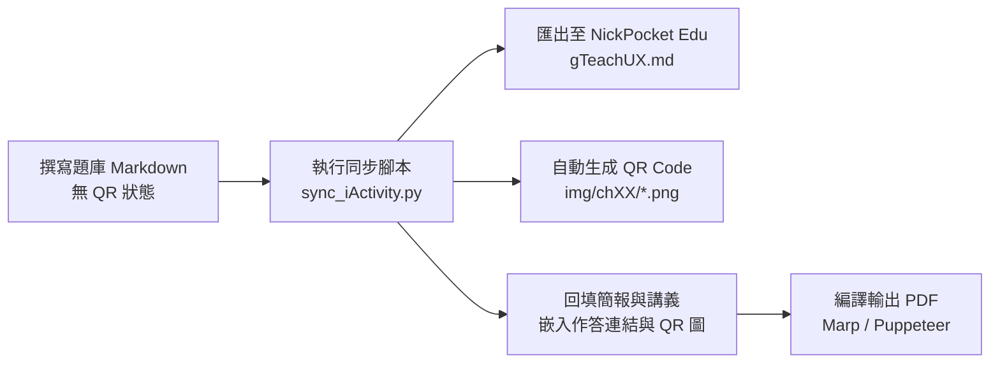

# gTeachUX — 使用者體驗設計與 AI (User Experience Design & AI)

[](#)
[](#)
[](#)
[](https://marp.app/)
[](https://nlhsueh.github.io/nickedupocket/)

---

## 📖 專案簡介 (Overview)

`gTeachUX` 是逢甲大學資訊工程學系 **薛念林 教授** 所編撰之 **「使用者體驗設計與 AI（User Experience Design & AI）」** 課程教學資源庫（與 Gemini AI 共同協作編製）。

本專案整合了現代 UI/UX 理論架構、人機互動啟發式原則、Jenifer Tidwell 經典介面設計模式、AI 原型工具（AI-Powered Prototyping）實務應用，以及整合了 **NickPocket Edu** 線上即時課堂互動題目（CCQ, Concept Checking Questions）與自動化 QR Code 同步系統。

---

## 📚 核心課程主題與簡報 (Course Modules & Slides)

| 模組簡報 (Slide Deck) | 原始碼 (Source) | 輸出檔案 (PDF) | 主要內容與涵蓋主題 |
| :--- | :--- | :--- | :--- |
| **UX & AI 全方位導論**<br>`UX_AI` | [`Slide/source/UX_AI.md`](Slide/source/UX_AI.md) | [`Slide/pdf/UX_AI.pdf`](Slide/pdf/UX_AI.pdf) | <ul><li>**Part 1**: UI vs. UX 差異、日常壞設計反思與 UX 5 大流程</li><li>**Part 2**: 尼爾森 10 大可用性原則 (NS01~NS10) 與案例解析</li><li>**Part 3**: AI for UX — 結合可用性原則的提示工程 (Prompt)</li><li>**Part 4**: UX for AI — 以人為本的 AI 介面與互動設計心法</li></ul> |
| **Tidwell 介面設計模式**<br>`Tidwell_UX` | [`Slide/source/Tidwell_UX.md`](Slide/source/Tidwell_UX.md) | [`Slide/pdf/Tidwell_UX.pdf`](Slide/pdf/Tidwell_UX.pdf) | <ul><li>Jenifer Tidwell *Designing Interfaces* 經典模式解析</li><li>9 大核心模式：一般性互動、組織內容、導覽走查、排版、清單、動作與指令、數據視覺化、表單輸入與社群媒體</li></ul> |
| **AI 驅動的 UI/UX 原型驗證**<br>`UX_tools` | [`Slide/source/UX_tools.md`](Slide/source/UX_tools.md) | [`Slide/pdf/UX_tools.pdf`](Slide/pdf/UX_tools.pdf) | <ul><li>**觀念**：前期確認 (Early Validation) 與 1-10-100 成本法則</li><li>**工具**：`v0`、`Lovable`、`Bolt.new`、`Uizard`、`Galileo AI` 等實務盤點</li><li>**實戰**：AI 驅動前期確認流程與 High-fi 雛形快速迭代</li></ul> |

---

## 📝 講義教材與概念檢核題庫 (Lecture Handbook & CCQ)

教材手冊位於 `Lecture/source/`，配合課堂互動設計了概念核對問答（CCQ）：

* **[Chapter 1: 使用者體驗設計導論 (Introduction to UX)](Lecture/source/ch01_intro.md)**
  * UX/UI 定義邊界、ISO 9241-11 可用性標準、5 大體驗流程、可操作性 (Affordance) 與意圖符號 (Signifier)。
* **[Chapter 2: 尼爾森 10 大可用性啟發式原則 (Nielsen's Heuristics)](Lecture/source/ch02_heuristics.md)**
  * 狀態可見性、符合真實世界、使用者控制與逃生門、一致性標準、防錯設計、辨識取代記憶、彈性效率、簡約設計、容錯復原、協助文件。
* **[Chapter 3: AI for UX — 提示工程與可用性結合](Lecture/source/ch03_ai_for_ux.md)**
  * 可用性導向的 Prompt 架構、極端狀態 (Edge Cases) 提示、漸進式迭代策略。
* **[Chapter 4: UX for AI — 以人為本的 AI 互動設計](Lecture/source/ch04_ux_for_ai.md)**
  * AI 系統延遲反饋（串流輸出）、不確定性防呆、黑盒機制可解釋性 (Explainability)、使用者控制感。
* **[題庫標準答案與詳細解析](Lecture/UX_AI_answer.md)**（[`Lecture/UX_AI_answer.pdf`](Lecture/UX_AI_answer.pdf)）

---

## 🗂️ 專案目錄結構 (Directory Structure)

```text
gTeachUX/
├── AGENTS.md                  # AI 協作規範與 Marp / Markdown 格式守則
├── README.md                  # 專案說明文件 (本檔)
├── Slide/                     # 課程簡報
│   ├── source/                # Marp Markdown 原始檔 (UX_AI, Tidwell_UX, UX_tools)
│   └── pdf/                   # 匯出之 PDF 簡報檔
├── Lecture/                   # 講義手冊與題庫
│   ├── source/                # 各章節 Markdown (ch01~ch04)
│   ├── UX_AI_answer.md        # 題庫標準答案與解析 Markdown
│   └── UX_AI_answer.pdf       # 題庫標準答案與解析 PDF
├── img/                       # 教材插圖與課堂互動 QR Code
│   ├── ch01/ ~ ch04/          # 依章節分類之 CCQ QR Code (自動同步生成)
│   └── ...                    # UI/UX 範例圖片、架構圖與對比圖
└── .gitignore                 # Git 忽略設定檔
```

---

## 🔄 課堂互動題目 (CCQ) 生命週期與同步機制

本專案各章節題目支援與 **NickPocket Edu** 線上作答平台無縫同步：



### 同步步驟：
1. **編輯題目**：在 `Lecture/source/` 或 `Slide/source/` 中撰寫題目文字、選項與解析（初創時保留或產生 `<!-- id: ux-chXX-ccqN -->`，無需手動放 QR Code）。
2. **執行同步**：
   ```bash
   python3 scripts/sync_iActivity.py --course gTeachUX
   ```
3. **編譯 PDF**：
   ```bash
   # 編譯投影片 PDF
   npx @marp-team/marp-cli Slide/source/UX_AI.md --pdf --allow-local-files --no-stdin -o Slide/pdf/UX_AI.pdf
   npx @marp-team/marp-cli Slide/source/Tidwell_UX.md --pdf --allow-local-files --no-stdin -o Slide/pdf/Tidwell_UX.pdf
   npx @marp-team/marp-cli Slide/source/UX_tools.md --pdf --allow-local-files --no-stdin -o Slide/pdf/UX_tools.pdf

   # 編譯題庫解析 PDF
   npx @marp-team/marp-cli Lecture/UX_AI_answer.md --pdf --allow-local-files --no-stdin -o Lecture/UX_AI_answer.pdf
   ```

---

## ⚠️ Markdown 格式與 Marp 協作守則

在編輯投影片與講義時，請遵守 [`AGENTS.md`](AGENTS.md) 中定義之規範：

1. **中文粗體空格規則 (Chinese Bold Spacing)**：
   * 在 Markdown-it / Marp 解析器中，粗體標記 `**` 若緊貼中文字元或全形標點符號，可能導致解析失敗並直接印出星號。
   * **規則**：在任何相鄰中文字元或全形標點的 `**粗體內容**` 前後 **務必各保留一個半形空格**。
   * ✅ 正確範例：`在 **合理的時間內** 給予反饋`
   * ❌ 錯誤範例：`在**合理的時間內**給予反饋`

---

## 👨‍🏫 授課與維護資訊

* **授課教師**：薛念林 教授 (Prof. Nien-Lin Hsueh)
* **服務單位**：逢甲大學 資訊工程學系 (Department of Information Engineering and Computer Science, Feng Chia University)
* **聯絡信箱**：nlhsueh@gmail.com
