<!-- _class: lead -->
# Introduction to User Experience Design & AI
## 使用者體驗設計、AI 提示工程與互動模式

**薛念林 教授**
逢甲大學 資訊工程學系

<span style="font-size: 14px; color: #64748b; margin-top: 24px; display: block;">（本講義與 Gemini AI 共同協作編製）</span>

---

## 課程大綱 (Course Outline)

<div class="two-columns">
<div class="card">

### 📘 Part 1: 使用者體驗設計導論
* 日常體驗觀察與壞設計反思
* UI vs. UX 核心差異與 5 大流程

### 📗 Part 2: 尼爾森 10 大可用性啟發式原則
* NS01 ~ NS10 原則定義與經典生活案例
* 評估標準與日常系統健康檢查

</div>
<div class="card">

### 📙 Part 3: AI for UX — 應用可用性原則於提示工程
* 將尼爾森原則融入 Prompt 設計
* 專家級 Master Prompt 與代碼即時迭代

### 🤖 Part 4: UX for AI — 以人為本的 AI 系統介面與互動設計
* AI 產品的體驗設計心法與防呆機制
* 破解延遲等待、黑盒幻覺、字海與不確定性

</div>
</div>

---

<!-- _class: part-cover -->
# Part 1: 使用者體驗設計導論
## Introduction to User Experience Design

---

## 生活中的體驗與設計

我們在生活的每一天，不斷地 **體驗** 各種 **設計** 。

* 🚌 搭乘大眾交通工具（公車動態、捷運刷卡閘門）
* 📱 滑手機使用 App（社群瀏覽、外送點餐、行動支付）
* 💻 辦公與學習系統（選課系統、請假系統、線上會議）
* 🚗 駕駛或操作各類設備（汽車中控螢幕、家電開關）

> **好的設計** 讓你如沐春風、自然流暢；
> **壞的設計** 讓你懷疑人生、挫折抓狂。

---

## 生活中處處是 UX

<div class="two-columns">
<div class="card">

### <span class="badge-good">好的 UX</span>
* 生活有效率、順手
* 感覺舒服、自然
* 帶來愉快的心情 😀
* 直覺無負擔，一次就做對

</div>
<div class="card">

### <span class="badge-bad">不好的 UX</span>
* 容易誤操作、迷路
* 產生困惑、生氣惱怒 😡
* 浪費大量寶貴時間
* 讓人感到挫折與焦慮

</div>
</div>

---

## 經典反面教材：Norman's Door (諾曼門)

<div class="two-columns">
<div class="card">

### 什麼是「諾曼門」？
當你看到一扇門，上面裝了漂亮的「拉手把」，你下意識用力往外拉——結果門紋絲不動，因為它是 **「推門」** 。門上甚至貼了手寫字條：`「請用推的 PUSH」`。

* **設計缺陷** ：外觀視覺特徵（Affordance / 預設用途）與實際操作邏輯相衝突。
* **使用者心理** ：使用者拉不開時往往會覺得「自己很蠢」，但 **這完全是設計師的責任** ！
* 參考來源：[Norman Door at Apple Store](https://www.reddit.com/r/CrappyDesign/comments/5wolzl/a_norman_door_at_the_apple_store/)

</div>
<div class="card-img">

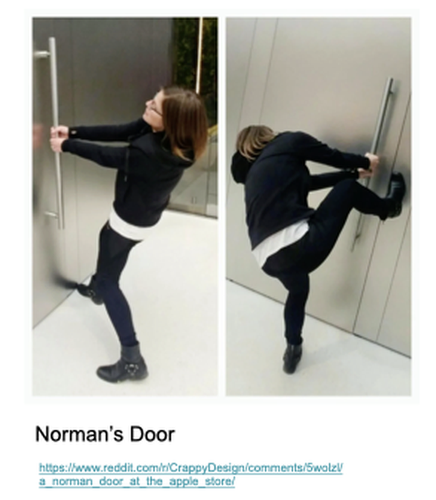

</div>
</div>

---

## 遇到糟糕的 UI/UX，你會感到…

當系統介面難用、卡關、報錯不明時，使用者的真實情緒反映：

* 😣 **情緒受挫** ：丟臉、煩躁、委屈、羞恥
* ❓ **認知迷失** ：不悅、困惑、生氣、挫折
* 🚫 **信任崩塌** ：對該產品甚至品牌喪失信心，不再願意嘗試

> 設計不良不僅僅是外觀難看，更會直接傷害使用者的心理安全感與效率！

---


---

## 糟糕設計類型 (1)：夜市擺攤型

<div class="card">

### 特徵：資訊雜亂無章、隨機塞滿畫面
* **模式識別失效** ：現代電商的商品區塊（圖片、價格、名稱）位置固定。若區塊長寬比、對齊線、字體完全隨機，大腦無法建立模式，必須對每個點重新「對焦」，造成大腦極度疲勞。
* **缺乏視覺錨點** ：缺乏嚴格的網格系統（Grid System），使用者的視線無法沿著水平或垂直軸順暢掃描。
* **成因** ：往往不是審美問題，而是技術不足（例如只會用 Flow Layout 依序硬塞元件，且未規劃架構）。

</div>

---

<!-- _class: full-img -->


---

## 糟糕設計類型 (2)：顏料不用錢型

<div class="card">

### 「視覺虐待」與易讀性的毀滅
* **色彩對比崩壞（Color Contrast）** ：藍色漸層橫條紋搭配深紅細體字，產生視覺閃爍感，對色弱與年長使用者完全不可讀。
* **排版災難（Typography Nightmares）** ：隨機浮雕陰影增加視覺噪音；文字列表「左右交錯」長短不一，強迫視線痛苦地 Z 字型掃視。
* **缺乏負空間（White Space）** ：內容塞得密不透風，讓人感覺呼吸困難。
* **摧毀品牌信賴感** ：專業醫療或科技器材網站若採用五顏六色的隨意混搭，會直接摧毀安全感與專業度。

</div>

---

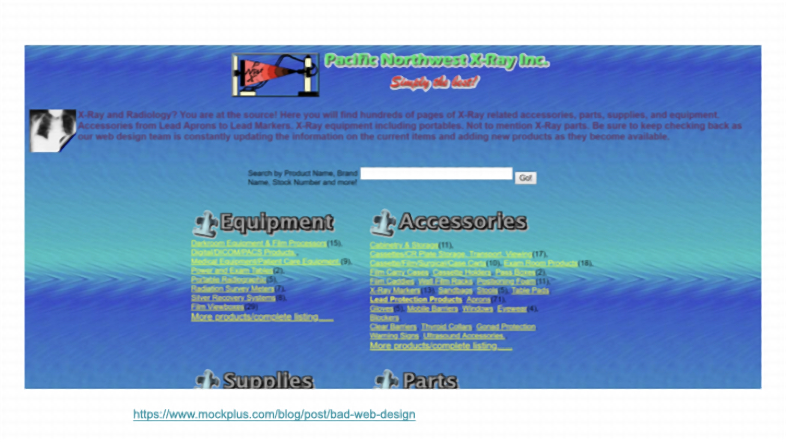

---

## 糟糕設計類型 (3)：不知從何下手型

<div class="card">

### 特徵：視覺過載、內容過剩、導覽失能
* **資訊洪流** ：首頁塞滿大量電話、Email、跑馬燈與未分類圖示，完全沒有視覺焦點。
* **寬度失控** ：文字段落橫跨整個螢幕且字距緊湊。
  * 人類最舒適的閱讀長度為 **每行 45 ~ 75 個字元** 。
  * 超寬排版強迫讀者的脖子與眼球頻繁左右擺動，嚴重損害閱讀體驗。
* **死連結（Broken Links）** ：大量按鈕點進去無效或 404，使用者徹底迷航。

</div>

---

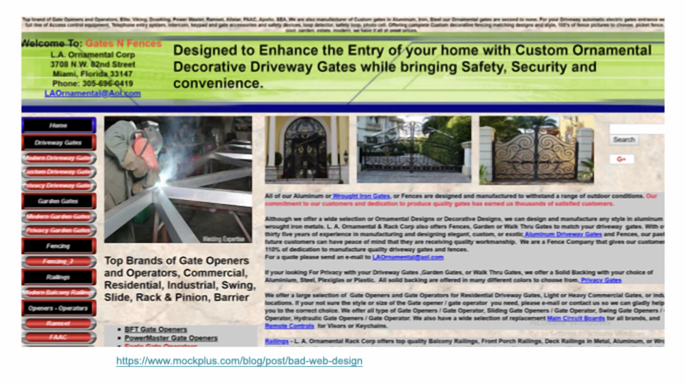

---

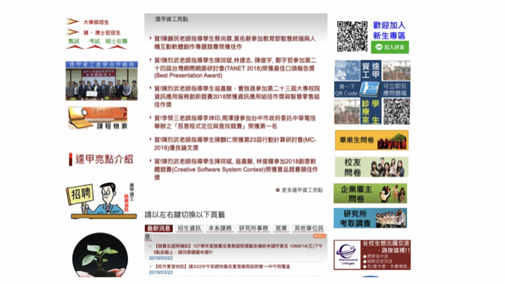

---
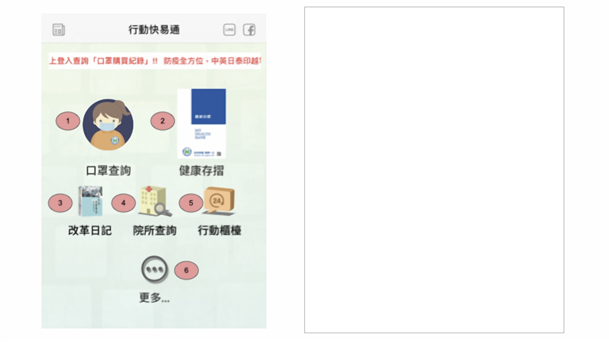

---

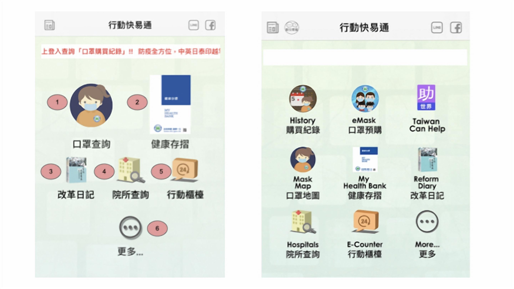

---

## UX 為何如此困難？

<div class="two-columns">
<div class="card">

### 常見的開發盲點
* ❌ **只有模組思考，沒有系統思考** ：疊床架屋，來一個做一個。
* ❌ **只有系統思考，沒有使用者思考** ：忽略同理心與實際體驗。
* ❌ **沒有使用者研究，沒有需求分析** ：閉門造車。
* ❌ **沒有設計就直接施工** ：邊寫邊改，架構混亂。
* ❌ **沒有測試反饋與修正** 。
* 💸 **No Money** → 便宜行事；😴 **Lazy** → 知錯不改。

</div>
<div class="card-img">


</div>
</div>

---

## 迷思破解：系統難用只是美工不好嗎？

> **老師** ：「這個系統很難用，操作體驗很不順。」
> **學生** ：「我又不會畫圖，我美工很差沒辦法……」

<div class="card">

### 系統難用只和「美工」有關嗎？
* **絕對不是！** 美工（Visual Graphic）只負責視覺外觀與修飾。
* 系統難用通常源於：
  1. 資訊架構混亂（找不到功能）
  2. 互動流程繁瑣（多餘步驟）
  3. 狀態反饋缺失（不知道有沒有成功）
  4. 認知模型不匹配（用語只有工程師看得懂）

</div>

---

## 什麼是使用者體驗 (User Experience, UX)？

<div class="card">

### 權威定義 (ISO 9241-210 / Wikipedia)
> **The user experience (UX)** is how a user interacts with and experiences a product, system or service. It includes a person's perceptions of **utility**, **ease of use**, and **efficiency**.

* **使用者體驗 (UX)** 是使用者在與產品、系統或服務互動過程中的整體體驗與內在感受。
* 核心三要素：
  1. **效用 (Utility)** ：能否滿足使用者需求、解決問題？
  2. **易用性 (Ease of Use)** ：容易學習與操作嗎？
  3. **效率 (Efficiency)** ：完成任務是否迅速流暢？

</div>

---

## UI (使用介面) vs. UX (使用體驗)

<div class="two-columns">
<div class="card">

### UI (User Interface)
* **外在視覺與互動介面**
* 關注按鈕顏色、字體大小、排版、視覺階層、動效。
* 核心問題： **「產品看起來如何？操作元件長怎樣？」**

</div>
<div class="card">

### UX (User Experience)
* **內在心理感受與整體旅程**
* 關注按鈕位置合不合理、流程順暢度、能否減輕痛點。
* 核心問題： **「使用者用起來感覺如何？是否順利達成目標？」**

</div>
</div>

---

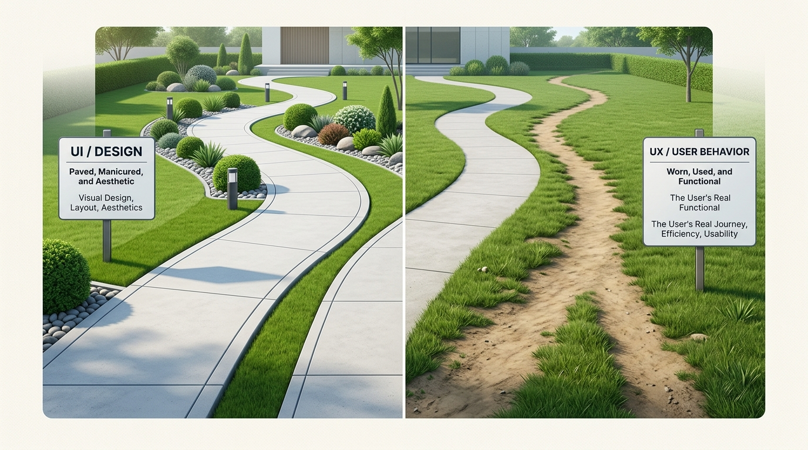

---

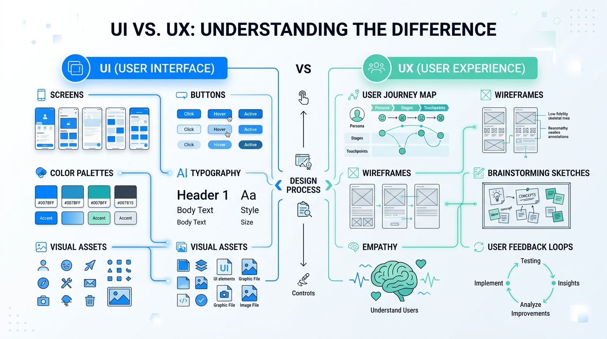

---

## 什麼是使用者體驗設計 (UX Design)？

<div class="card">

### UX Design 的定義
> **User Experience Design** is the process that design teams use to create products that provide meaningful and relevant experiences to users.
> It involves the design of the entire process of acquiring and integrating the product, including aspects of **branding**, **design**, **usability**, and **function**.

UX 設計是團隊為了打造 **有意義且具高度關聯性體驗** 的完整設計流程，涵蓋品牌塑造、介面設計、可用性評估及核心功能。

</div>

---

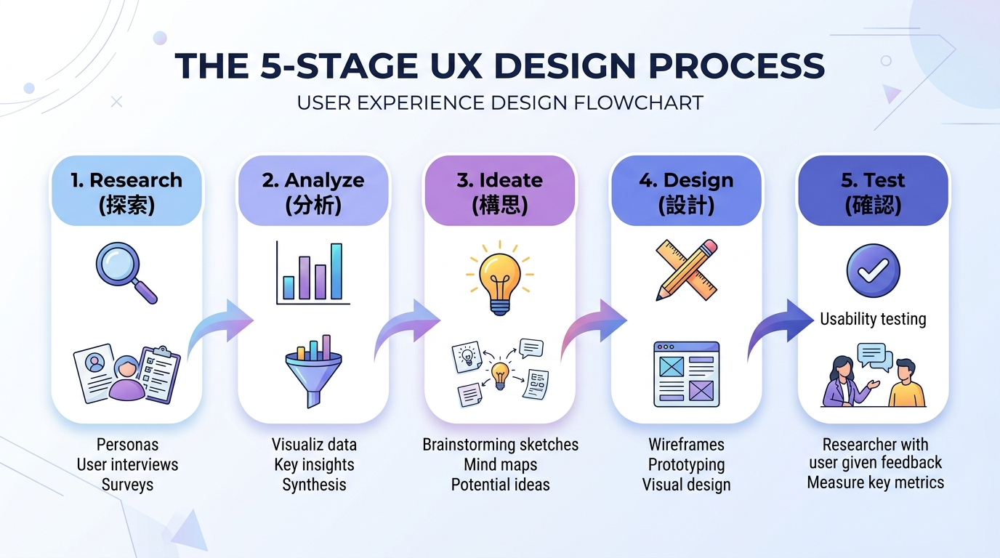

---

## UX 設計的標準核心流程：步驟解析

* **1. 探索 (Research)** ：研究使用者行為，理解他們「為什麼」這樣做。
* **2. 分析 (Analyze)** ：從調研結果提煉關鍵使用者目標與核心痛點。
* **3. 構思 (Ideate)** ：結合使用者目標、商業需求與技術規格擬定設計要求。
* **4. 設計 (Design)** ：產出低/高保真原型並提出具體解決方案。
* **5. 確認 (Test)** ：與真實使用者進行可用性測試，驗證方案是否達成目標。

---

<!-- id: ux-ch01-ccq1 -->
## 🙋 概念核對問答 (CCQ1)

<div class="two-columns-64">
<div class="card">

### UX 和 UI 的差異
**[ 是 / 否 ]**

> 對於使用者而言，UX 決定了系統是否「好用」，而 UI 則決定了系統是否「好看」。兩者相輔相成，缺一不可，共同構築了最終的使用者體驗。

請判斷上述說法是否正確，並簡述兩者的定義邊界。

[線上作答](https://nlhsueh.github.io/nickedupocket/#/student/ux-ch01-ccq1)

  

</div>
<div class="card-img">


</div>
</div>

---

<!-- id: ux-ch01-ccq2 -->
## 🙋 概念核對問答 (CCQ2)

<div class="two-columns-64">
<div class="card">

### UX
**[ 是 / 否 ]**

> 登入系統的時間過長，是屬於系統架構和效能的問題，與 UX 無關。

請參考 ISO9241-11 對 UX 的定義，判斷上述說法是否正確。

[線上作答](https://nlhsueh.github.io/nickedupocket/#/student/ux-ch01-ccq2)

  

</div>
<div class="card-img">


</div>
</div>

---

<!-- id: ux-ch01-ccq3 -->
## 🙋 概念核對問答 (CCQ3)

<div class="two-columns-64">
<div class="card">

### UX process
以下哪個活動**不算**在 UX 的標準流程中？

* **(A)** 了解使用者的痛點
* **(B)** 進行畫面的設計與確認
* **(C)** 進行市場的分析與調查
* **(D)** 開發一個雛形進行試用
* **(E)** 對系統進行壓力測試

[線上作答](https://nlhsueh.github.io/nickedupocket/#/student/ux-ch01-ccq3)

  

</div>
<div class="card-img">


</div>
</div>

---

<!-- id: ux-ch01-qa1 -->
## 🙋 問答討論 (QA1)

<div class="two-columns-64">
<div class="card">

### 分享你的糟糕 UX 體驗
請回想並描述一個你在日常生活中遇過 **UX 最糟糕的系統** （如學校系統、政府網站、點餐 App、售票系統等）：

1. **系統名稱與使用情境**
2. **操作時遇到的最大障礙或崩潰瞬間**
3. **這帶給你什麼心理感受？（困惑、生氣、無助）**
4. **如果你是設計師，你第一步想如何改善它？**

[線上作答](https://nlhsueh.github.io/nickedupocket/#/student/ux-ch01-qa1)

  

</div>
<div class="card-img">


</div>
</div>

---

<!-- _class: part-cover -->
# Part 2: 尼爾森 10 大可用性啟發式原則
## Nielsen’s 10 Usability Heuristics

---


## 尼爾森 10 大原則總覽 (Nielsen's Heuristics)

<div class="two-columns">
<div class="card">

* **NS01** 清楚的系統狀態 (Visibility of System Status)
* **NS02** 與真實世界對應 (Match Between System & Real World)
* **NS03** 使用者控制權 (User Control & Freedom)
* **NS04** 一致的風格 (Consistency & Standards)
* **NS05** 錯誤預防 (Error Prevention)

</div>
<div class="card">

* **NS06** 易於識別 (Recognition Rather Than Recall)
* **NS07** 彈性與效率 (Flexibility & Efficiency of Use)
* **NS08** 優雅簡潔設計 (Aesthetic & Minimalist Design)
* **NS09** 清楚錯誤處理 (Error Recovery)
* **NS10** 適當的說明 (Help & Documentation)

</div>
</div>

---

## NS01 清楚的系統狀態 (Visibility of System Status)

> *“The system should always keep users informed about what is going on, through appropriate feedback within a reasonable time.”*

<div class="card">

### 核心概念：適時反饋、消除焦慮
* 系統必須在 **合理的時間內** 給予適當反饋，始終讓使用者了解當前進度與狀態。
* 凸顯重要資訊，建立使用者的情境掌控感。
* 👍 **優良實踐** ：提供上傳進度條、按鈕點擊後立即顯示 Loading 狀態、步驟指示器（Step 2 of 4）。
* 👎 **不良設計** ：點擊無反應、畫面凍結、讓使用者猜測「系統是不是當機了？」。

</div>

---

## NS01 案例解析與實務應用

<div class="two-columns">
<div class="card">

### 檔案上傳狀態
```
Upload 100 files
[✓] image1.png (Done)
[✓] image2.png (Done)
[⟳] image3.png (45%...)
```
* 清楚交代每一項任務的進度。
* 使用者完全安心。

</div>
<div class="card">

### 即時表單與未讀通知
* 🔔 未讀訊息數字徽章（Badge）
* 📧 Email 格式輸入錯誤時 **即時** 紅字提示
* 🛒 商品各尺寸之庫存即時狀態提示

</div>
</div>

---

## iPhone Bug?

<div class="card-img">

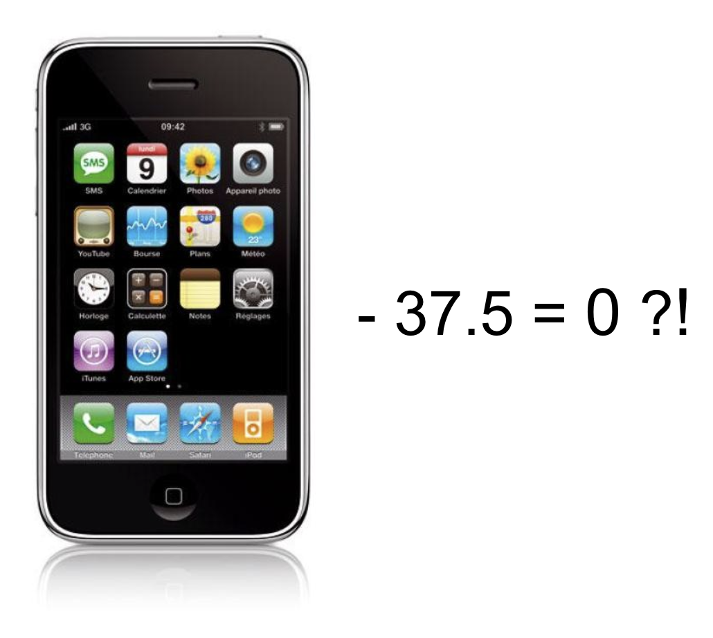

</div>

---


---

## NS02 與真實世界的對應 (Match System & Real World)

> *“The system should speak the users’ language, with words, phrases, and concepts familiar to the user, rather than system-oriented terms.”*

<div class="card">

### 核心概念：說使用者的話、遵循日常習慣
* 使用使用者熟悉的日常單詞與概念，避免工程師導向的專業術語。
* 資訊排列順序應符合現實邏輯與心理模型。
* 👍 **優良實踐** ：「每天食用止痛藥不要超過 4 顆」
* 👎 **不良設計** ：「每日乙醯胺酚攝取上限為 2000mg」（過度術語化）

</div>

---

## NS02 案例解析：物理隱喻與直覺對應

<div class="two-columns">
<div class="card">

### 物理對應 (Natural Mapping)
* **瓦斯爐旋鈕** ：控制器的排列位置應與四個爐嘴的空間位置完全一致。
* **機車方向燈** ：左轉撥左、右轉撥右（若改成上下按鍵將極難直覺對應）。
* **Tesla 換檔** ：螢幕向上滑前進 (D)、向下滑倒車 (R)、點擊 P 停車。

</div>
<div class="card">

### 人性化文案與代碼提示
* **註冊按鈕** ：不寫生硬的 "Sign Up"，改為「是的，我想立即提升業績！」。
* **終端機輸入** ：
  * 👎 `press -9 to stop` (工程師代碼邏輯)
  * 👍 `Press X to finish` (高可讀性日常邏輯)

</div>
</div>

---


---

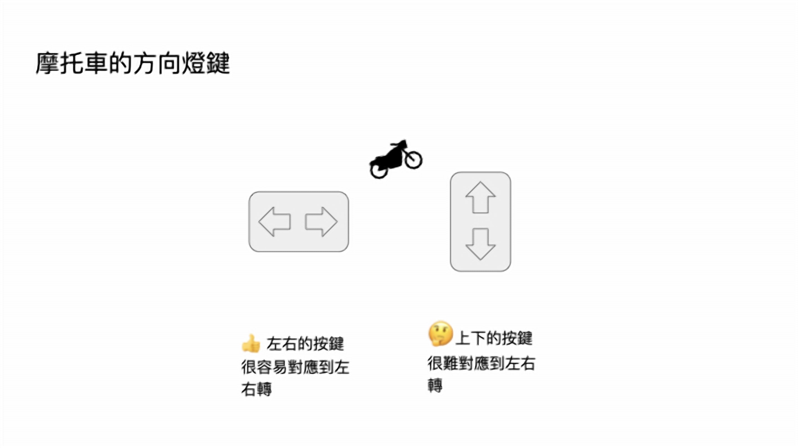

---

## NS03 使用者擁有控制權 (User Control & Freedom)

> *“Users often choose system functions by mistake and will need a clearly marked ‘emergency exit’ to leave the unwanted state. Support undo and redo.”*

<div class="card">

### 核心概念：提供「緊急出口」與反悔機會
* 使用者經常手滑誤觸功能，系統必須提供顯眼的 **緊急出口** ，無需繁瑣對話框。
* 必備按鈕：`[Back]`, `[Cancel]`, `[Close]`, `[Undo]`, `[Redo]`。
* ⚠️ **謹慎使用 [Reset]** ：一鍵清空整個表單容易造成災難性誤刪。

</div>

---

## NS03 案例解析：常用的緊急出口

<div class="three-columns">
<div class="card">

### [Undo] 寄信與刪除
* Gmail 寄出信件後，底部浮現 **5 秒內「復原 (Undo)」** 。
* 丟到垃圾桶時提供反悔復原按鈕。

</div>
<div class="card">

### [Cancel] 留言與表單
* 放棄填寫留言時，提供取消按鈕快速回到上一層。
* 允許中途退出流程而不死鎖畫面。

</div>
<div class="card">

### [Back / Close]
* 進入錯誤頁面能按 Back 返回。
* 彈出式廣告或視窗提供明確且容易點擊的 `[✕]` 關閉鍵。

</div>
</div>

---

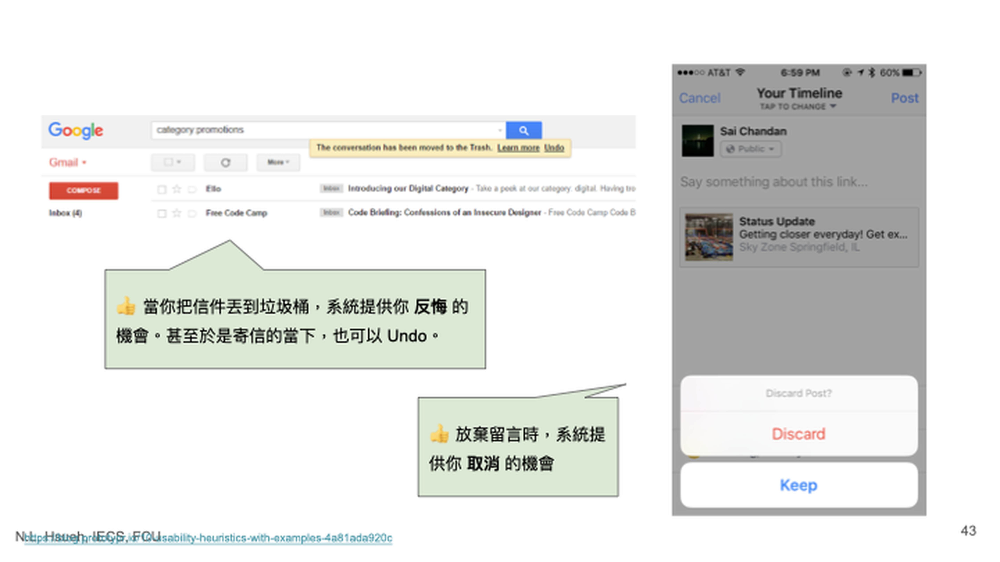

---

## NS04 一致的風格與標準 (Consistency & Standards)

> *“Users should not have to wonder whether different words, situations, or actions mean the same thing. Follow platform conventions.”*

<div class="card">

### 核心概念：降低學習成本
* **內部一致性** ：同一系統或產品家族內，文字、按鈕顏色、圖示與排版風格保持統一。
* **外部一致性** ：遵循平台與業界既定慣例（如 iOS HIG, Material Design, `Ctrl+C` 複製）。

</div>

---

## NS04 案例解析：不一致帶來的混亂

<div class="two-columns">
<div class="card">

### 用詞不一致
* 同一個操作在不同頁面寫成：
  `[提交]`、`[Submit]`、`[確認]`、`[OK]`、`[Done]`
  --> 使用者會懷疑功能是否不同。

</div>
<div class="card">

### 空間記憶破壞 (Spatial Memory)
* 「確認」與「取消」按鈕在不同彈窗 **忽左忽右** 。
* 確認按鈕的顏色一下藍、一下綠、一下紅。
  --> 使用者容易手快誤按。

</div>
</div>

---

## NS05 錯誤預防 (Error Prevention)

> *“Even better than good error messages is a careful design which prevents a problem from occurring in the first place.”*

<div class="card">

### 核心概念：預防勝於治療
* 比「友善的報錯訊息」更優秀的是： **一開始就設計成不可能犯錯** ！
* 策略一： **限制輸入條件（Constraints）** （如禁用過去日期、只能輸入數字）。
* 策略二： **危險操作二次確認（Confirmation）** （不可逆刪除需再次確認）。
* 策略三： **智慧提醒與預測** （如偵測到內文寫「附件」卻未上傳檔案時主動提醒）。

</div>

---

## NS05 案例解析：表單防呆與即時約束

<div class="two-columns">
<div class="card">

### 表單輸入屬性防呆
```html
<label for="weight">Weight (kg):</label>
<input type="number" id="weight" 
       name="weight" value="60" 
       min="30" max="300" required>
```
* 限制只能輸入數值，並設定合理的範圍 `[30, 300]`，防止輸入負數或異常數字。

</div>
<div class="card">

### 關鍵操作確認
* ⚠️ `你確認要刪除此帳號嗎？資料將無法復原。`
* ⚠️ `您似乎在信中提到了附件，但尚未添加附件，確定要傳送嗎？`
* 密碼設定時，即時顯示 8 碼英數混合之驗證狀態條。

</div>
</div>

---

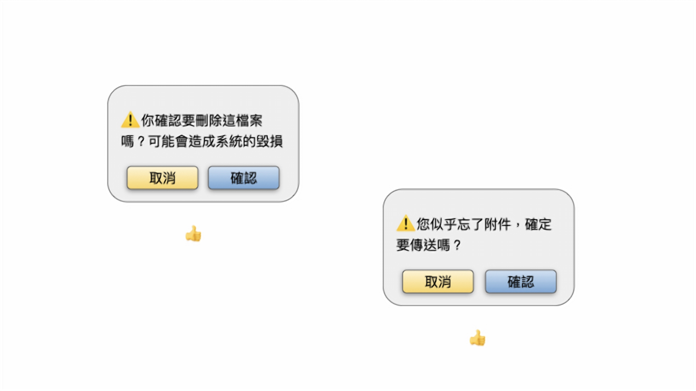

---

## NS06 易於識別而非記憶 (Recognition Rather Than Recall)

> *“Minimize the user’s memory load by making objects, actions, and options visible. Instructions should be easily retrievable.”*

<div class="card">

### 核心概念：看到就選，不要考驗大腦記憶
* 選擇題遠比問答題容易：
  * 👎 「葡萄牙的首都是哪座城市？」（需提取記憶 Recall）
  * 👍 「里斯本是葡萄牙的首都嗎？」（只需辨識 Recognition）
* 操作指引與選項隨處可見，使用者不需要在各畫面間切換記憶。

</div>

---

## NS06 案例解析：降低認知負擔

<div class="three-columns">
<div class="card">

### 搜尋關鍵字保留
* 搜尋結果頁上方保留剛剛輸入的關鍵字：
  `"user experience design"`
  讓使用者不必費心記憶。

</div>
<div class="card">

### Apple 產品規格比較表
* iPad Pro / Air / Mini 並列比較螢幕、晶片、鏡頭規格。
* 消除跨頁對比記憶負擔。

</div>
<div class="card">

### 已拜訪連結變色
* 搜尋引擎將已點擊過的連結以紫色標示。
* 清楚識別拜訪記錄。

</div>
</div>

---

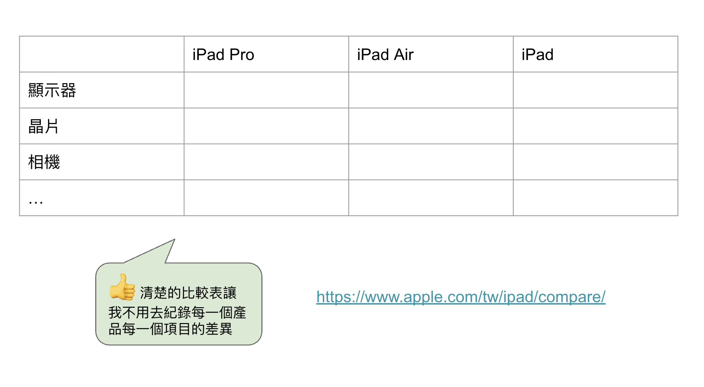

---


---

## NS07 彈性與使用效率 (Flexibility and Efficiency of Use)

> *“Accelerators — unseen by the novice user — may often speed up the interaction for the expert user. Allow users to tailor frequent actions.”*

<div class="card">

### 核心概念：新手好上手，專家更迅速
* 系統應兼顧新手與資深使用者的需求。
* **加速器（Accelerators）** ：提供鍵盤快捷鍵、自訂巨集、右鍵快顯功能。
* **個人化 (Personalization)** ：系統依據使用者歷史行為自動調整（如推薦片單）。
* **客製化 (Customization)** ：使用者自主調整偏好設定（如 VS Code / Gmail 設定）。

</div>

---

## NS07 案例解析：快捷鍵與個人化設定

<div class="two-columns">
<div class="card">

### 快捷鍵與快捷手勢
* Instagram 雙擊照片快速點讚 ❤️
* 終端機與 IDE 的程式碼片段 (Code Snippets)
* 簡易計算機一鍵切換成科學計算機

</div>
<div class="card">

### 個人化 vs 客製化
* **個人化** ：依角色顯示不同面板（管理者 vs 學生），或智慧推薦。
* **客製化** ：自訂最愛工具列、深色模式切換、批次選取操作。

</div>
</div>

---

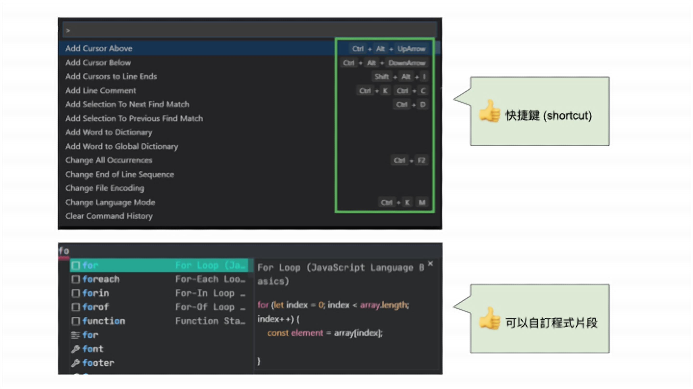

---

## NS08 優雅簡潔的設計 (Aesthetic & Minimalist Design)

> *“Dialogues should not contain information which is irrelevant or rarely needed. Every extra unit of information diminishes relative visibility.”*

<div class="card">

### 核心概念：少即是多，消滅視覺噪音
* 對話框與頁面不應包含不相關或極低頻率的訊息。
* 每多一個多餘元素，都會削弱重要資訊的可見度。
* **以圖表取代冗長文字** ，使用精準用詞，適度留白。

</div>

---

## NS08 案例解析：極簡主義的力量

<div class="two-columns">
<div class="card">

### Google 搜尋首頁
* 首頁只有中央乾淨的搜尋框與 Logo，極度專注。
* 簡約不代表功能簡單，背後需要更強大的智慧技術支持。
* 網址列直接兼具搜尋功能。

</div>
<div class="card">

### 漸進式選單與圖表視覺化
* 首頁僅呈現核心指標，點擊後才展開細部進階功能。
* 健康資訊以視覺化圓餅圖或柱狀圖呈現，一目了然。

</div>
</div>

---

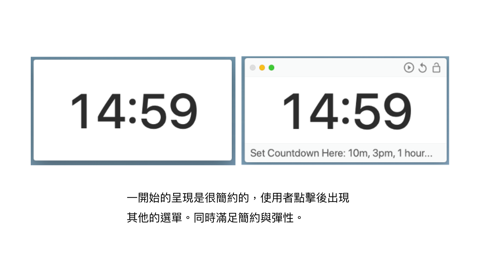

---

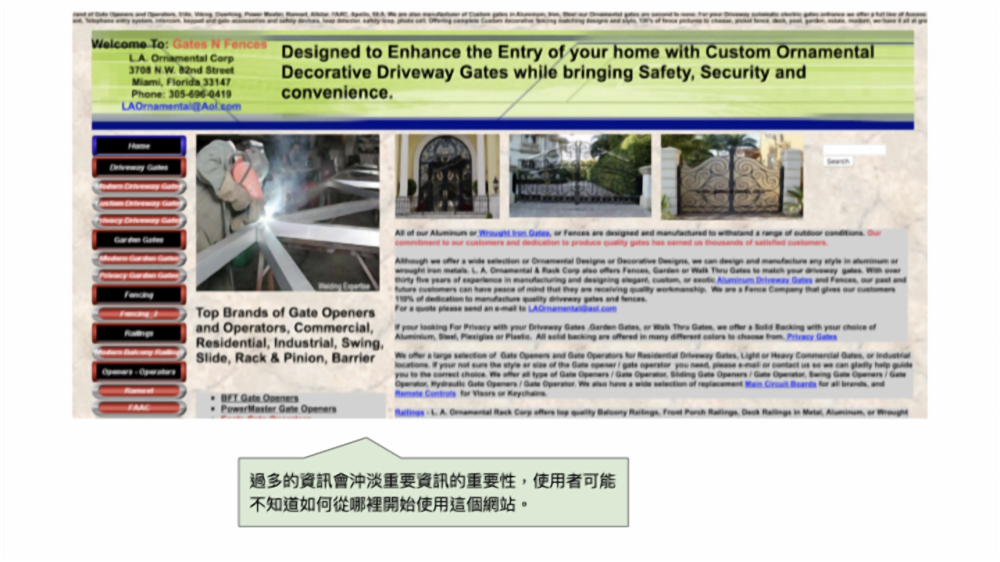

---

## NS09 清楚的錯誤處理 (Help Users Recover from Errors)

> *“Error messages should be expressed in plain language (no codes), precisely indicate the problem, and constructively suggest a solution.”*

<div class="card">

### 核心概念：通俗語言、精準定位、建設性建議
* **明晰的 (Explicit)** ：有錯誤必須明確提示，不能默默失敗。
* **精準的 (Precise)** ：指出究竟是哪個環節出錯。
* **白話文 (Readable)** ：嚴禁向一般使用者丟出 `Error 0x80070057` 或 `SQL Exception`。
* **客氣有禮 (Polite)** ：不要責怪使用者。
* **具建設性 (Constructive)** ：給予明確的下一步修復方案。

</div>

---

## NS09 案例解析：登入錯誤訊息對比

<div class="two-columns">
<div class="card">

### <span class="badge-bad">糟糕的報錯</span>
* ❌ `帳號或密碼錯誤，無法登入`
  （使用者不知道是帳號打錯還是密碼忘記）
* ❌ `System Error 500: NullReferenceException`
  （使用者完全看不懂）

</div>
<div class="card">

### <span class="badge-good">優良的報錯</span>
* ✅ `密碼錯誤。請重新輸入，或 [點此重設密碼]（我們將寄送重設信至您的信箱）。`
* ✅ **404 頁面** ：`抱歉，找不到該頁面。您可以返回首頁，或撥打客服電話 0800-xxx-xxx。`

</div>
</div>

---

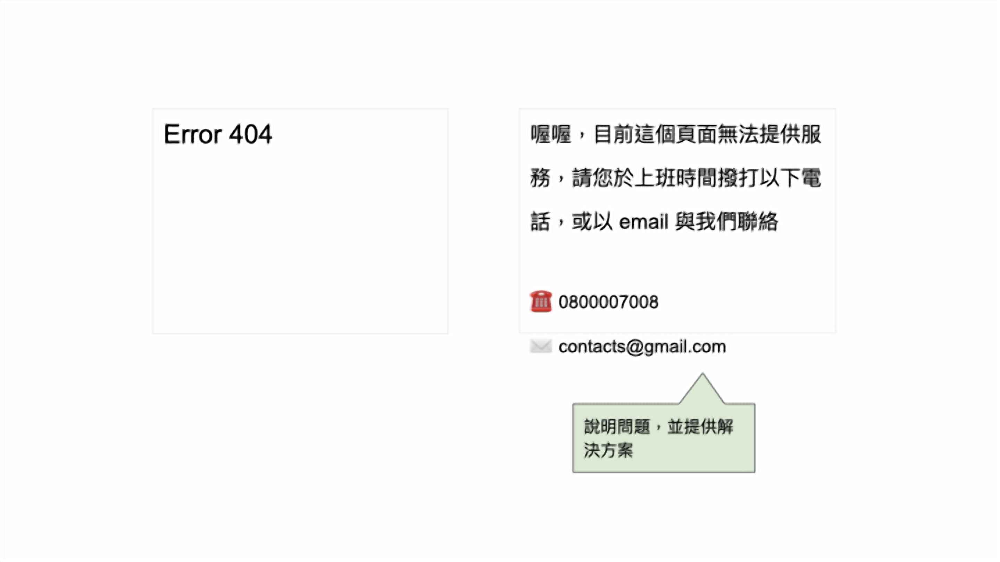

---

## NS10 說明與文件 (Help and Documentation)

> *“Even though it is better if the system can be used without documentation, it may be necessary to provide help and documentation. It should be easy to search and list concrete steps.”*

<div class="card">

### 核心概念：易於檢索、專注任務、步驟具體
* 最理想的系統是無須說明就能直覺使用，但針對複雜業務仍需具備完善說明。
* **被動式協助** ：使用者有疑問時可搜尋的 Help Center / FAQ。
* **主動式協助** ：新功能 Onboarding 導覽、多樣化樣板 (Templates)。
* ⚠️ **避免多餘的干擾導覽** （例如在極度直覺的日曆新增介面彈出長篇教學）。

</div>

---

## NS10 案例解析：情境化與樣板協助

<div class="two-columns">
<div class="card">

### 互動式導覽 (Interactive Tour)
* 新手登入後的 3 步驟快速引導：
  `Step 1: 建立專案 ➔ Step 2: 邀請成員 ➔ 完成`
* 隨時可點擊 `[Skip 跳過]`。

</div>
<div class="card">

### 豐富的樣板庫 (Templates)
* Notion / Canva / Google Docs 提供各領域範本。
* 使用者在參考他人作品與範本的過程中，自然學會如何使用系統。

</div>
</div>

---

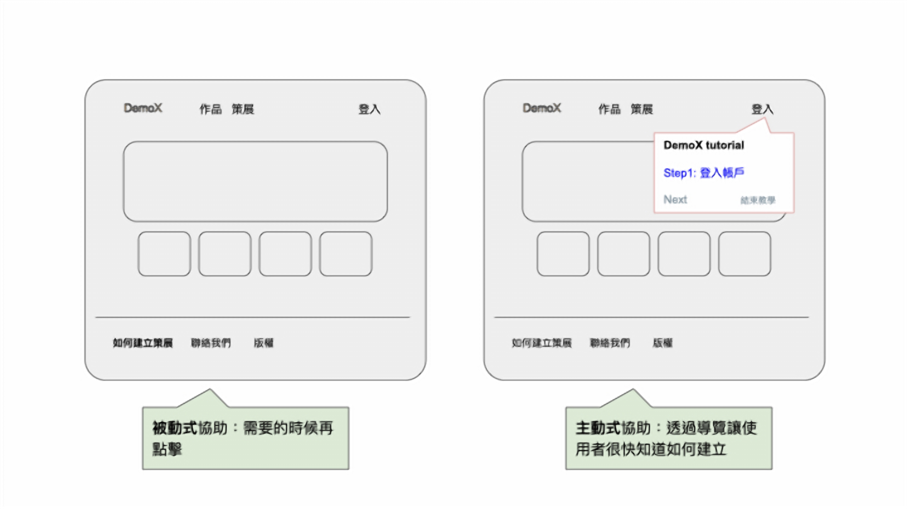

---

## 尼爾森 10 大可用性原則總結對照表

| 代號 | 原則名稱 | 核心目標 | 典型範例 |
| :---: | :---: | :--- | :--- |
| **NS01** | 清楚的系統狀態 | 消除等待焦慮，進度即時反饋 | 上傳進度條、Loading 動畫 |
| **NS02** | 與真實世界對應 | 使用通俗語言與物理隱喻 | 丟入垃圾桶、日常詞彙 |
| **NS03** | 使用者擁有控制權 | 提供反悔機會與緊急出口 | Undo 復原、Cancel 取消 |
| **NS04** | 一致的風格與標準 | 降低學習成本，排版用詞統一 | 遵循 iOS/Material 慣例 |
| **NS05** | 錯誤預防 | 預防勝於治療，輸入防呆 | 禁用過去日期、刪除確認 |
| **NS06** | 易於識別而非記憶 | 降低認知負擔，看到即選 | 歷史搜尋記號、產品比較表 |
| **NS07** | 彈性與使用效率 | 兼顧新手與資深用戶速度 | 鍵盤快捷鍵、批次操作 |
| **NS08** | 優雅簡潔的設計 | 消除干擾資訊，強調核心重點 | Google 極簡首頁、圖表化 |
| **NS09** | 清楚的錯誤處理 | 白話說明問題並給予復原指引 | 附帶重設連結的密碼報錯 |
| **NS10** | 適當的說明與文件 | 任務導向教學，易於檢索搜尋 | 步驟引導、豐富樣板庫 |

---

<!-- id: ux-ch02-ccq1 -->
## 🙋 概念核對問答 (CCQ1)

<div class="two-columns-64">
<div class="card">

### 錯誤預防 (NS05) 
**[ 是 / 否 ]**

> 「為了徹底落實錯誤預防，系統在使用者執行『任何』可能修改資料的操作（包括編輯個人暱稱、切換深色模式）時，都強制彈出確認視窗要求點擊『確定修改』，這是兼顧安全性與可用性的最佳實踐。」

[線上作答](https://nlhsueh.github.io/nickedupocket/#/student/ux-ch02-ccq1)

  

</div>
<div class="card-img">


</div>
</div>

---

<!-- id: ux-ch02-ccq2 -->
## 🙋 概念核對問答 (CCQ2)

<div class="two-columns-64">
<div class="card">

### 簡潔設計
**[ 是 / 否 ]**

> 「為了實現極致簡潔的視覺體驗，將資料表格中的操作按鈕（編輯/刪除/下載）全數隱藏，改為僅在使用者將滑鼠 Hover 懸停於該列時才浮現，這在所有裝置與情境下都是最推薦的做法。」

[線上作答](https://nlhsueh.github.io/nickedupocket/#/student/ux-ch02-ccq2)

  

</div>
<div class="card-img">


</div>
</div>

---

<!-- id: ux-ch02-ccq3 -->
## 🙋 概念核對問答 (CCQ3)

<div class="two-columns-64">
<div class="card">

### 尼爾森原則綜合交叉應用
電商結帳頁在輸入信用卡時，自動依卡號長度在每 4 碼插入空格（`4111 2222 3333 4444`），並在辨識出卡別後即時於右側點亮 Visa 圖示。這項設計最直接體現了哪兩項原則的結合？

* **(A)** NS05 (錯誤預防) 與 NS06 (易於識別而非記憶)
* **(B)** NS03 (控制權) 與 NS07 (彈性與使用效率)
* **(C)** NS04 (一致性) 與 NS09 (清楚的錯誤處理)
* **(D)** NS08 (優雅簡潔的設計) 與 NS10 (適當的說明與文件)

[線上作答](https://nlhsueh.github.io/nickedupocket/#/student/ux-ch02-ccq3)

  

</div>
<div class="card-img">


</div>
</div>

---

<!-- id: ux-ch02-ccq4 -->
## 🙋 概念核對問答 (CCQ4)

<div class="two-columns-64">
<div class="card">

### 尼爾森原則綜合交叉應用
使用者在 Gmail 內文提及「如附件企劃書」，但在未附加檔案時點擊「傳送」，系統即時攔截並提示：*「您提及了附件但未附加檔案，是否仍要傳送？」* ，並提供「取消」與「直接傳送」。這最直接體現了哪兩項原則的結合？

* **(A)** NS05 (錯誤預防) 與 NS03 (使用者控制與自由)
* **(B)** NS01 (系統狀態能見度) 與 NS08 (優雅簡潔的設計)
* **(C)** NS02 (與真實世界對應) 與 NS06 (易於識別而非記憶)
* **(D)** NS04 (一致性與標準) 與 NS10 (適當的說明與文件)

[線上作答](https://nlhsueh.github.io/nickedupocket/#/student/ux-ch02-ccq4)

  

</div>
<div class="card-img">


</div>
</div>

---

## 練習 🏄🏻‍♀️：應用尼爾森原則評估系統

<div class="card">

### 請挑選以下其中一個系統，依據尼爾森原則進行 UX 分析與改進建議：
* 🎓 研究所推薦信系統（Web）
* 📋 課堂出缺席點名系統（Mobile/Web）
* 🍜 餐廳 Line 點餐系統（Mobile）
* 🚄 台灣高鐵線上訂票系統（Web/App）
* 🛵 美食外送軟體（Foodpanda/UberEats）
* 🏫 校園資訊入口網站（Web）
* 🚗 汽車中控車機資訊系統（Car）

</div>

---

<!-- _class: part-cover -->
# Part 3: AI for UX — 應用可用性原則於提示工程
## Prompting with UX: 結合尼爾森原則指導 AI 生成優質體驗

---

## AI for UX：專家級 Master Prompt 範本

<div class="prompt-box" style="font-size: 18px;">

**Role:** 你是一位具備 20 年經驗的資深 UI/UX 專家與資深軟體架構師。
**Task:** 在設計系統架構、編寫 UI 程式碼或規劃 AI Agent 流程時，請嚴格執行 Nielsen's 10 Heuristics。
**Execution Requirements:**
1. **系統狀態 (NS01):** 所有的非同步操作（API 請求、AI 運算）必須包含 Loading 狀態或進度百分比。
2. **錯誤預防 (NS05):** 在執行破壞性操作（刪除、覆蓋）前，必須主動設計確認機制或預檢邏輯。
3. **防呆與復原 (NS03 & NS09):** 提供明確的 Undo 機制；錯誤訊息必須是白話文並給予修復建議，嚴禁只噴錯誤代碼。
4. **極簡與效率 (NS07 & NS08):** 優先採用「約定大於配置」；UI 介面應過濾掉 80% 的低頻資訊，保持視覺清爽。
5. **代碼一致性 (NS04):** 產出的程式碼必須嚴格遵守專案既有的命名規範與 Design System 組件。
**Output Format:** 在產出方案後，請簡短標註你應用了哪些尼爾森原則（例如：`[已加入 NS05 錯誤預防邏輯]`）。

</div>

---

## AI for UX：NS01 系統狀態能見度 (Visibility of System Status)

<div class="two-columns">
<div class="prompt-box" style="font-size: 18px;">

### 💡 Prompt 設計框架
* **角色 (Role)**: 資深前端與 UX 專家。
* **目的 (Objective)**: 當系統執行非同步操作（如 API 請求或資料處理）時，必須提供即時反饋，讓使用者得知目前狀態。
* **避免 (Avoid)**: 避免毫無說明的空白畫面、或無限旋轉但無進度說明的 Spinner。

</div>
<div class="prompt-box" style="font-size: 18px;">

### 📝 提示詞範本
> 你是一個資深前端工程師。在設計匯入大型 Excel 檔案的 UI 時，請確保提供一個即時進度條（Progress Bar），包含目前處理百分比（如 45%）、已處理筆數與剩餘預估秒數。禁止在背景默默運算而不給任何進度指示。

</div>
</div>

---

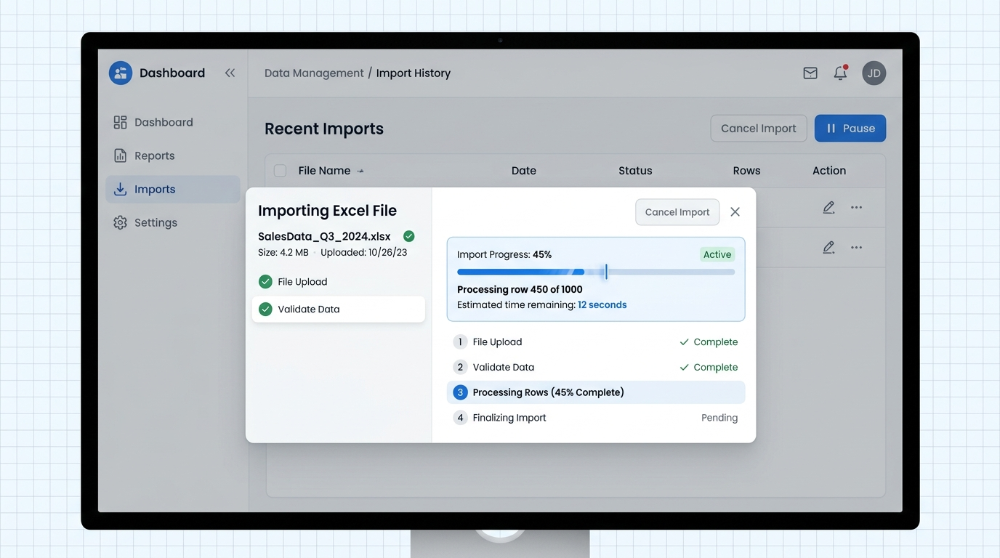

---

## AI for UX：NS02 系統與真實世界的對照 (Match Between System & Real World)

<div class="two-columns">
<div class="prompt-box" style="font-size: 18px;">

### 💡 Prompt 設計框架
* **角色 (Role)**: 產品經理與資深 UX Writer。
* **目的 (Objective)**: 系統文字與警示語必須使用使用者聽得懂的真實世界語言，而非冷冰冰的資料庫錯誤或系統代碼。
* **避免 (Avoid)**: 避免拋出程式技術術語（如 `NullPointerException`）。

</div>
<div class="prompt-box" style="font-size: 18px;">

### 📝 提示詞範本
> 你是一位專為電商平台撰寫文案的 UX Writer。當使用者付款失敗時，請寫出友好的提示。避免使用 "交易異常 403" 或 "Connection timeout" 等技術詞彙，應改用 "目前付款通道繁忙，我們無法完成扣款，請您稍候再試或更換信用卡。" 並提供直接的下一步建議。

</div>
</div>

---


---

## AI for UX：NS03 使用者控制與自由 (User Control & Freedom)

<div class="two-columns">
<div class="prompt-box" style="font-size: 18px;">

### 💡 Prompt 設計框架
* **角色 (Role)**: 互動設計師。
* **目的 (Objective)**: 當使用者不小心做錯操作時（如點錯按鈕、刪除郵件），提供明確的「緊急出口」（如一鍵撤銷、取消）。
* **避免 (Avoid)**: 避免強迫使用者走完流程、沒有退路、或危險動作沒有撤銷機會。

</div>
<div class="prompt-box" style="font-size: 18px;">

### 📝 提示詞範本
> 你是一位網頁互動設計師。當使用者在行事曆上拖拉並移動會議時間後，請設計一個 Toast 提示框，包含 "已將會議移動至 10:00" 以及一個明顯的 "復原 (Undo)" 按鈕，讓使用者能在 5 秒內一鍵撤銷剛才的移動。避免讓使用者必須手動把會議拖拉回去。

</div>
</div>

---

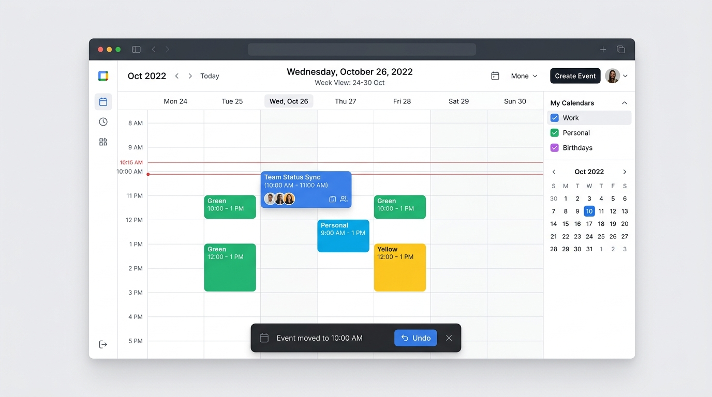

---

## AI for UX：NS04 一致性與標準 (Consistency & Standards)

<div class="two-columns">
<div class="prompt-box" style="font-size: 18px;">

### 💡 Prompt 設計框架
* **角色 (Role)**: 設計系統 (Design System) 維護者。
* **目的 (Objective)**: 確保同一個系統內的按鈕命名、顏色語意、圖示意義及操作手勢保持一致，符合平台通用標準。
* **避免 (Avoid)**: 避免同一個動作在不同頁面有不同名稱（如有的叫「儲存」、有的叫「寫入」、有的叫「確定」）。

</div>
<div class="prompt-box" style="font-size: 18px;">

### 📝 提示詞範本
> 你是一位 UI/UX 專家。請為我們的 SaaS 後台檢視所有的確認動作。請統一使用 "確定" 作為主按鈕文字，並套用綠色（#10b981）語意；取消動作一律使用 "取消" 灰色按鈕。避免在部分頁面使用 "送出"、"確認" 等混淆命名，確保全站一致性。

</div>
</div>

---

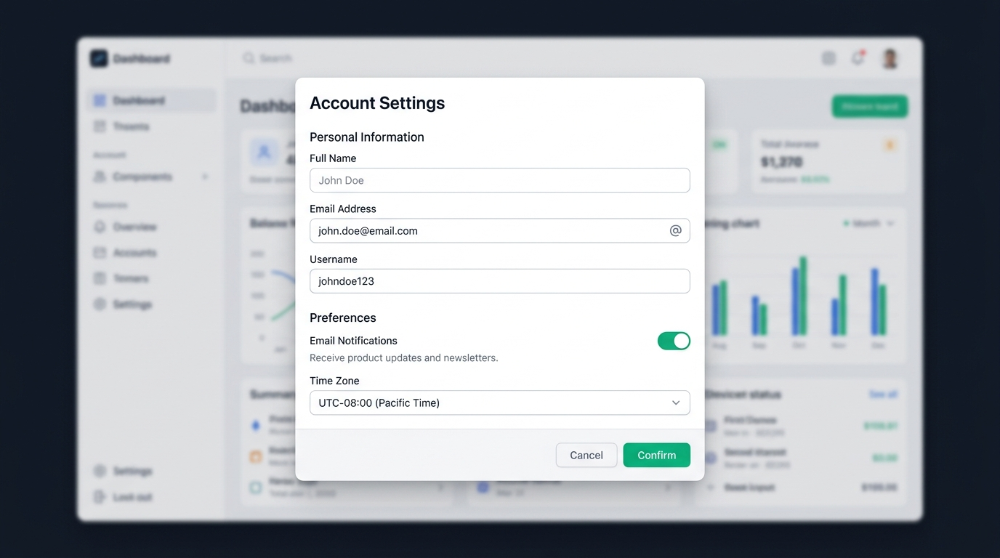

---

## AI for UX：NS05 錯誤預防 (Error Prevention)

<div class="two-columns">
<div class="prompt-box" style="font-size: 18px;">

### 💡 Prompt 設計框架
* **角色 (Role)**: 資深系統架構師與防呆專家。
* **目的 (Objective)**: 在錯誤發生前就先將其阻擋（例如格式不符時無法點擊送出、危險操作需要二次確認）。
* **避免 (Avoid)**: 避免讓使用者輸入錯誤後才噴出警告，特別是破壞性操作（如刪除專案）不能在沒有防護的情況下直接執行。

</div>
<div class="prompt-box" style="font-size: 18px;">

### 📝 提示詞範本
> 你是一位防呆專家。請設計一個 "刪除專案" 的安全機制。當使用者點擊刪除時，不要直接執行，而是彈出一個二次確認視窗，要求使用者手動輸入專案名稱（例如輸入 "MyProject"）才能啟用刪除按鈕。避免讓使用者因誤觸按鈕而導致資料遺失。

</div>
</div>

---

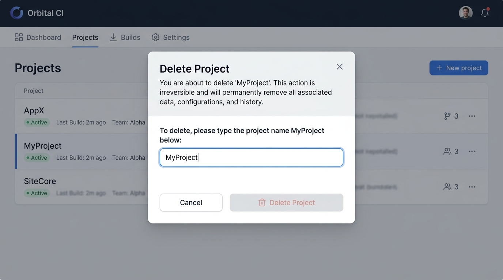

---

## AI for UX：NS06 辨識而非回憶 (Recognition Rather Than Recall)

<div class="two-columns">
<div class="prompt-box" style="font-size: 18px;">

### 💡 Prompt 設計框架
* **角色 (Role)**: 認知心理學與介面設計專家。
* **目的 (Objective)**: 將選項和資訊外顯，降低使用者的記憶負擔。例如：最近搜尋的紀錄、下拉選單的自動完成提示。
* **避免 (Avoid)**: 避免讓使用者回想之前的輸入或去尋找隱藏的設定。

</div>
<div class="prompt-box" style="font-size: 18px;">

### 📝 提示詞範本
> 你是一位搜尋介面設計師。當使用者點擊搜尋框時，請顯示一個浮動視窗，列出 "最近搜尋項目" 與 "熱門推薦標籤"，讓使用者可以直接點擊。避免讓使用者必須自己去回想上一次輸入的關鍵字。

</div>
</div>

---

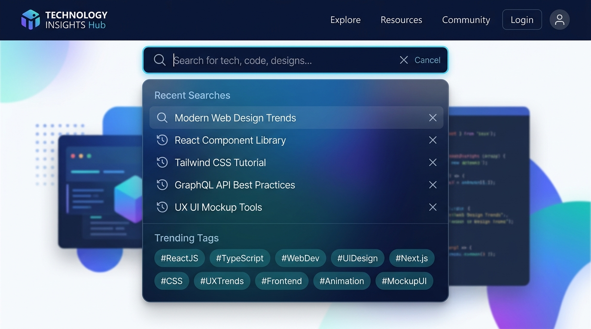

---

## AI for UX：NS07 使用的彈性與效率 (Flexibility & Efficiency of Use)

<div class="two-columns">
<div class="prompt-box" style="font-size: 18px;">

### 💡 Prompt 設計框架
* **角色 (Role)**: 生產力工具 UX 專家。
* **目的 (Objective)**: 為新手提供簡單易懂的引導，同時為專家使用者提供快捷路徑（如鍵盤快捷鍵、批次處理、自訂範本）。
* **避免 (Avoid)**: 避免讓所有操作都必須一步步點擊，這會導致高頻使用者效率極低。

</div>
<div class="prompt-box" style="font-size: 18px;">

### 📝 提示詞範本
> 你是一位負責報表管理系統的 UX 專家。請為資料列表設計 "批次操作"（如批次刪除、批次匯出）。使用者勾選多個項目後，上方應出現浮動操作列，並支援快捷鍵（如按 Delete 鍵觸發批次刪除確認）。避免讓使用者必須點進每一筆資料單獨刪除。

</div>
</div>

---

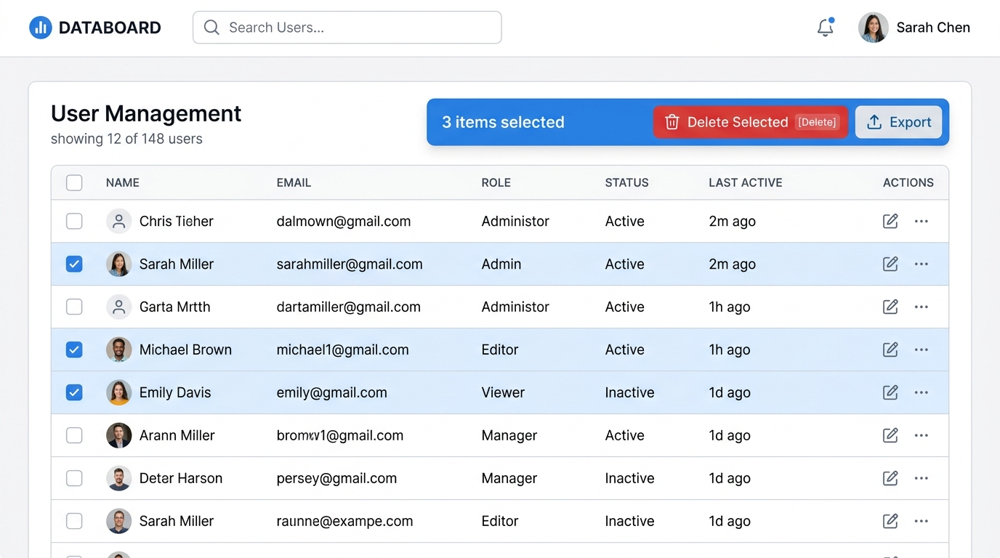

---

## AI for UX：NS08 極簡與美觀設計 (Aesthetic & Minimalist Design)

<div class="two-columns">
<div class="prompt-box" style="font-size: 18px;">

### 💡 Prompt 設計框架
* **角色 (Role)**: 視覺傳達與 UI 設計師。
* **目的 (Objective)**: 移除不必要的元素、低頻資訊或裝飾性干擾，確保核心資訊有足夠的負空間與高易讀性。
* **避免 (Avoid)**: 避免將所有資訊一次塞在同一個畫面中（造成視覺噪音過載）。

</div>
<div class="prompt-box" style="font-size: 18px;">

### 📝 提示詞範本
> 你是一位追求極簡主義的 UI 設計師。請重新設計這個儀表板。請過濾掉 80% 的次要監控數據，僅保留最重要的 3 個指標，並使用大字體與大量的留白（White Space）。其餘次要數據應收納至 "詳細報告" 展開按鈕中。避免把所有圖表和數字擠在同一頁。

</div>
</div>

---

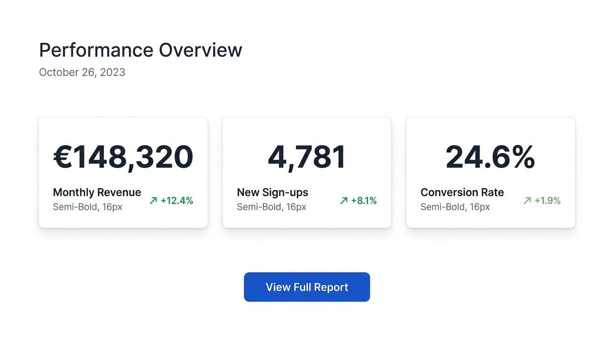

---

## AI for UX：NS09 協助使用者辨識、診斷並從錯誤中復原 (Help Users Recognize, Diagnose, & Recover from Errors)

<div class="two-columns">
<div class="prompt-box" style="font-size: 18px;">

### 💡 Prompt 設計框架
* **角色 (Role)**: 客服體驗與 UX 技術 Writer。
* **目的 (Objective)**: 錯誤訊息必須用簡單直白的語言指出問題所在，並明確給予「解決步驟」或「重試機會」。
* **避免 (Avoid)**: 避免只顯示模糊的錯誤代碼（如 `Error 0x80070005`）而沒有任何修復建議。

</div>
<div class="prompt-box" style="font-size: 18px;">

### 📝 提示詞範本
> 你是一位軟體易用性專家。請重寫上傳檔案失敗的錯誤提示。如果使用者上傳了不支援的格式（如 PDF，而系統只接受 PNG/JPG），請顯示："上傳失敗：不支援此檔案格式。我們只接受 PNG 或 JPG 格式（最大 5MB）。請將您的檔案轉檔後重新上傳，或點此 [查看支援格式說明] 連結。" 避免使用 "Format invalid" 這種無建設性的文字。

</div>
</div>

---

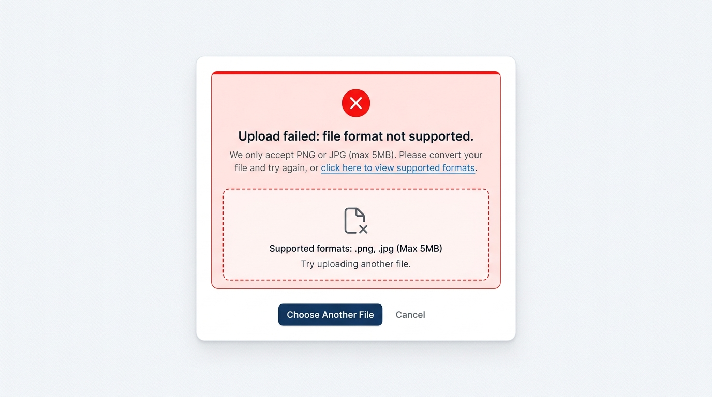

---

## AI for UX：NS10 說明文件與輔助說明 (Help & Documentation)

<div class="two-columns">
<div class="prompt-box" style="font-size: 18px;">

### 💡 Prompt 設計框架
* **角色 (Role)**: 技術寫作與引導設計專家。
* **目的 (Objective)**: 設計易於檢索、任務導向且簡潔的情境式引導說明，幫助使用者快速上手。
* **避免 (Avoid)**: 避免提供冗長無趣的整本操作手冊，或完全沒有任何操作說明。

</div>
<div class="prompt-box" style="font-size: 18px;">

### 📝 提示詞範本
> 你是一位新手引導設計專家。請為我們的 [智慧報稅系統] 設計一個 Heuristic 10 (Help and Documentation) 的引導方案。當使用者首次進入『薪資申報』頁面時，設計一個輕量級的步驟引導 (Walkthrough Tooltip) 說明如何匯入扣繳憑單，並提供常見問答連結，避免拋出 20 頁的說明書讓使用者自己閱讀。

</div>
</div>

---

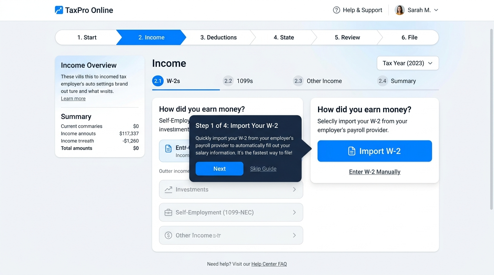

---

<!-- id: ux-ch03-ccq1 -->
## 🙋 概念核對問答 (CCQ1)

<div class="two-columns-64">
<div class="card">

### ❓ API 例外處理與使用者感知 (NS09)
**[ 是 / 否 ]**

> **「在要求 AI 生成前端資料請求組件時，提示詞明確要求『當 API 發生 500 伺服器錯誤時，必須使用 `try...catch` 捕捉並在控制台輸出 `console.error(err)`』，在軟體工程與 UX 層面上已完整滿足了 NS09（協助辨識與復原錯誤）的要求。」**

請判斷上述說法是否正確，並思考對使用者介面的影響。

[線上作答](https://nlhsueh.github.io/nickedupocket/#/student/ux-ch03-ccq1)

  

</div>
<div class="card-img">


</div>
</div>

---

<!-- id: ux-ch03-ccq2 -->
## 🙋 概念核對問答 (CCQ2)

<div class="two-columns-64">
<div class="card">

### ❓ 高保真提示詞的多維度 UX 約束
在要求 AI 生成「多步驟註冊表單」時，以下哪一段提示詞最能同時滿足 **NS01 (狀態)** 、 **NS03 (控制權)** 與 **NS05 (錯誤預防)** ？

* **(A)** 「請用 React + Tailwind 寫一個美觀的註冊表單，支援深色模式。」
* **(B)** 「提供步驟進度條；每步均有『上一步』且保留資料；欄位 blur 時即時驗證並禁用未過關的『下一步』按鈕。」
* **(C)** 「表單最後提供送出按鈕，送出失敗時彈出 Toast `Submission failed`。」
* **(D)** 「使用 LocalStorage 快取所有欄位，並提供一鍵重設按鈕。」

[線上作答](https://nlhsueh.github.io/nickedupocket/#/student/ux-ch03-ccq2)

  

</div>
<div class="card-img">


</div>
</div>

---

<!-- id: ux-ch03-qa1 -->
## 🙋 問答討論 (QA1)

<div class="two-columns-64">
<div class="card">

### 用 AI 設計辦公室 Web 點餐系統
請使用 AI 輔助設計辦公室 Web 點餐系統，並分享你的提示詞與生成觀察：

1. **初版生成 vs. UX 優化**：比較「無 Prompt 限制」與「加入尼爾森原則約束」後的程式碼與介面差異。
2. **滿足哪些易用性原則**：你的 Master Prompt 中加入了哪些 UX 約束（如 NS01 狀態、NS03 控制權、NS05 錯誤預防）？
3. **心得與發現**：AI 生成的 UX 細節是否符合預期？有哪些值得注意的盲點？

[線上作答](https://nlhsueh.github.io/nickedupocket/#/student/ux-ch03-qa1)

  

</div>
<div class="card-img">


</div>
</div>

---

<!-- _class: part-cover -->
# Part 4: UX for AI
## Nielsen Heuristics in the AI Era (AI 產品的體驗設計心法)

---

## AI 系統與應用的全面普及

<div class="two-columns">
<div class="card">

### 💡 什麼是 AI 系統 (AI Systems)？
* **非單純的大語言模型 (LLM)** ：它不是叫使用者去跟 ChatGPT/Claude 網頁版聊天，而是將 AI 能力深度封裝於工作流中的 **應用產品** 。
* **以人為本的系統整合** ：AI 扮演背景運算、自動完成、智能建議或自主代理人 (Agent) 的角色，提供直覺且自然的互動介面。

</div>
<div class="card">

### 🎯 AI 系統的關鍵應用範疇
* **智慧輔助與自動完成 (Co-piloting)** ：在開發或創作中給予行內建議。
* **上下文關聯操作 (Contextual Actions)** ：根據使用者目前選取的內容主動提供功能。
* **多模態智慧轉換 (Multimodal)** ：將文字、圖像、語音、代碼等多種媒介進行無縫轉譯。

</div>
</div>

---

## 知名 AI 系統與應用案例 (Famous AI Systems)

<div class="two-columns">
<div class="card" style="font-size: 21px;">

* 💻 **GitHub Copilot** ：整合於 IDE 的 AI 結對程式員。透過灰色預測字元 (Ghost Text) 在行內即時推薦代碼，極大提升開發效率。
* 🎨 **Midjourney / DALL-E 3** ：文字生成圖像系統。將複雜的藝術創作過程簡化為 Prompt 對話，從根本改變了創意設計流程。
* 📝 **Notion AI** ：將 AI 融入文件編輯器的右鍵/斜線選單。提供選取文字一鍵潤飾、翻譯、總結或擴寫的情境功能。

</div>
<div class="card" style="font-size: 21px;">

* 🌐 **DeepL** ：基於神經網絡的 AI 機器翻譯系統。具備極強的上下文理解力，能生成自然流暢的商業與學術翻譯。
* 🚗 **Tesla FSD (Full Self-Driving)** ：車載自動駕駛系統。採用純視覺神經網路，為車主提供端到端 (End-to-End) 的輔助駕駛體驗。
* 🔬 **AlphaFold** ：蛋白質結構預測系統。為生物學家提供高精度預測，將傳統實驗需耗時數年的工作縮短至數秒。

</div>
</div>

---


## AI 時代的 UX 挑戰與心法

> 面對大語言模型與生成式 AI（黑盒子、思考延遲、幻覺、輸出不確定性），如何以人為本重塑可用性原則？

<div class="three-columns">
<div class="card">

### 1. 緩解等待焦慮
* 拒絕靜態 Loading
* 打字機 Streaming 輸出
* 展開式 Thinking Steps

</div>
<div class="card">

### 2. 消除空白框恐懼
* 拒絕單一空白對話框
* 提示詞晶片 (Prompt Chips)
* 反白文字 AI 快捷懸浮球

</div>
<div class="card">

### 3. 對抗不確定性
* 隨時中斷生成 (Stop)
* 歷史版本輪播 (Carousel)
* 幻覺防範與優雅降級

</div>
</div>

---

## Slide 01: AI and NS01 (系統狀態能見度) - UX 設計心法

> *“系統應在合理時間內，透過適當的反饋，隨時讓使用者掌握目前狀態。”*

<div class="two-columns-73">
<div class="card" style="font-size: 21px;">

### 💡 AI 產品設計心法 (UX for AI)
* **緩解 AI 的「思考延遲（Latency）」：** 
  * 避免只用靜態的「Loading...」，改用 **打字機效果（Streaming）** 即時輸出內容。
  * 引入 **展開式「思考步驟（Thinking Steps）」** （如 DeepSeek/O1 的 CoT 摺疊面板），讓使用者清楚 AI 正在進行「聯網搜尋」、「閱讀文件」或「執行代碼」。
* **多步驟 AI 工作流（Multi-Agent Workflows）：**
  * 使用狀態節點圖（Node Graph）或微步進器，向使用者顯示目前 AI 助理正在進行 5 個步驟中的第 2 步（例如：生成草稿 → 翻譯 → 校對）。

</div>
<div class="card" style="font-size: 21px;">

### 🔍 真實系統應用案例
* **DeepSeek-R1 / OpenAI o1** 思考摺疊面板。
* AI 進行推理時，介面會呈現一個名為 `Thought` 或 `Thinking` 的摺疊區塊，即時顯示其思考步驟（ **Chain of Thought, CoT** ）。使用者可展開查看詳細邏輯，以緩解等待焦慮。

</div>
</div>

---

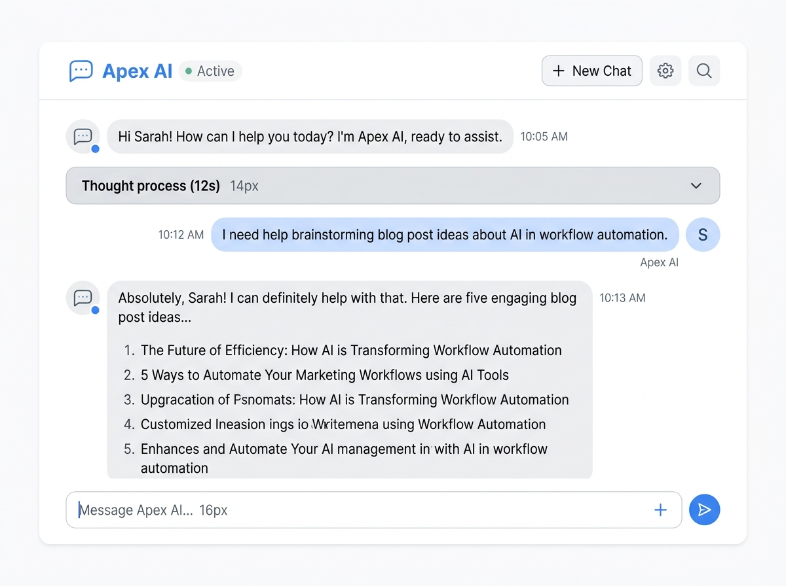

---

## Slide 01: AI and NS01 (系統狀態能見度) - 建議 Prompt

<div class="prompt-box" style="font-size: 19px;">

### 📝 建議 Prompt (AI for UX)
> 「我正在開發一個 [AI 簡報生成功能]。當使用者輸入主題後，AI 需要進行：資料檢索、大綱生成、內容撰寫、投影片排版等 4 個耗時步驟。
> 請為我設計符合 **Visibility of System Status** 原則的 UI 反饋機制：
> 1. 請規劃每一個步驟的狀態文案（如：正在尋找資料... 預估剩餘 10 秒）。
> 2. 請提供前端 React 或 Vue 的狀態變數（Variables，如 `isSearching`, `progressPercent`）之設計邏輯，讓工程師能直接套用。」

</div>

---

## Slide 02: AI and NS02 (真實世界與系統的對應) - UX 設計心法

> *“系統應說使用者的日常語言，而非工程師的技術術語，並遵循真實世界的邏輯習慣。”*

<div class="two-columns-73">
<div class="card" style="font-size: 21px;">

### 💡 AI 產品設計心法 (UX for AI)
* **將「模型參數」具象化：**
  * 避免在一般介面直接呈現 Temperature、Top_p、Token Limit 等大模型底層術語。
  * 將技術參數轉化為直覺的「擬真滑桿」或「單選按鈕」（例如：將 Temperature 轉化為「💡 創意表現：保守 → 豐富想像力」）。
* **擬真隱喻與控制：**
  * 使用「副駕駛（Copilot）」或「助理（Assistant）」的擬人化視覺隱喻，讓使用者知道它可以對話，而非面對一個冰冷的 Command Line。

</div>
<div class="card" style="font-size: 21px;">

### 🔍 真實系統應用案例
* **Notion AI** 的「變更語氣」下拉選單。
* 後台模型參數如 `Temperature` （溫度）對大眾而言過於技術化。 Notion AI 將其轉化為直覺的「語氣調整」（例如：專業、日常、幽默、友善），更貼近使用者的日常語音習慣。

</div>
</div>

---

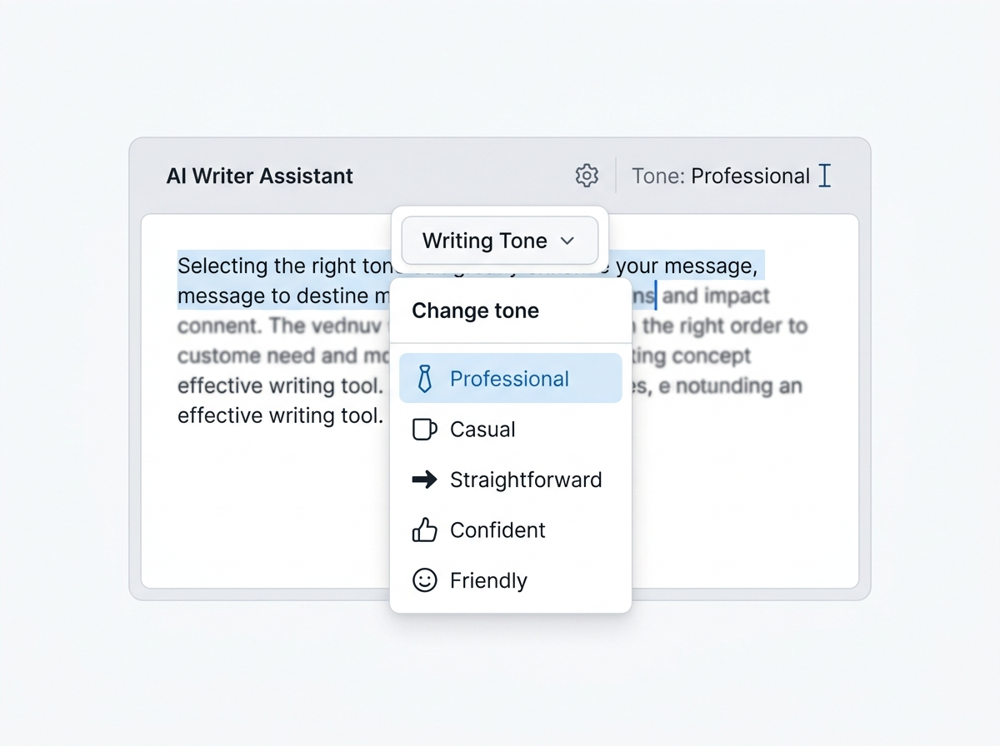

---

## Slide 02: AI and NS02 (真實世界與系統的對應) - 建議 Prompt

<div class="prompt-box" style="font-size: 19px;">

### 📝 建議 Prompt (AI for UX)
> 「我們正在為非技術背景的主管開發一個 [AI 行銷文案助手]。大模型後台有 `Temperature`、`Presence Penalty`、`Frequency Penalty` 等參數需要調整。
> 請基於 **Match Between System and Real World** 原則，幫我重新設計這套設定介面：
> 1. 請將這些參數重新命名，換成商務人士直覺、大眾化的字眼（例如：『文案創意度』等）。
> 2. 請描述介面互動方式，並附上調整不同等級時，文字生成的模擬效果對照範例。」

</div>

---

## Slide 03: AI and NS03 (使用者控制與自由) - UX 設計心法

> *“使用者常會誤觸功能，系統必須提供明確的『緊急出口』與隨時能復原的 Undo/Redo 控制權。”*

<div class="two-columns-64">
<div class="card" style="font-size: 21px;">

### 💡 AI 產品設計心法 (UX for AI)
* **對抗 AI 的不確定性：**
  * 提供隨時 **「中斷生成（Stop Generating）」** 的按鈕，防止 AI 輸出過長或失控的內容。
  * 引入 **「版本輪播（Version Carousel）」** ：在 AI 生成的結果旁，提供 1/3 的左右切換鍵，允許使用者對比並找回前幾次生成的滿意版本。
  * **Prompt 局部編輯** ：使用者可以編輯對話歷史中的任何一則 Prompt，點擊後系統自動在該節點分支「重新生成」，不破壞原始對話。

</div>
<div class="card" style="font-size: 21px;">

### 🔍 真實系統應用案例
* **ChatGPT / Claude** 的「中斷生成」與「歷史版本切換」。
* 當 AI 輸出的內容偏離預期或陷入無限迴圈時，使用者可隨時點擊「■ 中斷生成 (Stop Generating)」按鈕；生成完成後，若對答案不滿意，可使用 `1/2` 左右按鈕切換並對比歷史生成的不同版本。

</div>
</div>

---

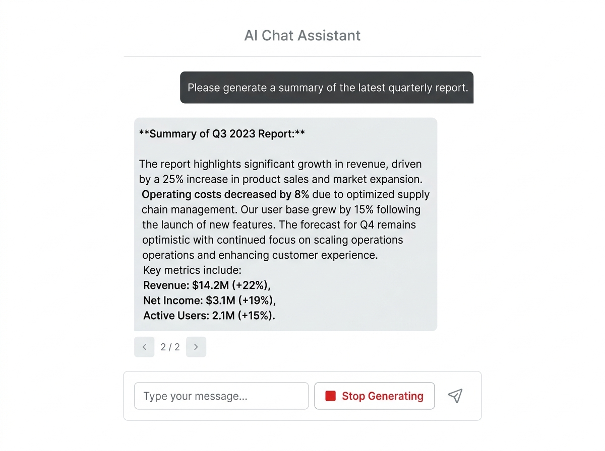

---

## Slide 03: AI and NS03 (使用者控制與自由) - 建議 Prompt

<div class="prompt-box" style="font-size: 19px;">

### 📝 建議 Prompt (AI for UX)
> 「當我們的 [AI 程式碼生成器] 在輸出一段 50 行的代碼時，使用者發現方向錯了，或者大模型陷入了無限循環。
> 請基於 **User Control and Freedom** 原則，為我設計介面的控制流程：
> 1. 設計一個隨時『中斷生成』的 UI 機制（包含視覺提示）。
> 2. 當使用者發現 AI 修改了他們原本的程式碼，應如何設計『一鍵還原 (Revert)』或『顯示差異對照 (Diff View)』的選項，以降低修改錯誤的焦慮。」

</div>

---

## Slide 04: AI and NS04 (一致性與標準) - UX 設計心法

> *“使用者不應懷疑不同的詞彙、操作或位置是否代表同一件事。需遵循平台既有慣例。”*

<div class="two-columns-73">
<div class="card" style="font-size: 21px;">

### 💡 AI 產品設計心法 (UX for AI)
* **建立 AI 互動的「新標準」：**
  * 雖然 AI 介面日新月異，但已建立起業界標準（Standards），設計時必須遵循：
    * `Cmd + K` 或 `Ctrl + K` 喚醒全域 AI 搜尋/指令面板。
    * 輸入框按 `Enter` 為發送，`Shift + Enter` 為換行。
    * 每一則 AI 回覆的底部必備「複製（Copy）」與「重新生成（Regenerate）」圖標。
* **反饋機制的一致性：** 全站統一使用「👍 / 👎」或「星星評分」收集使用者對 AI 回覆的滿意度，不可隨意更換評分標準。

</div>
<div class="card" style="font-size: 21px;">

### 🔍 真實系統應用案例
* **Cursor / ChatGPT** 的標準輸入框按鍵設計。
* 全網 AI 助手已形成通用的操作標準：使用 `Enter` 鍵發送、 `Shift + Enter` 鍵進行換行；回覆內容底部一致使用「📋 複製」與「👍/👎 回饋評分」圖標。

</div>
</div>

---

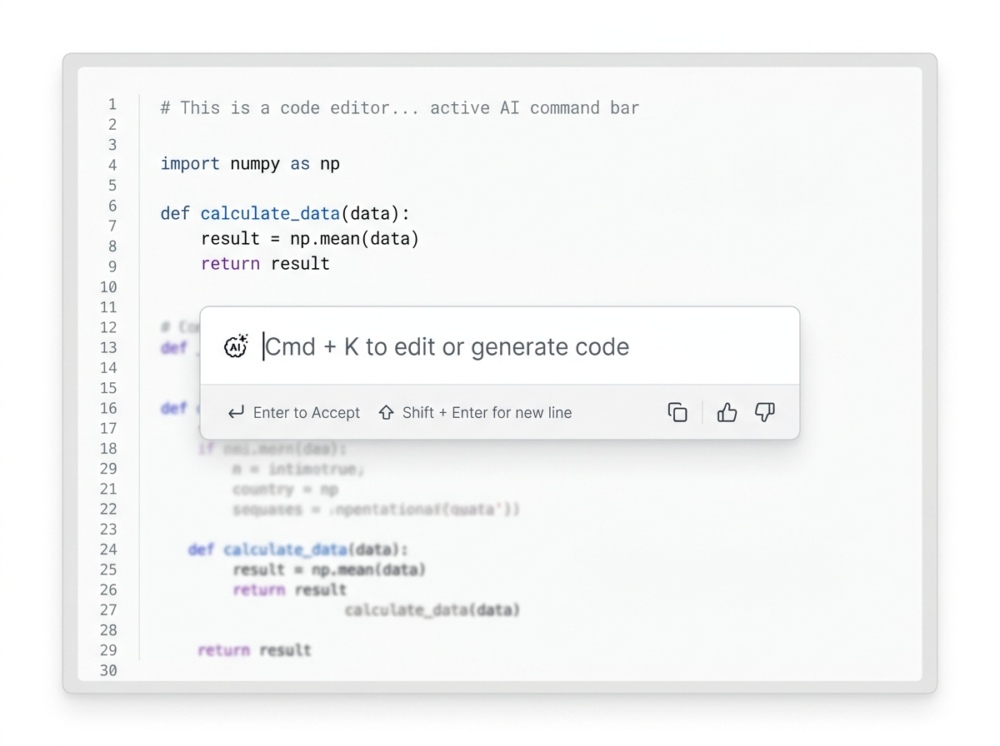

---

## Slide 04: AI and NS04 (一致性與標準) - 建議 Prompt

<div class="prompt-box" style="font-size: 19px;">

### 📝 建議 Prompt (AI for UX)
> 「我們正在為企業內部多個不同業務系統（如：HR 系統、財務系統）設計內嵌的 [AI 對話助理]。
> 請基於 **Consistency and Standards** 原則，幫我制定一套跨系統的 AI 互動規範（UI Style Guide）：
> 1. 請定義 AI 輸入框的通用功能與快捷鍵規範（如發送鍵、清除鍵、歷史紀錄按鈕的位置）。
> 2. 請統一一套收集 AI 回覆品質反饋（👍/👎 評分）以及錯誤提示的共通 UI 樣式。」

</div>

---

## Slide 05: AI and NS05 (錯誤預防) - UX 設計心法

> *“比起提供好用的錯誤訊息，更好的設計是防範錯誤於未然（預防不合理的輸入或操作）。”*

<div class="two-columns-64">
<div class="card" style="font-size: 21px;">

### 💡 AI 產品設計心法 (UX for AI)
* **預防「糟糕輸入導致垃圾輸出（Garbage in, Garbage out）」：**
  * 一般使用者極度不擅長寫 Prompt。提供 **「提示詞晶片（Prompt Chips/Suggestions）」** 或模板（Templates），點擊即代入標準提示。
  * 輸入框中預設豐富的 **Placeholder 提示字** （例如：試試看輸入：『幫我把這段報告翻譯成日文...』），引導正確輸入。
* **智慧 Prompt 預檢（Pre-flight Check）：** 當檢測到使用者上傳了不支援的檔案格式，或輸入的 Prompt 語意含混時，在發送前以「Inline Suggestion」主動提醒。

</div>
<div class="card" style="font-size: 21px;">

### 🔍 真實系統應用案例
* **ChatGPT / Claude** 的「提示字晶片 (Prompt Chips)」與「預設預檢」。
* 一般使用者不擅長撰寫 Prompt 。輸入框下方預設提供常用範本的晶片（例如「分析數據」、「撰寫郵件」），點擊即可套用；且當上傳不支援的檔案格式時，發送按鈕會轉為禁用狀態，防止無效點擊。

</div>
</div>

---


---

## Slide 05: AI and NS05 (錯誤預防) - 建議 Prompt

<div class="prompt-box" style="font-size: 19px;">

### 📝 建議 Prompt (AI for UX)
> 「使用者在使用我們的 [AI 圖表分析助理] 時，常常上傳了不支援的檔案格式（例如上傳了 `.rar` 壓縮檔，但系統僅支援 `.csv` 試算表），或者直接輸入了不具實質內容的 Prompt（如『哈囉』、『幫我做圖』）。
> 請基於 **Error Prevention** 原則，幫我設計一套防範機制的互動邏輯：
> 1. 在使用者點選發送前，如何進行檔案與文字的智慧預檢，並給予就地提示？
> 2. 設計一個 Prompt 引導輸入區，利用 Prompt Chips 與選單功能限制使用者的不當輸入。」

</div>

---

## Slide 06: AI and NS06 (易於識別，而非憑空記憶) - UX 設計心法

> *“讓資訊、動作與選項保持可見，降低使用者的記憶負荷。使用者不應背誦指令。”*

<div class="two-columns-73">
<div class="card" style="font-size: 21px;">

### 💡 AI 產品設計心法 (UX for AI)
* **告別「萬惡的空白輸入框（Empty State Fear）」：**
  * 不要只給使用者一個空無一物的對話框，這會帶來極高的認知摩擦（Cognitive Friction）。
  * 畫面上應常駐 **「最近使用的 Agent 助理」** 、 **「常用 Prompt 歷史紀錄」** 、或一鍵調用最近編輯的檔案。
* **情境選單（Contextual Actions）：**
  * 當使用者在網頁上反白選取一段文字時，立刻在游標旁彈出「AI 快捷懸浮球」（如：翻譯、總結、潤飾），讓使用者「看得到就能點」，不需手動複製貼上。

</div>
<div class="card" style="font-size: 21px;">

### 🔍 真實系統應用案例
* **Notion AI** 的「文字選取 AI 懸浮選單」。
* 當使用者在頁面中反白選取任何文字時，系統會自動在游標旁彈出懸浮工具列，提供翻譯、摘要、重寫等 AI 情境按鈕。使用者「看見即可點選」，不需要回憶 `/` 指令或複製貼上。

</div>
</div>

---

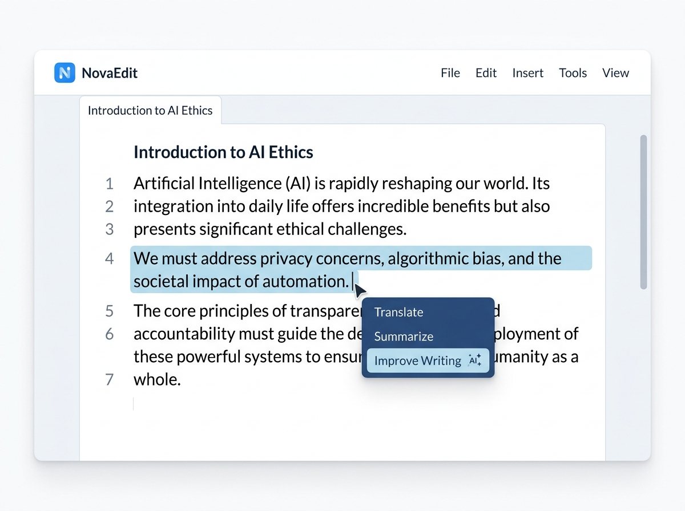

---

## Slide 06: AI and NS06 (易於識別，而非憑空記憶) - 建議 Prompt

<div class="prompt-box" style="font-size: 19px;">

### 📝 建議 Prompt (AI for UX)
> 「我們正在重構一個 [AI 寫作助手]。目前使用者進入系統後，只有一個全黑的空白輸入框，必須自行回想所有 AI 指令（例如：/summarize, /translate）。
> 請遵循 **Recognition Rather Than Recall** 原則：
> 1. 設計一個在輸入框下方、可橫向滑動的常用指令卡片區。
> 2. 當使用者在左側打字區選取特定段落時，設計一個在右側或游標旁彈出的快捷工具列（Contextual Menu），列出最適合該段落的 AI 工具選單。」

</div>

---

## Slide 07: AI and NS07 (使用彈性與效率) - UX 設計心法

> *“系統應能滿足新手與專家的不同需求。提供快捷操作以提高效率。”*

<div class="two-columns-64">
<div class="card" style="font-size: 21px;">

### 💡 AI 產品設計心法 (UX for AI)
* **專為高頻使用者設計的快捷路徑（Shortcuts）：**
  * **斜線指令（Slash Commands）：** 輸入 `/` 即可快速喚起功能選單（如 Notion AI 或 Slack）。
  * **@Mentions 跨領域調用：** 輸入 `@` 快速指派特定專長的 AI 代理人或引用外部知識庫（如 `@Designer`、`@CodingBot`）。
  * **一鍵自訂（Prompt Presets）：** 允許使用者將自己調校好、最常用的長 Prompt 存檔，設定成自訂按鈕（如：『以專業金融顧問的口吻回覆』快捷鍵）。

</div>
<div class="card" style="font-size: 21px;">

### 🔍 真實系統應用案例
* **Cursor** 的 `@-mentions` 與 Notion AI 的 `/` 斜線指令。
* 針對高頻專業使用者， Cursor 允許在輸入框輸入 `@` 快速調用檔案 ( `@Files` )、資料夾 ( `@Folders` ) 或網頁 ( `@Web` )； Notion AI 支援輸入 `/` 快速喚起 AI 寫作助手，極大提升專家的操作效率。

</div>
</div>

---

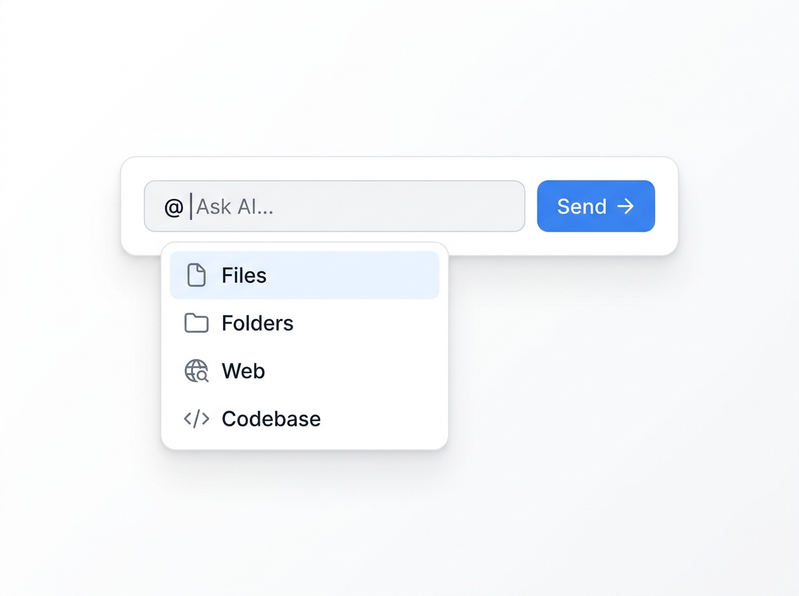

---

## Slide 07: AI and NS07 (使用彈性與效率) - 建議 Prompt

<div class="prompt-box" style="font-size: 19px;">

### 📝 建議 Prompt (AI for UX)
> 「我們需要為 [AI 智能合約審查系統] 同時設計給『新手（一般法務助理）』與『專家（資深律師）』使用的介面。
> 請遵循 **Flexibility and Efficiency of Use** 原則，為我規劃功能：
> 1. 針對新手，提供步驟式點選審查（精靈引導）。
> 2. 針對專家，設計一個可通過鍵盤快捷操作的『命令控制台』（例如輸入 `/review` 快速審查、輸入 `@compliance` 調用合規知識庫），並支持自訂 Prompt 範本的快捷按鈕。」

</div>

---

## Slide 08: AI and NS08 (美學與簡約設計) - UX 設計心法

> *“投影片與介面不應包含無關或極少需要的資訊。每一個額外的資訊都會與重要資訊競爭注意波段。”*

<div class="two-columns-73">
<div class="card" style="font-size: 21px;">

### 💡 AI 產品設計心法 (UX for AI)
* **避免 AI「資訊轟炸（Information Overload）」：**
  * AI 生成內容空間有限且往往極長。避免一次性將幾千字全部扔給使用者。
  * **預設折疊與展開（Show More）：** 對於長篇文章、代碼塊或詳細的分析過程，預設僅顯示前 3 行與摘要，使用者有興趣再展開。
  * **善用資訊層級：** 使用粗體、高亮、標籤晶片和適度的卡片區塊區隔資訊，保持版面的整潔與高度可讀性。

</div>
<div class="card" style="font-size: 21px;">

### 🔍 真實系統應用案例
* **Claude Artifacts** 獨立雙面板設計。
* Claude 將生成的長篇程式碼、網頁或圖表等複雜內容，自動拆分至右側獨立的預覽面板（ **Artifacts** ）中，避免左側對話框被幾千行的程式碼淹沒，保持版面極簡與高度可讀性。

</div>
</div>

---

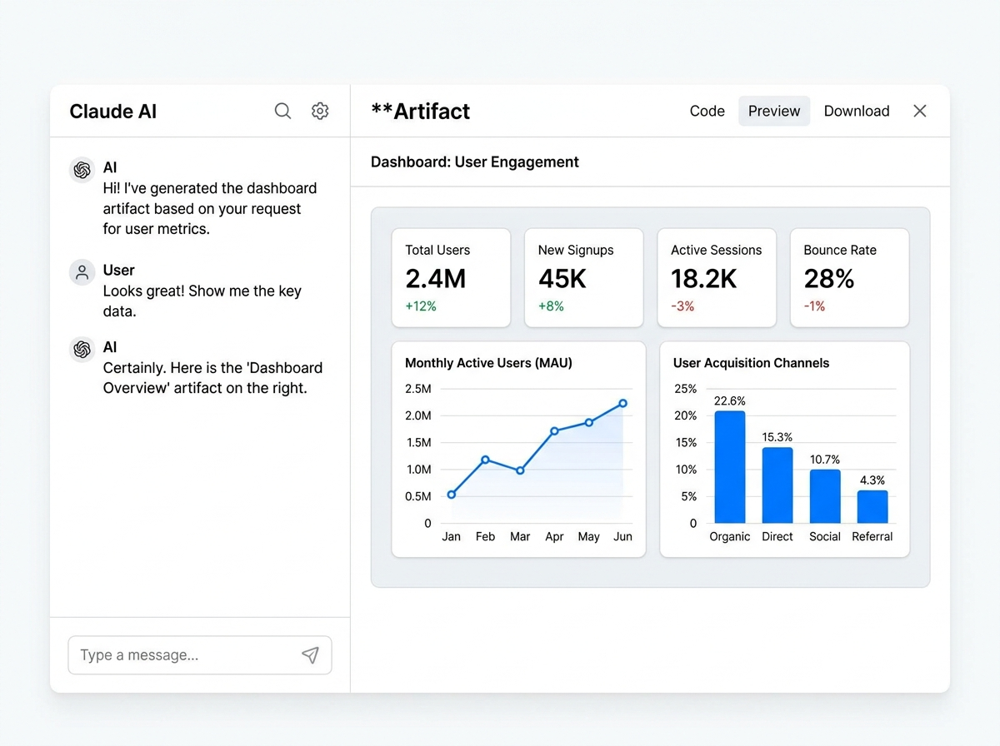

---

## Slide 08: AI and NS08 (美學與簡約設計) - 建議 Prompt

<div class="prompt-box" style="font-size: 19px;">

### 📝 建議 Prompt (AI for UX)
> 「當我們的 [AI 商務分析師] 完成一個市場調研後，會自動生成一份包含數據表格、長篇分析、參考文獻、與 5 個圖表在內的巨大報告。目前的介面將這份報告像純文字檔一樣直接瀑布流灌入畫面，視覺非常混亂。
> 請遵循 **Aesthetic and Minimalist Design** 原則，重新排版此報告介面：
> 1. 請提供折疊與層級化方案，將文獻與長段落數據進行智慧收納。
> 2. 設計一個極簡的『資訊看板（Dashboard）』，只突出 3 個關鍵數據點，其他細節隱藏在點擊互動後呈現。」

</div>

---

## Slide 09: AI and NS09 (協助辨識、診斷與從錯誤中復原) - UX 設計心法

> *“錯誤訊息應以清晰白話呈現，精確指出問題，並建設性地提供具體解決方案。”*

<div class="two-columns-73">
<div class="card" style="font-size: 21px;">

### 💡 AI 產品設計心法 (UX for AI)
* **優雅防範 AI「幻覺（Hallucination）」與「失效」：**
  * 當 AI 的回答可能不準確或不符合事實時，介面應明確標記（如：「⚠️ 此回答由 AI 生成，關鍵資訊請交叉核對」），並提供快速重新生成。
* **API 連線/超時報錯優雅降級（Graceful Degradation）：**
  * 當 AI 服務過載（如 Token 耗盡、超時斷線），不要只拋出「HTTP 502 Bad Gateway」等代碼。
  * 應白話告訴使用者：「目前 AI 連線人數眾多，您的 Prompt 檔已自動儲存，您可以[一鍵重試]。」

</div>
<div class="card" style="font-size: 21px;">

### 🔍 真實系統應用案例
* **Cursor** 的終端機錯誤「Fix with AI」按鈕。
* 當編譯或執行出錯時， Cursor 在終端機輸出區直接提供「Fix with AI」一鍵修復按鈕。點擊後 AI 會讀取錯誤訊息並自動生成修正方案，協助使用者快速從錯誤中復原，而非僅僅拋出看不懂的錯誤代碼。

</div>
</div>

---

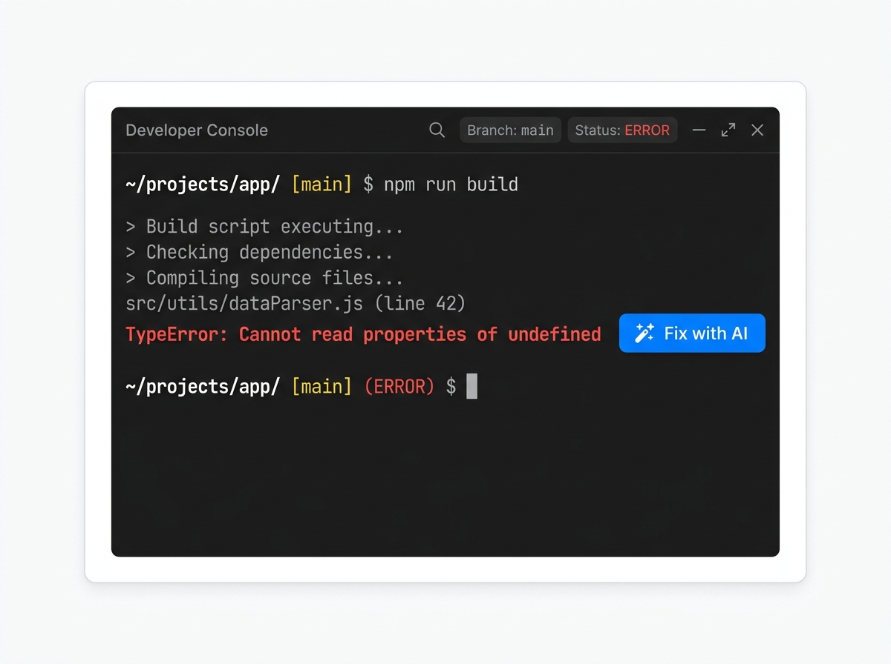

---

## Slide 09: AI and NS09 (協助辨識、診斷與從錯誤中復原) - 建議 Prompt

<div class="prompt-box" style="font-size: 19px;">

### 📝 建議 Prompt (AI for UX)
> 「當我們的 [AI 自動翻譯器] 在處理使用者上傳的 50MB 超大型 PDF 檔時，因為超時（Timeout）導致系統斷開連線。
> 請遵循 **Help Users Recognize, Diagnose, and Recover from Errors** 原則，幫我撰寫一套 UI 錯誤彈窗（Error Dialog）的文案與互動：
> 1. 說明原因（避免艱深代碼）。
> 2. 提供具體復原手段（如：建議使用者一鍵將文件自動拆分成 3 個小檔案上傳、或一鍵重試）。」

</div>

---

## Slide 10: AI and NS10 (說明文件與輔助說明) - UX 設計心法

> *“雖然不需文件就能操作系統是最好的，但隨時提供易於檢索、聚焦任務且簡潔的說明文件依然不可或缺。”*

<div class="two-columns-73">
<div class="card" style="font-size: 21px;">

### 💡 AI 產品設計心法 (UX for AI)
* **「可解釋性 AI」（XAI, Explainable AI）即是最好的說明：**
  * AI 產生的推薦或決策，往往像個黑盒子。
  * 介面中必須在決策旁提供 **「解釋說明（Explain this recommendation）」** 的互動提示。例如：「為什麼我會看到這筆推薦？因為您在 3 天內曾瀏覽過 Python 與 UI 設計相關職缺。」這就是 AI 時代的「說明文件」。
* **情境化動態引導（Context-sensitive Copilot）：**
  * 揚棄傳統的大部頭 Help PDF。在輸入框旁設計輕量化的「互動式提示指南」，引導使用者逐步學會如何精準寫出「好 Prompt」。

</div>
<div class="card" style="font-size: 21px;">

### 🔍 真實系統應用案例
* **Perplexity AI / ChatGPT Search** 的數字引文腳註。
* AI 生成的內容可能存在幻覺。介面在每個事實論點旁標記數字腳註（例如 `[1]` , `[2]` ），滑鼠懸停或點擊可顯示該資訊的原始新聞或網頁來源，作為可信度的即時輔助說明。

</div>
</div>

---

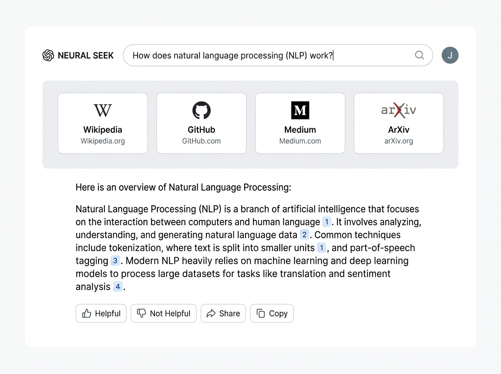

---

## Slide 10: AI and NS10 (說明文件與輔助說明) - 建議 Prompt

<div class="prompt-box" style="font-size: 19px;">

### 📝 建議 Prompt (AI for UX)
> 「我們正在為一個 [AI 個人理財投資分析助理] 設計新手引導。
> 請遵循 **Help and Documentation** 原則，幫我設計一套引導使用者如何對話的互動方案：
> 1. 設計一個 interactive tooltip（互動提示框），教導使用者如何包含『投資預算、風險偏好、時間軸』三個核心要素來向 AI 提問。
> 2. 提供 3 個新手一鍵套用的理財 Prompt 範本。」

</div>

---

## 實用講義精進技巧 (師生互動建議)

<div class="two-columns">
<div class="card">

### 1. 「Before & After」對比法
* **不好的傳統 AI 介面** ：
  * 空白對話框、缺少指引
  * 毫無狀態提示、死等 30 秒
  * 拋出 Raw Exception Log
* **現代 UX for AI 介面** ：
  * 打字機 Streaming + 思考步驟 CoT
  * 豐富 Prompt 晶片與懸浮快捷選單
  * 友善降級與可解釋性 (XAI)

</div>
<div class="card">

### 2. 課堂即時測試與互動
* 讓學生在課堂中拿出手機，打開主流 AI 工具（ChatGPT, Claude, Cursor, Notion AI）：
  * 找出它們在 **NS01 - NS10** 中分別做對了哪些設計？
  * 哪些地方仍有改進空間？
* 以實務體驗連結學術理論，大幅提升課堂參與度！

</div>
</div>

---

<!-- id: ux-ch04-ccq1 -->
## 🙋 概念核對問答 (CCQ1)

<div class="two-columns-64">
<div class="card">

### ❓ AI 信心度 (Confidence) 與防呆設計
**[ 是 / 否 ]**

> **「在 AI 輔助醫療診斷或智慧報稅系統中，為了建立使用者對 AI 的強大信任感，介面應一律以 100% 篤定的語氣呈現 AI 的分析結果，避免顯示『信心度 (Confidence Score: 68%)』或替代方案，以免引發使用者的懷疑與猶豫。」**

請判斷上述說法是否正確，並思考過度信任 (Over-reliance) 的風險。

[線上作答](https://nlhsueh.github.io/nickedupocket/#/student/ux-ch04-ccq1)

  

</div>
<div class="card-img">


</div>
</div>

---

<!-- id: ux-ch04-ccq2 -->
## 🙋 概念核對問答 (CCQ2)

<div class="two-columns-64">
<div class="card">

### ❓ 複雜長任務的 AI 等待體驗
當 AI 執行需耗時 15~20 秒的深度研究（如文獻交叉驗證）時，以下哪一種介面反饋設計最符合現代 UX for AI 的「透明度與等待心理學」？

* **(A)** 顯示全螢幕單一旋轉 Spinner，註明「運算中請勿關閉」
* **(B)** 採用動態思考進度（CoT），即時滾動顯示「正在搜尋 12 篇文獻 ➔ 萃取論點 ➔ 驗證數據」，並支援折疊
* **(C)** 立即顯示空白頁，待全部完成後瞬間重新整理
* **(D)** 將 Timeout 強制縮短為 3 秒，未完成直接中斷報錯

[線上作答](https://nlhsueh.github.io/nickedupocket/#/student/ux-ch04-ccq2)

  

</div>
<div class="card-img">


</div>
</div>

---

<!-- id: ux-ch04-qa1 -->
## 🙋 問答討論 (QA1)

<div class="two-columns-64">
<div class="card">

### 全面系統 UX 健檢
請挑選一個你常用的系統進行全方位診斷與優化構想：

1. **問題診斷**：找出系統中違反 **Nielsen 10 大原則** 的 3 個具體問題。
2. **AI Prompt 實踐**：寫出一段具備工程師思維的 Prompt，要求 AI 生成符合該 UX 規範的前端組件。
3. **AI 產品優化**：若將該系統升級為 AI 智慧助手，你將如何設計防呆反饋與錯誤復原機制？

[線上作答](https://nlhsueh.github.io/nickedupocket/#/student/ux-ch04-qa1)

  

</div>
<div class="card-img">


</div>
</div>

---

<!-- _class: lead -->
# Thank You!
## 打造以人為本、流暢優雅的使用者體驗

**Q & A / 交流討論**
