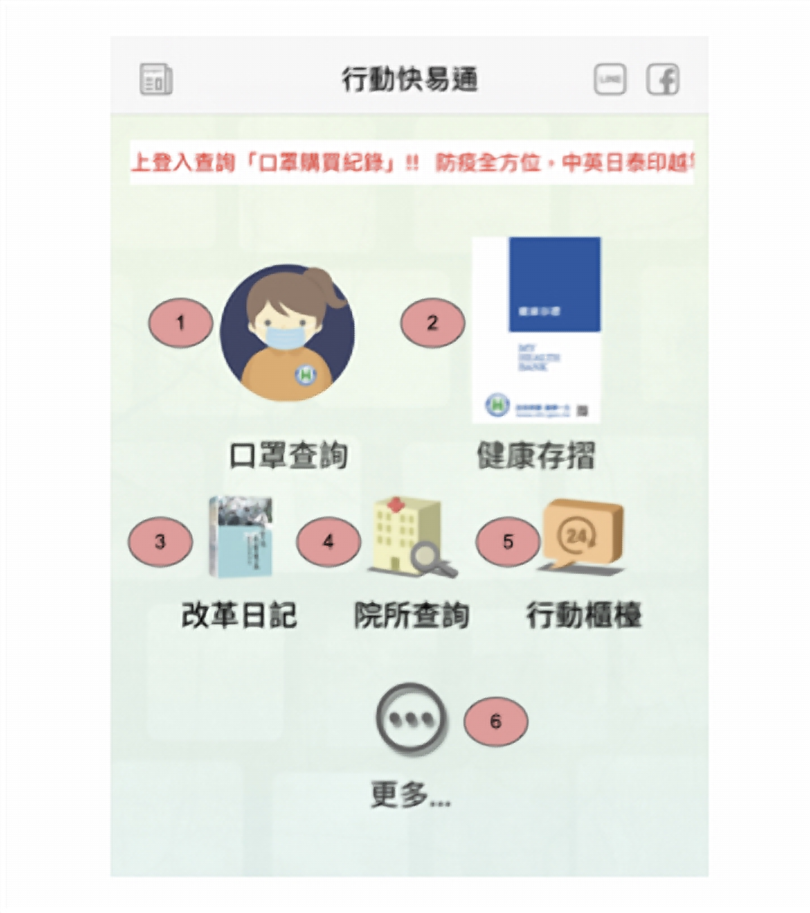
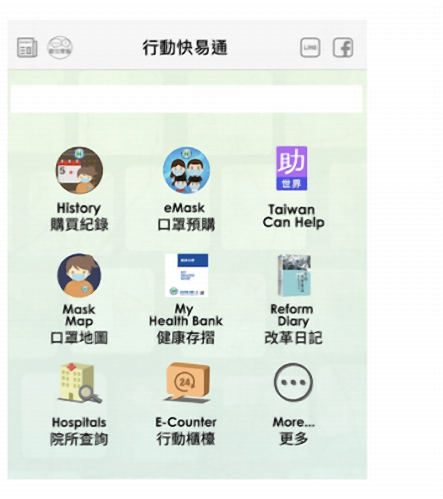

<!-- _class: lead -->
<!-- _header: '' -->
# Introduction to User Experience Design
## 使用者體驗設計導論

**薛念林 教授**
逢甲大學 資訊工程學系

（本講義與 Gemini AI 共同協作編製）

---
<!-- header: '[◄](#1) 本單元大綱 (Outline) [►](#3)' -->

## 本單元大綱 (Outline)

### 🔍 日常體驗與設計反思
- 生活中的體驗與設計
- 什麼是壞的 UX？經典案例與日常痛點
- 諾曼門 (Norman's Door) 與心智模型
- 糟糕設計類型分析（夜市擺攤型、顏料不用錢型、不知從何下手型）

### 💡 UX 核心概念與實踐流程
- 什麼是使用者體驗 (UX)？
- UI (使用介面) vs. UX (使用體驗)
- 設計思考 (Design Thinking) 5 大階段流程
- 課堂觀念檢測與討論 (CCQ & QA)

---
<!-- header: '[◄](#2) 1. 日常體驗與設計反思 [►](#16)' -->

## 無所不在的使用體驗 (Everywhere UX)

### 🏡 實體生活中的體驗案例
- 🚪 **門把與推拉門** ：扁平鐵板直覺「推」、握把直覺「拉」（預設用途 Affordance）。
- ☕ **外帶咖啡杯蓋** ：防溢流吸口與透氣孔，流暢飲用不燙嘴。
- 🚦 **行人號誌（小綠人）** ：倒數秒數與動態快走，即時反饋剩餘時間。
- 🎛️ **家電操作旋鈕** ：實體段位手感回饋 vs. 繁瑣反光觸控板。

### 💻 資訊系統中的體驗案例
- 📱 **行動支付與掃碼** ：一鍵亮碼、震動感應反饋、即時顯示交易明細。
- 🎓 **選課與購票系統** ：透明排隊進度與即時餘額 vs. 流量過載白畫面。
- 🛵 **外送點餐 App** ：即時地圖追蹤外送員軌跡，消除等待焦慮。
- 🔑 **生物辨識登入** ：Face ID / 指紋秒速授權 vs. 繁瑣多重驗證碼。

---

## 經典反面教材：Norman's Door (諾曼門)

### 什麼是「諾曼門」？
當你看到一扇門，上面裝了漂亮的「拉手把」，你下意識用力往外拉——結果門紋絲不動，因為它是 **「推門」** 。門上甚至貼了手寫字條：`「請用推的 PUSH」`。

- **設計缺陷** ：外觀視覺特徵（Affordance / 預設用途）與實際操作邏輯相衝突。
- **使用者心理** ：使用者拉不開時往往會覺得「自己很蠢」，但 **這完全是設計師的責任** ！
- 參考來源：[Norman Door at Apple Store](https://www.reddit.com/r/CrappyDesign/comments/5wolzl/a_norman_door_at_the_apple_store/)

---

## 遇到糟糕的 UI/UX，你會感到…

### 😣 情緒受挫
- **負面情緒蔓延**
- 丟臉、煩躁、委屈、羞恥
- 懷疑自己的操作能力

### ❓ 認知迷失
- **心智負擔爆表**
- 不悅、困惑、生氣、挫折
- 迷失在複雜流程中

### 🚫 信任崩塌
- **拒絕再次使用**
- 對該產品甚至品牌喪失信心
- 轉向競爭對手產品

> 💡 **核心啟示** ：設計不良不僅僅是外觀難看，更會直接傷害使用者的心理安全感與操作效率！

---

<!-- _class: full-img -->

---

## 糟糕設計類型 (1)：夜市擺攤型

### 資訊雜亂無章、隨機塞滿畫面
- **模式識別失效** ：現代電商的商品區塊（圖片、價格、名稱）位置固定。若區塊長寬比、對齊線、字體完全隨機，大腦無法建立模式，必須對每個點重新「對焦」，造成大腦極度疲勞。
- **缺乏視覺錨點** ：缺乏嚴格的網格系統（Grid System），使用者的視線無法沿著水平或垂直軸順暢掃描。

### 核心成因與危害
- **成因** ：往往不是審美問題，而是架構規劃與技術不足（例如只會用 Flow Layout 依序硬塞元件，且未規劃資訊階層）。
- **後果** ：使用者無法快速找到核心任務，跳出率極高。

---

<!-- _class: full-img -->

---

## 糟糕設計類型 (2)：顏料不用錢型

### 「視覺虐待」與易讀性的毀滅
- **色彩對比崩壞（Color Contrast）** ：藍色漸層橫條紋搭配深紅細體字，產生視覺閃爍感，對色弱與年長使用者完全不可讀。
- **排版災難（Typography Nightmares）** ：隨機浮雕陰影增加視覺噪音；文字列表「左右交錯」長短不一，強迫視線痛苦地 Z 字型掃視。

### 負空間與品牌信賴
- **缺乏負空間（White Space）** ：內容塞得密不透風，讓人感覺呼吸困難。
- **摧毀品牌信賴感** ：專業醫療或科技器材網站若採用五顏六色的隨意混搭，會直接摧毀安全感與專業度。

---

<!-- _class: full-img -->

---

## 糟糕設計類型 (3)：不知從何下手型

### 視覺過載與導覽失能
- **資訊洪流** ：首頁塞滿大量電話、Email、跑馬燈與未分類圖示，完全沒有視覺焦點。
- **死連結（Broken Links）** ：大量按鈕點進去無效或 404，使用者徹底迷航。

### 寬度失控（Line Length Issue）
- **寬度失控** ：文字段落橫跨整個螢幕且字距緊湊。
- 人類最舒適的閱讀長度為 **每行 45 ~ 75 個字元** 。
- 超寬排版強迫讀者的脖子與眼球頻繁左右擺動，嚴重損害閱讀體驗。

---

<!-- _class: full-img -->

---

## 案例對照：健保快易通 App 介面重構

### 改版前（猜猜看口罩在哪裡買？）

  

### 改版後（九宮格標準化重構）

  

---

## UX 為何如此困難？

### 常見的開發盲點
* 只有模組思考，沒有系統思考: 疊床架屋，來一個做一個。
* 只有系統思考，沒有使用者思考: 忽略同理心與實際體驗。
* 沒有使用者研究，沒有需求分析: 閉門造車。
* 沒有設計就直接施工: 邊寫邊改，架構混亂。
* 沒有測試反饋與修正
* 💸 **No Money** → 便宜行事；😴 **Lazy** → 知錯不改。

---

## 迷思破解：系統難用只是美工不好嗎？

### 💭 開發者常見對話
> **老師** ：「這個系統很難用，操作體驗很不順。」
> **學生** ：「我又不會畫圖，我美工很差沒辦法……」

- **絕對不是！** 美工（Visual Graphic）只負責視覺外觀與修飾。

### 💡 系統難用的 4 大真正癥結
1. **資訊架構混亂** （找不到功能）
2. **互動流程繁瑣** （多餘與繁雜步驟）
3. **狀態反饋缺失** （不知道系統有沒有成功）
4. **認知模型不匹配** （用語只有工程師看得懂）

---
<!-- header: '[◄](#3) 2. UX 核心概念與實踐流程 [►](#23)' -->

## 什麼是使用者體驗 (User Experience, UX)？

### ISO 9241-210
> **The user experience (UX)** is how a user interacts with and experiences a product, system or service. It includes a person's perceptions of **utility**, **ease of use**, and **efficiency**.

- **使用者體驗 (UX)** 是使用者在與產品、系統或服務互動過程中的整體體驗與**內在感受**。

### 🎯 UX 核心三要素
* **效用 (Utility)** ：能否滿足使用者需求、解決問題？
* **易用性 (Ease of Use)** ：容易學習與直覺操作嗎？
* **效率 (Efficiency)** ：完成任務是否迅速流暢？

---

## UI (使用介面) vs. UX (使用體驗)

### UI (User Interface)
- **外在視覺與互動介面**
- 關注按鈕顏色、字體大小、排版、視覺階層、動效。
- 核心問題： **「產品看起來如何？操作元件長怎樣？」**

### UX (User Experience)
- **內在心理感受與整體旅程**
- 關注按鈕位置合不合理、流程順暢度、能否減輕痛點。
- 核心問題： **「使用者用起來感覺如何？是否順利達成目標？」**

---

<!-- _class: full-img -->

---

<!-- _class: full-img -->

---

## 什麼是使用者體驗設計 (UX Design)？

### UX Design 的定義
> **User Experience Design** is the process that design teams use to create products that provide meaningful and relevant experiences to users.

- UX 設計是團隊為了打造 **有意義且具高度關聯性體驗** 的完整設計流程。

### 涵蓋範圍 (4 大構面)
- 🎨 **品牌塑造 (Branding)**
- 📐 **介面設計 (Design)**
- ⚙️ **可用性 (Usability)**
- 🛠️ **核心功能 (Function)**

---

<!-- _class: full-img -->

---

## UX 設計的標準核心流程：5 大步驟

### 前期探索與定義
- **1. 探索 (Research)** ：研究使用者行為，理解他們「為什麼」這樣做。
- **2. 分析 (Analyze)** ：從調研結果提煉關鍵使用者目標與核心痛點。
- **3. 構思 (Ideate)** ：結合使用者目標、商業需求與技術規格擬定設計要求。

### 後期設計與驗證
- **4. 設計 (Design)** ：產出低/高保真原型並提出具體解決方案。
- **5. 確認 (Test)** ：與真實使用者進行可用性測試，驗證方案是否達成目標。
- 🔄 **迭代演進** ：根據測試反饋持續優化體驗。

---
<!-- header: '[◄](#16) 3. 課堂檢測與討論 (CCQ & QA) [►](#27)' -->

<!-- id: ux-ch01-ccq1 -->
## 🙋 概念核對問答 (CCQ1)

### UX 和 UI 的差異
**[ 是 / 否 ]**

> 對於使用者而言，UX 決定了系統是否「好用」，而 UI 則決定了系統是否「好看」。兩者相輔相成，缺一不可，共同構築了最終的使用者體驗。

請判斷上述說法是否正確，並簡述兩者的定義邊界。

[線上作答](https://nlhsueh.github.io/nickedupocket/#/student/ux-ch01-ccq1)

---

<!-- id: ux-ch01-ccq2 -->
## 🙋 概念核對問答 (CCQ2)

### UX
**[ 是 / 否 ]**

> 登入系統的時間過長，是屬於系統架構和效能的問題，與 UX 無關。

請參考 ISO9241-11 對 UX 的定義，判斷上述說法是否正確。

[線上作答](https://nlhsueh.github.io/nickedupocket/#/student/ux-ch01-ccq2)

---

<!-- id: ux-ch01-ccq3 -->
## 🙋 概念核對問答 (CCQ3)

### UX process
以下哪個活動 **不算** 在 UX 的標準流程中？

- **(A)** 了解使用者的痛點
- **(B)** 進行畫面的設計與確認
- **(C)** 進行市場的分析與調查
- **(D)** 開發一個雛形進行試用
- **(E)** 對系統進行壓力測試

[線上作答](https://nlhsueh.github.io/nickedupocket/#/student/ux-ch01-ccq3)

---

<!-- id: ux-ch01-qa1 -->
## 🙋 問答討論 (QA1)

### 分享你的糟糕 UX 體驗
請回想並描述一個你在日常生活中遇過 **UX 最糟糕的系統** （如學校系統、政府網站、點餐 App、售票系統等）：

1. **系統名稱與使用情境**
2. **操作時遇到的最大障礙或崩潰瞬間**
3. **這帶給你什麼心理感受？（困惑、生氣、無助）**
4. **如果你是設計師，你第一步想如何改善它？**

[線上作答](https://nlhsueh.github.io/nickedupocket/#/student/ux-ch01-qa1)

---
<!-- _class: lead -->
<!-- _header: '' -->

# Thank You!
## 打造以人為本、流暢優雅的使用者體驗

**Q & A / 交流討論**

