<!-- _class: lead -->
<!-- _header: '' -->
# Tidwell 經典網頁與介面設計模式
## Designing Interfaces: Patterns for Effective Interaction Design

**薛念林 教授**
逢甲大學 資訊工程學系

（本講義與 Gemini AI 共同協作編製）

---
<!-- header: '[◄](#1) Tidwell UX 設計模式 9 大核心分類 [►](#3)' -->

## Tidwell UX 設計模式 9 大核心分類

**1. 一般性互動**
(General Interaction)
- 安全探索
- 立即喜悅
- 空間記憶

**2. 組織內容**
(Organizing Content)
- 凸顯/搜尋/瀏覽
- 儀表板
- 精靈模式

**3. 到處走走：導覽**
(Navigation)
- 逃生門
- 麵包屑
- 深連接

**4. 網頁元素排版**
(Layout of Elements)
- 中央舞台
- 手風琴
- 模組化分頁

**5. 行動裝置介面**
(Mobile Interfaces)
- 垂直堆疊
- 底部導航
- 無限清單

**6. 清單展示**
(Lists)
- 雙面板選擇器
- 卡片
- 輪播轉盤

---
<!-- header: '[◄](#2) Chapter 1: 一般性模式 (General Patterns) [►](#7)' -->

## Chapter 1: 一般性模式 (General Patterns)

### 探索與彈性模式 (Part 1)
- **TW1.1 安全探索 (Safe Exploration)**
- **TW1.2 立即喜悅 (Instant Gratification)**
- **TW1.3 足夠滿足 (Satisficing)**
- **TW1.4 中途改變 (Changes in Midstream)**
- **TW1.5 延遲選擇 (Deferred Choice)**
- **TW1.6 漸進建構 (Incremental Construction)**

### 習慣與效率模式 (Part 2)
- **TW1.7 習慣就好 (Habituation)**
- **TW1.8 零碎空檔 (Microbreaks)**
- **TW1.9 空間記憶 (Spatial Memory)**
- **TW1.10 預期記憶 (Prospective Memory)**
- **TW1.11 流暢重複 (Streamlined Repetition)**
- **TW1.12 只用鍵盤 (Keyboard Only)**

---

## TW1.1 ~ TW1.3：探索、即時與滿足

### TW1.1 安全探索
- **「讓我放心探索，不會迷路也不會搞砸」**
- 提供隨時可用的返回與撤銷鍵，避免不可逆的阻撓畫面。
- 對應 NS01, NS03, NS09。

### TW1.2 立即喜悅
- **「我想現在立刻完成任務，而不是等很久」**
- 第一畫面保持極簡，不要在第一個動作前塞入冗長說明或強制廣告。
- 對應 NS07。

### TW1.3 足夠滿足
- **「看得懂、能用就好，不要強迫我詳讀」**
- 提示字精簡，以顏色與形狀傳達含義，直覺點擊即可完成。
- 對應 NS08。

---

## TW1.4 ~ TW1.6：彈性、延遲與漸進

### TW1.4 中途改變
- **「我改主意了，讓我隨時調整」**
- 高鐵查詢結果頁上方直接保留搜尋列，可立即更換時段。
- 對應 NS03, NS07。

### TW1.5 延遲選擇
- **「我現在不想填這個，讓我先用」**
- 降低註冊門檻，必填欄位降到最低，提供「稍後再設定」。
- 對應 NS08。

### TW1.6 漸進建構
- **「改一點、看一下，逐步完善」**
- 即時反應變化，自動暫存草稿，提供即時預覽反饋。
- 對應 NS01。

---

## TW1.7 ~ TW1.12：習慣、空間與鍵盤

### TW1.7 習慣就好
- 遵循使用者的肌肉記憶（`Ctrl+C`、儲存圖示）。
- 確認鍵位置切勿頻繁變換。
- 對應 NS04。

### TW1.9 空間記憶
- **「別幫我亂移桌上的東西」**
- 常用功能固定在相同位置，避免選單位置動態亂跳。
- 對應 NS04, NS06。

### TW1.12 只用鍵盤
- 專家使用者不希望手離開鍵盤。
- 支援完整 Tab 切換與快速鍵，Enter 鍵設定安全預設。
- 對應 NS07。

---
<!-- header: '[◄](#3) Chapter 2: 組織內容 (Organizing Content) [►](#18)' -->

## Chapter 2: 組織內容 (Organizing Content)

### 內容發現與畫布 (Part 1)
- **TW2.1 凸顯、搜尋與瀏覽 (Feature, Search, Browse)**
- **TW2.2 行動裝置快速反應 (Mobile Direct Access)**
- **TW2.3 持續及時的訊息供給 (Streams and Feeds)**
- **TW2.4 媒體瀏覽器 (Media Browser)**
- **TW2.5 儀表板 (Dashboard)**
- **TW2.6 畫布加工具盤 (Canvas plus Palette)**

### 引導與進階管理 (Part 2)
- **TW2.7 精靈模式 (Wizard)**
- **TW2.8 設定編輯器 (Settings Editor)**
- **TW2.9 備擇檢視 (Alternative Views)**
- **TW2.10 多工作空間 (Multiple Workspaces)**
- **TW2.11 協助系統 (Help Systems)**
- **TW2.12 標記分類 (Tagging)**

---

## TW2.1 凸顯、搜尋與瀏覽 (Feature, Search, Browse)

### 現代內容發現的三大支柱
- **凸顯 (Feature)** ：在首頁核心視覺區推薦最重要、最吸引人的焦點內容或即時活動。
- **搜尋 (Search)** ：針對目標明確的使用者，提供自動補全搜尋框與多維度篩選器 (Facets)。
- **瀏覽 (Browse)** ：針對探索型使用者，提供圖文分類網格與清晰目錄。

### 💡 設計心法與適用情境
- **經典範例** ：電商首頁 (Momo, Amazon)、串流影音 (Netflix)、新聞入口。
- **核心價值** ：同時滿足「隨意逛逛」與「精準找尋」兩種截然不同的使用者意圖。

---

<!-- _class: full-img -->

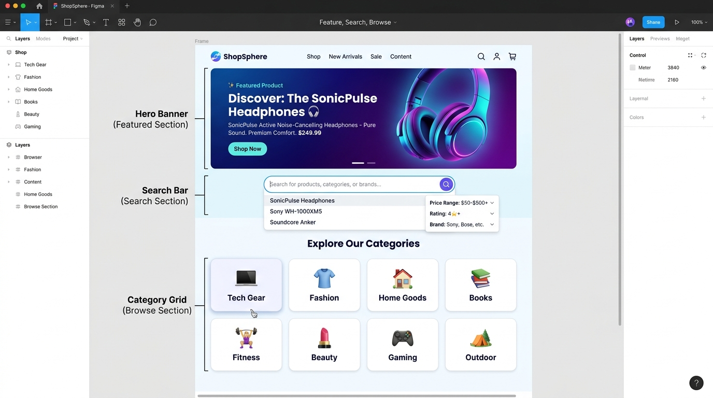

---

## 內容組織核心模式：精靈、儀表板與漸進揭露

### TW2.5 儀表板 (Dashboard)
- 以豐富圖表視覺化呈現關鍵 KPI 與即時數據。
- 定期自動更新，支援點擊鑽取 (Drilldown)。

### TW2.7 精靈 (Wizard)
- 針對複雜任務，拆解為 `Step 1 ➔ 2 ➔ 3` 的線性引導。
- 降低使用者的認知負擔。

### 漸進式揭露 (Progressive Disclosure)
- **回應式生效 (Responsive Enabling)** ：勾選某選項後才啟用相關子欄位。
- 預設隱藏進階參數。

---

<!-- _class: full-img -->

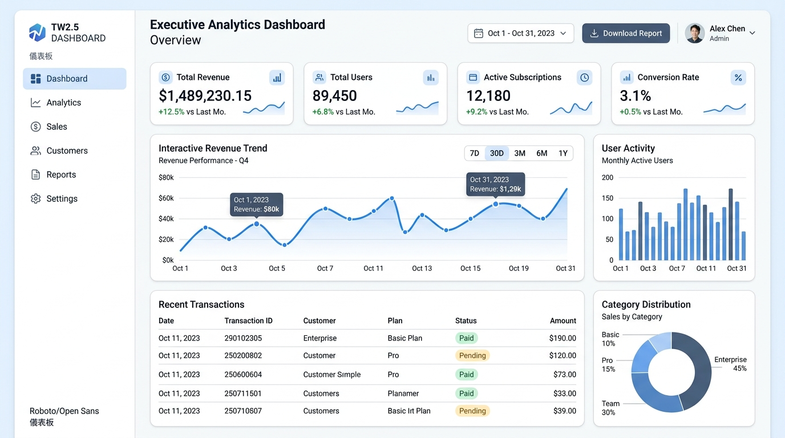

---

<!-- _class: full-img -->

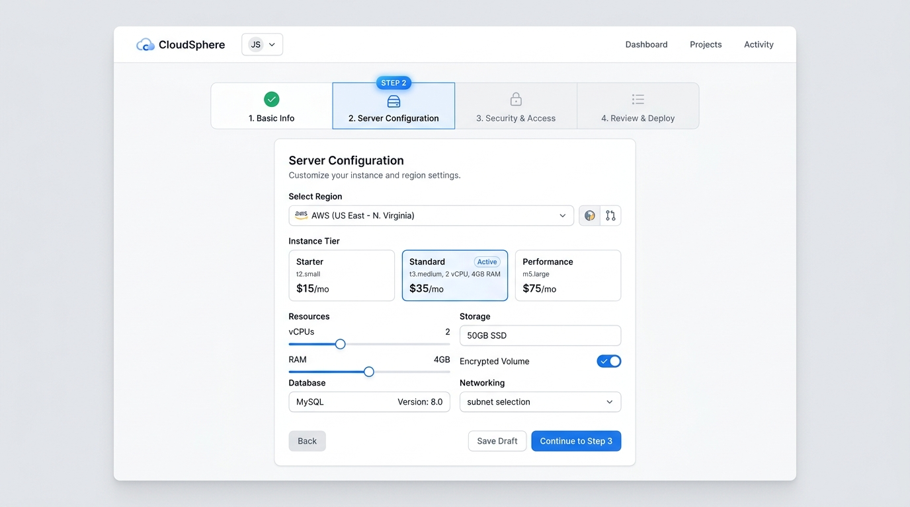

---

<!-- _class: full-img -->

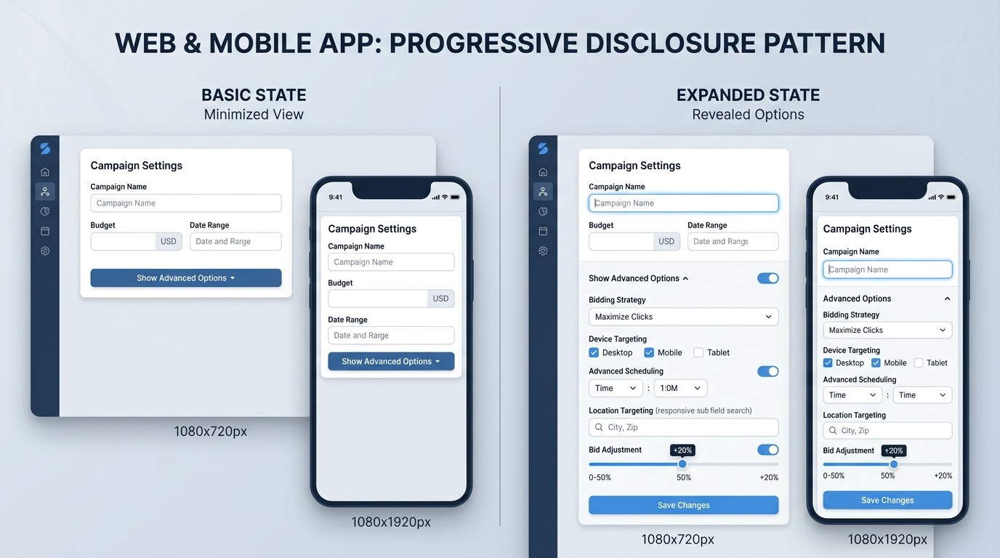

---

## TW2.8 設定編輯器 (Settings Editor)

### 集中式參數與個人化偏好管理
- **分類分群** ：將繁雜設定依模組分類（帳號、隱私安全、外觀、API 整合），避免單頁過長。
- **即時反饋 (Auto-save)** ：首選即時儲存並在頂部顯示狀態提示（如「已自動儲存」），減少額外點擊儲存按鈕。
- **防呆警示 (Danger Zone)** ：將敏感或破壞性操作（如刪除帳號）隔離於底部並以紅色標註二次確認。

### 💡 設計心法與適用情境
- **經典範例** ：SaaS 控制台、系統偏好設定、VS Code 設定頁。
- **核心價值** ：提供清晰的控制權（NS03），降低誤觸風險（NS05）。

---

<!-- _class: full-img -->

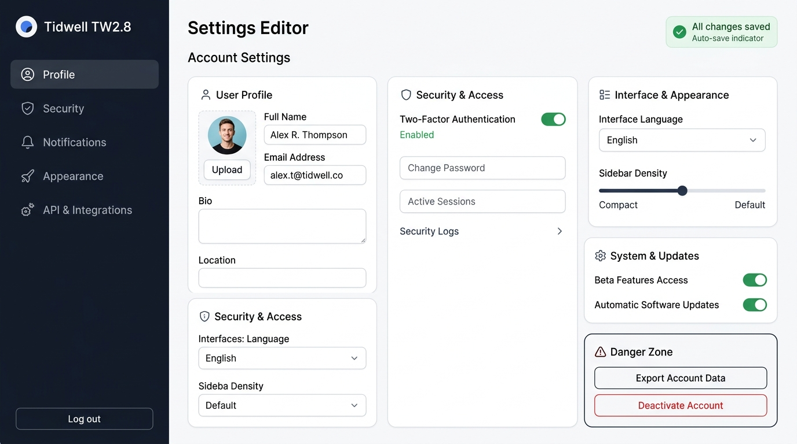

---

## TW2.9 備擇檢視 (Alternative Views)

### 同一資料的多維度視角切換
- **模式本質** ：底層資料模型完全相同，但在介面上提供多種呈現維度以滿足不同工作情境。
- **常見檢視類型** ：
  - 📋 **表格清單 (Table List)** ：適合批次檢視、排序與精確欄位比對。
  - 🗂️ **看板模式 (Kanban Board)** ：強調工作流程與狀態推進。
  - 📅 **行事曆 / 時間軸 (Calendar & Timeline)** ：聚焦死線與時程依賴關係。

### 💡 設計心法與適用情境
- **經典範例** ：Notion 數據庫、Jira 專案看板、Airtable。
- **核心價值** ：大幅提升專業工作效率與彈性（NS07）。

---

<!-- _class: full-img -->

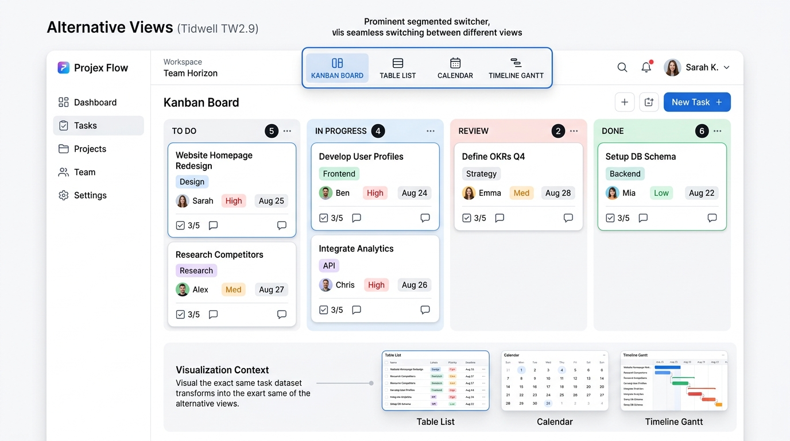

---
<!-- header: '[◄](#7) Chapter 3: 到處走走（導航與路標） [►](#27)' -->

## Chapter 3: 到處走走（導航與路標）

### 結構與進入點 (Part 1)
- **TW3.1 清楚的進入點 (Clear Entry Points)**
- **TW3.2 選單頁面 (Menu Page)**
- **TW3.3 金字塔結構 (Pyramid)**
- **TW3.4 強制回應面板 (Modal Panel)**
- **TW3.5 深連接 (Deep Links)**
- **TW3.6 逃生門 (Escape Hatch)**
- **TW3.7 寬選單 (Fat Menus / Mega Menus)**

### 路標與輔助工具 (Part 2)
- **TW3.8 網站地圖頁尾 (Sitemap Footer)**
- **TW3.9 登入工具 (Sign-in Tools)**
- **TW3.10 進度指示器 (Progress Indicator)**
- **TW3.11 麵包屑記號 (Breadcrumbs)**
- **TW3.12 註解式捲軸 (Annotated Scrollbar)**
- **TW3.13 動畫轉場效果 (Animated Transition)**

---

## 關鍵導航模式解析：逃生門與網站地圖

### TW3.6 逃生門 (Escape Hatch)
- 清楚醒目的退出按鈕，讓使用者隨時跳出當前流程，回到首頁或安全區。
- 如客服電話：「按 0 由專人服務」。

### TW3.8 網站地圖頁尾 (Sitemap Footer)
- 在網頁最底部以分類展開完整連結目錄。
- 釋放 Header 負擔，善用無限垂直空間。

---

<!-- _class: full-img -->

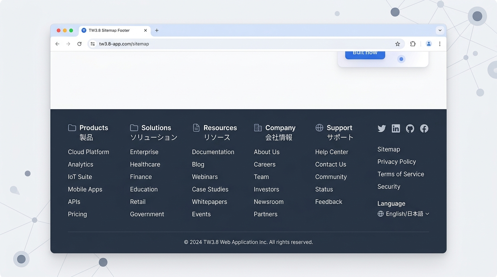

---

## TW3.5 深連接 (Deep Links)

### 直達內容核心的精確導航
- **模式本質** ：為特定頁面中的「特定區塊、標題、評論或項目」提供獨立可分享的專屬 URL。
- **核心互動** ：
  - 懸浮於段落或標題時出現 🔗 錨點圖示。
  - 提供「複製特定段落連結 (Copy Deep Link)」與一鍵分享。
  - 點擊進入時，頁面自動平滑捲動至目標位置並以高亮提示。

### 💡 設計心法與適用情境
- **經典範例** ：Figma 畫布定位連結、Notion 區塊連結、Google Docs 評論錨點。
- **核心價值** ：消除「進去首頁後找不到在哪」的溝通摩擦，團隊協作效率倍增。

---

<!-- _class: full-img -->

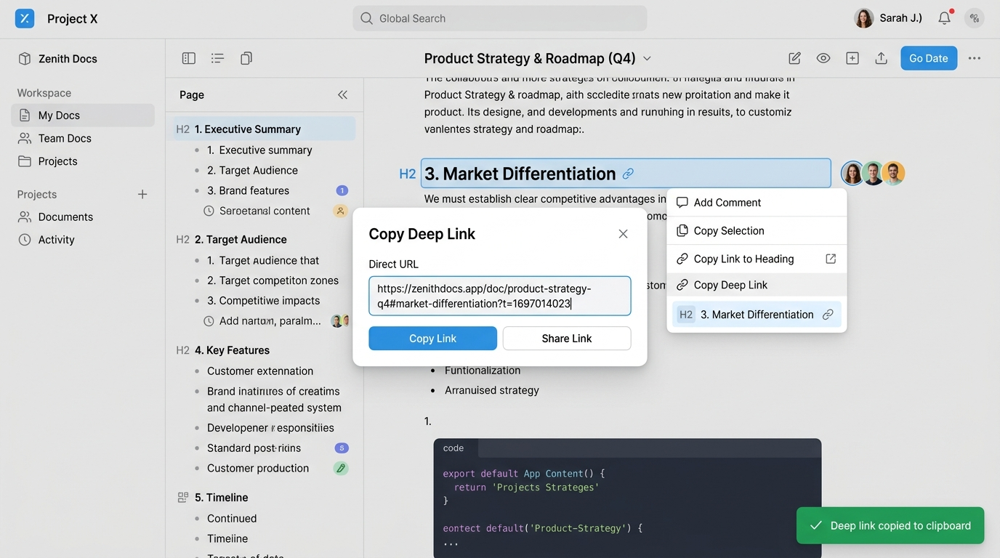

---

## TW3.7 寬選單 / 超級選單 (Fat Menus / Mega Menus)

### 一覽無遺的二維全站架構導航
- **突破傳統下拉限制** ：將傳統單欄長下拉選單展開為橫跨畫面的多欄二維資訊矩陣。
- **架構要素** ：
  - 🗂️ **分欄分類** ：依產品線或服務類型分欄，搭配圖示與簡短副標。
  - 🌟 **特色推薦** ：在選單右側嵌入精選產品圖卡或行銷 Banner。
  - ⚡ **視覺階層** ：粗體主類別 + 易讀子連結，讓視線一秒掃描全貌。

### 💡 設計心法與適用情境
- **經典範例** ：大型電商 (Amazon, ASOS)、企業雲端官網 (Microsoft, AWS)。
- **核心價值** ：將 3 層點擊縮短為 1 次懸停，降低架構迷航率。

---

<!-- _class: full-img -->

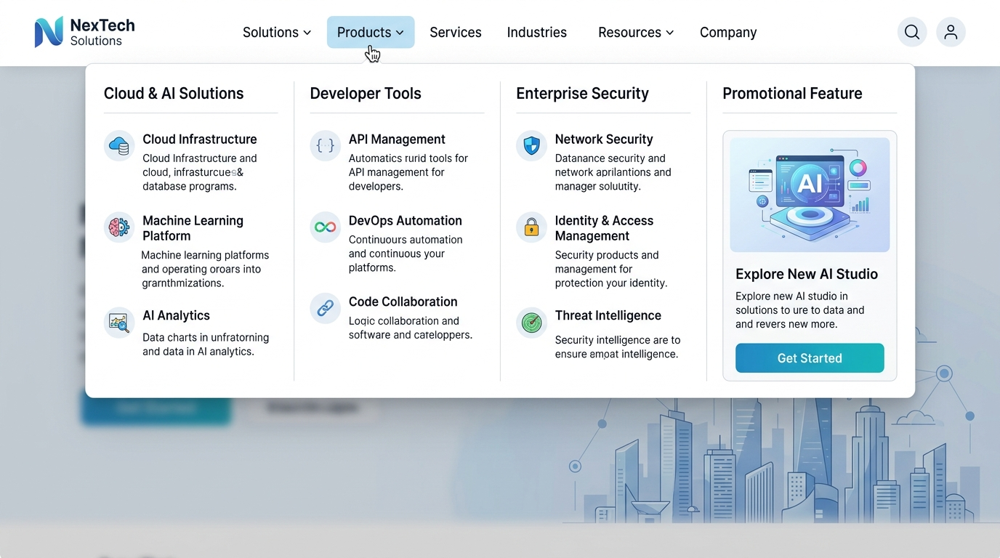

---

## TW3.11 麵包屑記號 (Breadcrumbs)

### 清楚標示「身在何處」的階層路標
- **模式本質** ：以水平文字鏈展示當前頁面在網站樹狀階層中的相對位置。
- **路徑格式** ：`首頁 > 3C 數位 > 耳機音響 > 無線降噪耳機`
- **設計規範** ：
  - 末端項目為當前頁面（不設超連結並加粗顯示）。
  - 每個父層級均可點擊，方便使用者一鍵回溯至上一層或根節點。

### 💡 設計心法與適用情境
- **經典範例** ：深層電商商品頁、大型知識庫與說明文件。
- **核心價值** ：增強空間認知與安全感，大幅降低跳出率。

---

<!-- _class: full-img -->

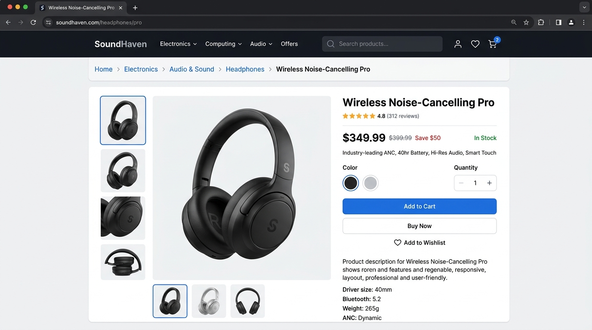

---
<!-- header: '[◄](#18) Chapter 4: 網頁元素的排版 (Layout) [►](#35)' -->

## Chapter 4: 網頁元素的排版 (Layout)

### 排版模式清單
- **TW4.1 視覺框架 (Visual Framework)**
- **TW4.2 中央舞台 (Center Stage)**
- **TW4.3 同質性網格 (Grid of Equals)**
- **TW4.4 標題分區 (Titled Sections)**
- **TW4.5 模組化分頁 (Module Tabs)**
- **TW4.6 手風琴模式 (Accordion)**
- **TW4.7 可折疊面板 (Collapsible Panels)**
- **TW4.8 可移動面板 (Movable Panels)**

### 核心原則
- **階層分明** ：利用標題、格線與負空間明確劃分資訊權重。
- **節省空間** ：在有限視窗內，利用 Tab 分頁與手風琴摺疊隱藏次要內容。
- **直覺對齊** ：保持網格對齊，消除視覺混亂。

---

## 排版模式對比：標題分區 vs 模組化分頁 vs 手風琴模式

### TW4.4 標題分區 (Titled Sections)
- **垂直全展開** ：所有章節與內容一覽無遺，靠標題與空白區隔。
- **適用** ：內容長度適中、需連續閱讀或整體掃描的長頁面（如產品介紹、文章）。

### TW4.5 模組化分頁 (Module Tabs)
- **同容器互斥切換** ：多個關聯模組共用同一空間，點擊 Tab 水平切換。
- **適用** ：平行獨立視圖、固定長度卡片，極致節省垂直空間（如設定頁、商品評價）。

### TW4.6 手風琴模式 (Accordion)
- **垂直堆疊按需折疊** ：標題垂直排列，點擊原地向下展開/收合。
- **適用** ：多段長度不一、使用者僅需挑選特定項目閱讀（如 FAQ、行動端篩選器）。

---

## TW4.5 模組化分頁 (Module Tabs)

### 在有限空間切換同一容器的內容模組
- **模式本質** ：將同一卡片或容器內的多組關聯資料，透過頂部分頁標籤進行切換顯示。
- **互動設計重點** ：
  - **當前狀態明顯** ：以底線、背景色反差或顏色高亮標記目前作用中的分頁。
  - **即時載入** ：切換時無需重新整理整個網頁，保持流暢體驗。
  - **資訊計數** ：分頁標籤可附帶數字徽章（如 `錯誤 (3)`、`待審核 (12)`）。

### 💡 設計心法與適用情境
- **經典範例** ：開發者控制台、產品規格/評價頁籤、個人檔案設定。
- **核心價值** ：極致利用垂直空間，維持頁面視覺清爽（NS08）。

---

<!-- _class: full-img -->

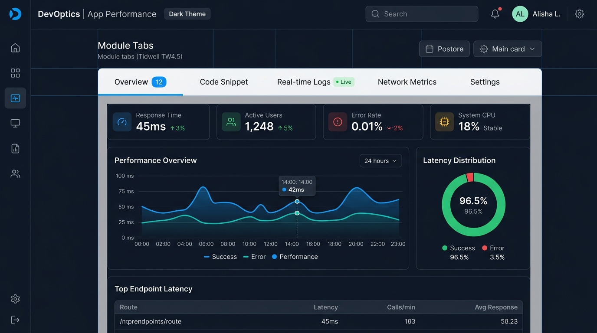

---

## TW4.6 手風琴模式 (Accordion)

### 垂直堆疊與按需展開的折疊清單
- **模式本質** ：垂直排列的標題面板，點擊可向下展開詳細內容；展開新項目時可選擇自動收合其餘項目。
- **關鍵視覺要素** ：
  - 右側提供明確的展開/收合狀態圖示（`+ / −` 或 `⌵ / ⌃`）。
  - 平滑的高度過渡動畫，避免畫面突兀跳動。
  - 適合內容長短不一、使用者僅需挑選特定項目閱讀的情境。

### 💡 設計心法與適用情境
- **經典範例** ：常見問答 (FAQ)、多步驟購物結帳表單、行動端篩選器。
- **核心價值** ：漸進式揭露資訊，避免超長頁面造成滾動疲勞。

---

<!-- _class: full-img -->

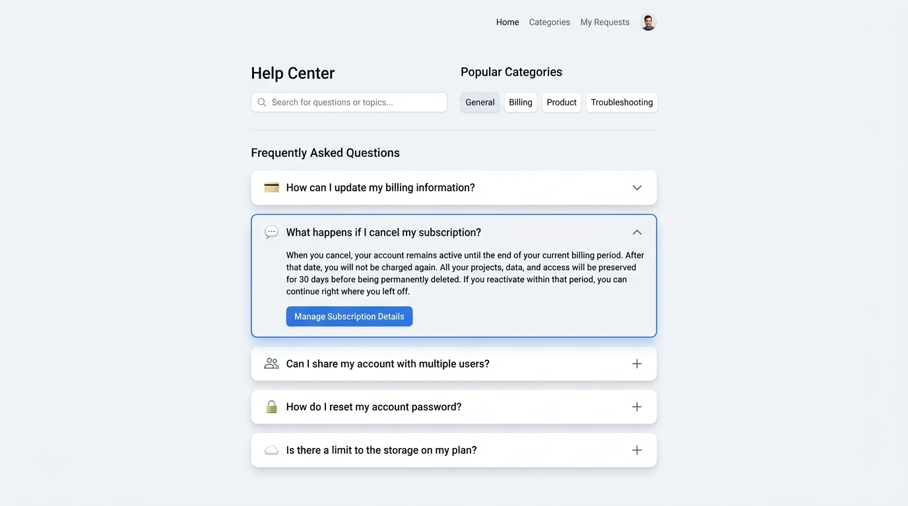

---

## TW4.7 可折疊面板 (Collapsible Panels)

### 彈性伸縮的專業工作區側邊欄
- **模式本質** ：將輔助功能（如檔案樹、屬性檢查器、AI 助理）置於可折疊收納的側邊欄。
- **核心機制** ：
  - 👈 **一鍵收折** ：點擊側欄切換按鈕或邊界圖示，側欄滑入/收合為緊湊圖示列。
  - ↔️ **邊界拖曳** ：支援拖曳邊界自訂寬度，適應不同螢幕大小。
  - 💻 **聚焦畫布** ：需要專注時收合兩側面板，最大化中央主要工作舞台。

### 💡 設計心法與適用情境
- **經典範例** ：VS Code / Cursor 編輯器、Figma 設計介面、Notion 側邊導航。
- **核心價值** ：兼顧工具完整度與主要任務專注度（NS07, NS08）。

---

<!-- _class: full-img -->

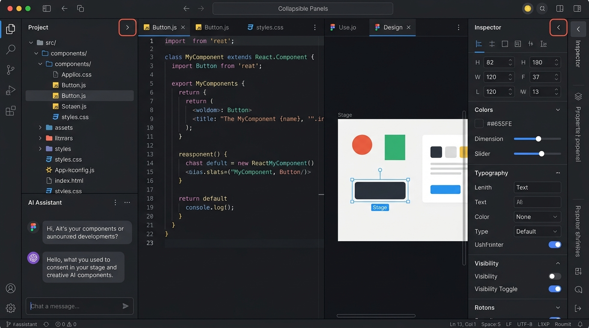

---
<!-- header: '[◄](#27) Chapter 7: 清單展示模式 (Lists) [►](#43)' -->

## Chapter 7: 清單展示模式 (Lists)

### 視圖與佈局模式 (Part 1)
- **TW7.1 雙面板選擇器 (Two-Panel Selector / Split View)**
- **TW7.2 單視窗深入 (One-Window Drilldown)**
- **TW7.3 清單嵌板 (List Inlay，如 Google Map 路線詳情)**
- **TW7.4 卡片化設計 (Cards，圖像、文字與操作合一)**
- **TW7.5 縮圖網格 (Thumbnail Grid)**

### 導覽與控制模式 (Part 2)
- **TW7.6 旋轉木馬 / 輪播 (Carousel)**
- **TW7.7 分頁標註 (Pagination，長清單拆頁載入)**
- **TW7.8 跳至項目 (Jump to Item)**
- **TW7.9 字母/數字索引捲軸 (Alpha/Numeric Scroller)**
- **TW7.10 新項目預備列 (New-Item Row)**

---

## 清單模式對比：雙面板 vs 卡片 vs 嵌板

### TW7.1 雙面板選擇器
- 左側為項目清單，右側為詳細內容。
- 適合寬螢幕桌面端 (如 Email 客戶端、檔案管理器)。

### TW7.4 卡片 (Cards)
- 將圖文、標籤與操作封裝在獨立矩形卡片中。
- 響應式佈局極佳，適合手機與跨裝置呈現。

### TW7.3 清單嵌板 (List Inlay)
- 點擊清單項目後，在原地向下展開詳細資訊。
- 無需跳轉頁面，保持上下文連貫。

---

## TW7.3 清單嵌板 (List Inlay)

### 清單項目原地下拉展開的上下文延續
- **模式本質** ：點擊清單中的某一列時，直接在該列下方原地「嵌入展開」詳細資訊區塊。
- **設計優勢** ：
  - 🚫 **無需跳轉頁面** ：完全避免進入新頁面再按返回的繁瑣流程。
  - 🧭 **保持上下文** ：展開時使用者依然能看到清單前後的相鄰項目。
  - 📈 **階層式詳情** ：適合呈現時間軸軌跡、配送站點、訂單明細。

### 💡 設計心法與適用情境
- **經典範例** ：Google Maps 路線轉乘詳情、物流行程追蹤、銀行交易明細。
- **核心價值** ：保持空間記憶與任務連貫性，大幅提升瀏覽效率。

---

<!-- _class: full-img -->

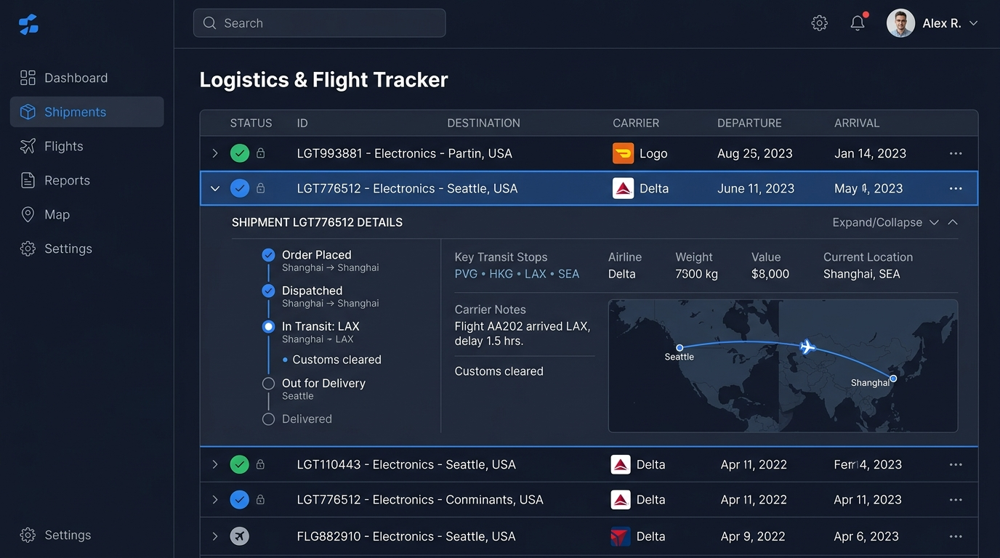

---

## TW7.4 卡片化設計 (Cards)

### 異質資訊的獨立模組化封裝
- **模式本質** ：將圖片、標題、標籤、摘要、作者資訊與操作按鈕封裝在獨立的矩形卡片中。
- **設計要素** ：
  - 🖼️ **視覺錨點** ：頂部特色封面圖吸引第一眼注意力。
  - 🏷️ **分類晶片 (Chips)** ：彩色標籤標示類別與狀態。
  - 🖱️ **清晰邊界與懸浮反饋** ：卡片具備微陰影與 Hover 浮起動效，暗示可點擊性。

### 💡 設計心法與適用情境
- **經典範例** ：社群動態 (Pinterest)、文章列表 (Medium)、儀表板小工具。
- **核心價值** ：極佳的響應式適配能力，在手機與電腦間無縫重排。

---

<!-- _class: full-img -->

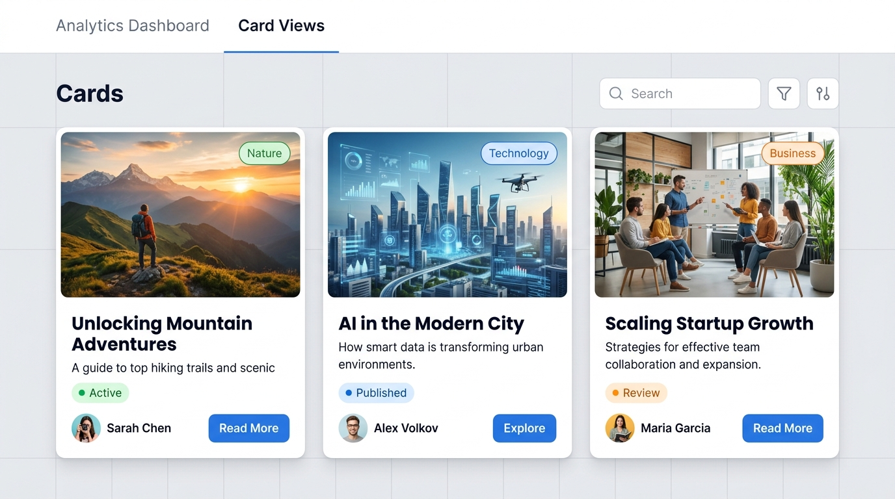

---

## TW7.6 旋轉木馬 / 輪播 (Carousel)

### 橫向滑動的多項目探索展示
- **模式本質** ：在固定寬度區域內，以橫向排列卡片或橫幅，支援左右滑動切換。
- **必備互動指引** ：
  - 左右兩側提供清晰的箭頭切換按鈕。
  - 底部提供當前頁數指示圓點（Pagination Dots）。
  - 兩側邊緣卡片「稍微露出一角（Peek-a-boo）」，視覺暗示右側還有更多內容。

### 💡 設計心法與適用情境
- **經典範例** ：Netflix 影集分類推薦、App Store 精選輪播、課程平台熱門推薦。
- **核心價值** ：在有限第一屏展示多個推薦項目，引導手勢橫向探索。

---

<!-- _class: full-img -->

---
<!-- header: '[◄](#35) 課堂遊戲：Tidwell 設計模式實戰闖關 [►](#51)' -->

## 🎮 課堂遊戲：Tidwell 介面設計模式闖關挑戰 (Game)

### 🏆 遊戲任務說明
- **挑戰目標** ：快速判別 6 個經典軟體與 Web 介面情境對應的 Tidwell 互動設計模式 (Tidwell Design Patterns) 。
- **作答規則** ：共 **6 道實戰單選題** ，限時搶答！請選出最精準適配的介面模式。
- **涵蓋範疇** ：一般性模式 (Ch1)、內容組織 (Ch2)、導航與路標 (Ch3)、網頁排版 (Ch4) 與清單展示 (Ch7)。

---

### 🎮 闖關第 01 關：【高鐵購票時段彈性更換】

**情境描述** ：
使用者在高鐵訂票 App 查詢「台北到左營」班次後，發現想搭的車次已客滿。查詢結果頁頂部直接保留「出發地、目的地、日期與時段下拉選單」，讓使用者不需點擊「回上頁」重新填寫，即可就地切換時段。

**請問這項設計最直接體現了 Tidwell 的哪一項一般性互動模式？**
- **(A)** TW1.1 安全探索 (Safe Exploration)
- **(B)** TW1.4 中途改變 (Changes in Midstream)
- **(C)** TW1.7 習慣就好 (Habituation)
- **(D)** TW1.12 只用鍵盤 (Keyboard Only)

---

### 🎮 闖關第 02 關：【線上報稅與帳號註冊逐步引導】

**情境描述** ：
在線上報稅或雲端伺服器建置系統中，將包含數十個欄位的複雜流程拆解為「1. 身分驗證 ➔ 2. 所得明細確認 ➔ 3. 扣除額計算 ➔ 4. 繳退稅方式 ➔ 5. 申報完成」等 5 個線性步驟，每步均有明確的進度條與「上一步/下一步」按鈕。

**請問這項設計最直接採用了哪一項 Tidwell 內容組織模式？**
- **(A)** TW2.1 凸顯、搜尋與瀏覽 (Feature, Search, Browse)
- **(B)** TW2.7 精靈模式 (Wizard)
- **(C)** TW2.8 設定編輯器 (Settings Editor)
- **(D)** TW2.9 備擇檢視 (Alternative Views)

---

### 🎮 闖關第 03 關：【跨層級大型知識庫精確分享】

**情境描述** ：
在 Figma、Notion 或 Google Docs 中，使用者滑鼠懸停於特定標題或評論時，可點擊「🔗 複製段落連結」，將該專屬 URL 傳送給同事；同事點擊後，網頁會直接自動平滑捲動至該具體章節並點亮高亮提示。

**請問這項設計最直接採用了哪一項 Tidwell 導覽模式？**
- **(A)** TW3.5 深連接 (Deep Links)
- **(B)** TW3.6 逃生門 (Escape Hatch)
- **(C)** TW3.7 寬選單 (Fat Menus / Mega Menus)
- **(D)** TW3.8 網站地圖頁尾 (Sitemap Footer)

---

### 🎮 闖關第 04 關：【設定頁面垂直空間極致收納】

**情境描述** ：
SaaS 系統的專案設定面板包含「一般設定」、「成員權限」、「帳務發票」與「API 密鑰」4 大區塊。設計師將這 4 組內容置於同一個白色卡片容器內，並在頂部提供 4 個按鈕標籤供使用者水平切換，切換時無需重新整理頁面。

**請問這項設計最直接採用了哪一項 Tidwell 排版模式？**
- **(A)** TW4.1 視覺框架 (Visual Framework)
- **(B)** TW4.3 同質性網格 (Grid of Equals)
- **(C)** TW4.5 模組化分頁 (Module Tabs)
- **(D)** TW4.6 手風琴模式 (Accordion)

---

### 🎮 闖關第 05 關：【社群動態與多樣化卡片展示】

**情境描述** ：
在 Pinterest 與 Medium 首頁，每一篇推薦文章均封裝在獨立的矩形區塊內，整合了首圖、標題、作者頭像、讚數與分享按鈕，且卡片在 Hover 懸停時會微微浮起帶有柔和陰影，暗示其可點擊性。

**請問這項設計最直接採用了哪一項 Tidwell 清單展示模式？**
- **(A)** TW7.1 雙面板選擇器 (Two-Panel Selector)
- **(B)** TW7.3 清單嵌板 (List Inlay)
- **(C)** TW7.4 卡片化設計 (Cards)
- **(D)** TW7.6 旋轉木馬 / 輪播 (Carousel)

---

### 🎮 闖關第 06 關：【電商階層探索與全站導航結合】

**情境描述** ：
使用者在電商網站選購耳機時，商品頁頂部顯示 `首頁 > 3C 數位 > 耳機音響 > 無線降噪耳機` ，讓使用者清楚當前位置並可一鍵回溯至任一上層目錄；同時頁面最底部展開多欄完整分類連結。這項設計結合了哪兩項導覽模式？

**請問這項設計結合了哪兩項 Tidwell 導覽模式？**
- **(A)** TW3.11 麵包屑 (Breadcrumbs) 與 TW3.8 網站地圖頁尾 (Sitemap Footer)
- **(B)** TW3.5 深連接 (Deep Links) 與 TW3.6 逃生門 (Escape Hatch)
- **(C)** TW3.7 寬選單 (Fat Menus) 與 TW3.4 強制回應面板 (Modal Panel)
- **(D)** TW3.2 選單頁面 (Menu Page) 與 TW3.10 進度指示器 (Progress Indicator)

---

### 🎯 闖關挑戰 6 題完整解答與核心解析

- **第 01 題 (B)** ： **TW1.4 中途改變** —— 查詢結果頁保留搜尋條件，隨時調整無需重來。
- **第 02 題 (B)** ： **TW2.7 精靈模式** —— 線性分步導引，將龐大複雜表單拆解為逐步完成。
- **第 03 題 (A)** ： **TW3.5 深連接** —— 提供直接定位到段落/評論的 URL 錨點，團隊溝通零摩擦。

- **第 04 題 (C)** ： **TW4.5 模組化分頁** —— 同一容器頂部切換 Tab，極致收納垂直空間。
- **第 05 題 (C)** ： **TW7.4 卡片化設計** —— 圖文、標籤與操作合一的獨立矩形封裝，響應式絕佳。
- **第 06 題 (A)** ： **TW3.11 麵包屑 + TW3.8 頁尾** —— 樹狀階層路標與全站完整導航互補。

---

<!-- _class: lead -->
<!-- _header: '' -->
# Thank You!
## 打造以人為本、流暢優雅的使用者體驗

**Q & A / 交流討論**

