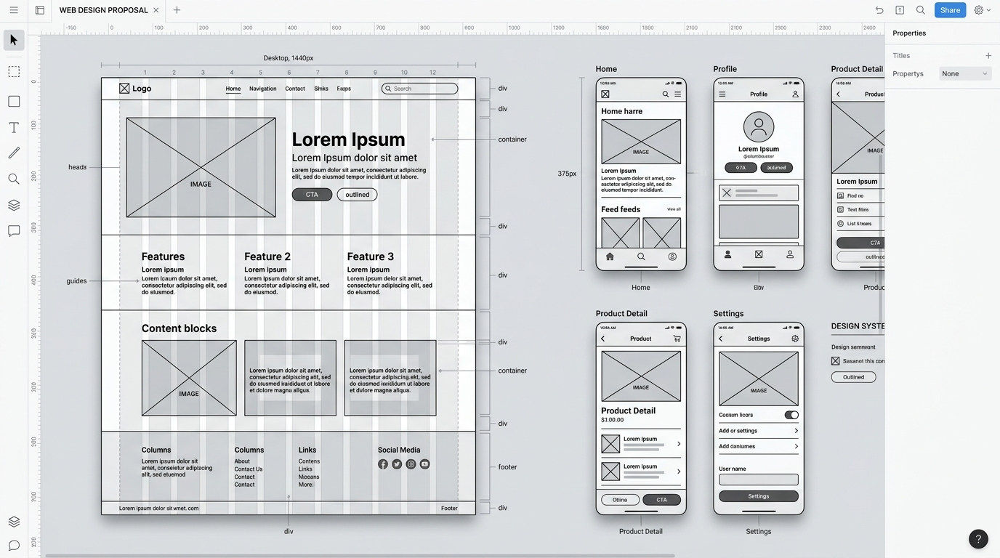
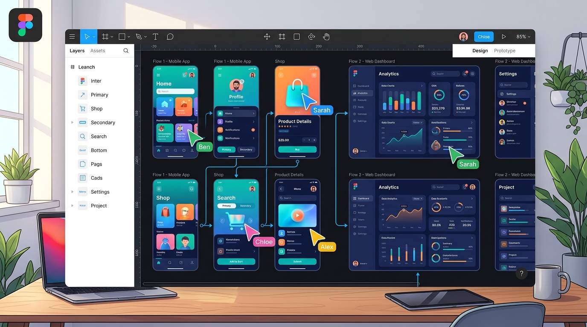
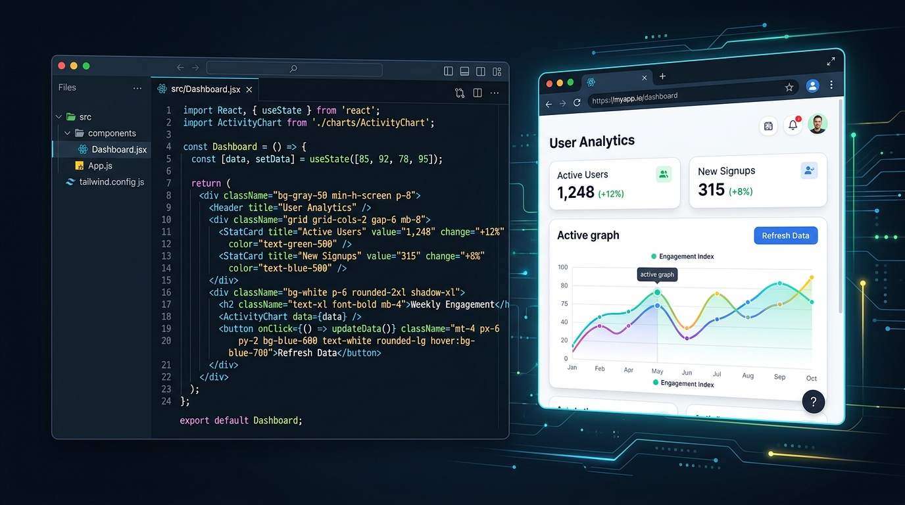
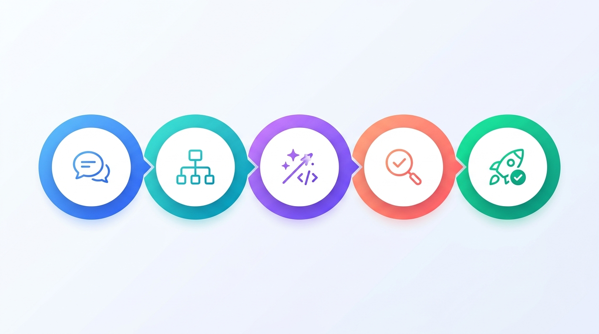
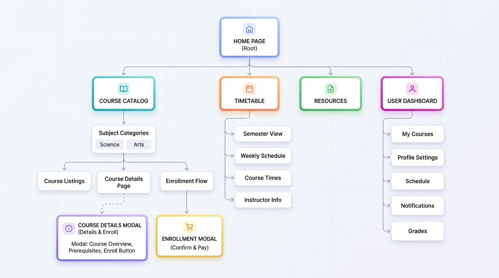

<script>
  // 支援由首頁 index.html 控制是否啟用換頁動畫
  const params = new URLSearchParams(window.location.search);
  const transitionPref = params.get('transition') ?? localStorage.getItem('marp-transition');
  if (transitionPref === 'false' || transitionPref === 'none') {
    document.querySelectorAll('section[data-transition], section[data-transition-back]').forEach(el => {
      el.removeAttribute('data-transition');
      el.removeAttribute('data-transition-back');
    });
  }
</script>


<!-- _class: lead -->
# AI 驅動的系統雛形設計與前期體驗確認
## AI-Powered UI/UX Prototyping & Early Validation

**薛念林 教授**
逢甲大學 資訊工程學系

<span style="font-size: 14px; color: #64748b; margin-top: 24px; display: block;">（本講義與 Gemini AI 共同協作編製）</span>

---

## 課程核心概念地圖

```
                    ┌────────────────────────┐
                    │ 為什麼需要前期確認？   │ 1-10-100 法則、降低溝通代溝
                    └───────────┬────────────┘
                                │
                    ┌───────────▼────────────┐
                    │  AI 雛形生成工具矩陣   │ 程式碼型 (v0, Lovable) vs 設計型 (Uizard, Galileo)
                    └───────────┬────────────┘
                                │
                    ┌───────────▼────────────┐
                    │   端到端驗證作業流程   │ 訪談 ➔ IA ➔ 雛形 ➔ 啟發式評估 ➔ 交付
                    └───────────┬────────────┘
                                │
                    ┌───────────▼────────────┐
                    │ Prompt 技巧與實戰演練  │ 結構化提示詞、防呆設計、極端狀態
                    └────────────────────────┘
```

---

## 講義大綱

<div class="two-columns">
<div class="card">

### 🎯 前半部：觀念與工具解析
- **Part 1: 為什麼前期確認 (Early Validation) 是關鍵？**
  - 軟體開發的「溝通代溝」
  - 1-10-100 成本法則
  - 雛形層次：從 Low-fi 到 High-fi 可操作程式碼
- **Part 2: 現代 AI 雛形生成工具深度盤點**
  - 程式碼互動型：`v0.dev`、`Lovable`、`Bolt.new`
  - 設計畫布型：`Uizard`、`Galileo AI`、`Relume`
  - 輕量預覽型：`Claude Artifacts`、`ChatGPT Canvas`

</div>
<div class="card">

### 🚀 後半部：流程與實戰應用
- **Part 3: AI 驅動的 UI/UX 前期確認作業流程**
  - 需求梳理與 User Story 提取
  - 資訊架構 (IA) 與線框圖快速成型
  - 結合尼爾森原則的啟發式走查 (Walkthrough)
  - 利害關係人實機體驗與 5 分鐘即時迭代
- **Part 4: 實戰 Prompt 技巧與避坑指南**
  - 高保真 Prototyping Prompt 撰寫公式
  - 實務練習：15 分鐘建立互動借還書系統

</div>
</div>

---

<!-- _class: part-cover -->
# Part 1: 為什麼前期確認是關鍵？
## 從「看文字憑空想像」到「動手操作真實體驗」

---

## 傳統軟體開發的「溝通代溝」

<div class="two-columns">
<div class="card">

### 傳統瀑布或口頭溝通模式
- 📝 **需求規格書 (PRD)** ：厚達數十頁的抽象文字與流程圖。
- 🗣️ **客戶/使用者** ：「我看文字覺得都可以，做出來再看看。」
- 💻 **工程團隊** ：埋頭苦幹 3 個月，依照規格逐條實作。
- 💥 **交付成果 Demo** ：「這跟我當初想像的完全不一樣！按鈕怎麼在這裡？操作太反人類了！」

</div>
<div class="card">

### 傳統溝通帶來的巨大痛點
- **文字的語意歧義** ：每個人對「友善的搜尋介面」定義不同。
- **無法預測實際互動** ：看不到資料載入延遲、表單欄位跳轉、錯誤訊息位置。
- **修改成本隨時間呈指數級上升** ：後期的任何介面變動都伴隨資料庫與後端邏輯的重構。

</div>
</div>

---

## 當交付成果與想像天差地別… 😱

<div class="card-img">


</div>

---

## 軟體工程的黃金法則：1-10-100 法則

<div class="card">

> **「在需求確認階段花 1 元修改的錯誤，到了開發階段要花 10 元，上線營運後要花 100 元甚至更多！」**

</div>

<div class="three-columns" style="margin-top: 16px;">
<div class="card">

### 💡 需求與雛形階段 (1x)
- **成本** ：低（數分鐘到數小時）
- **方式** ：AI 生成可互動雛形
- **價值** ：5 分鐘推翻重來毫無負擔，快速收斂真正需求。

</div>
<div class="card">

### ⚙️ 開發與編程階段 (10x)
- **成本** ：中（數天到數週）
- **方式** ：重寫前端元件、重調 API
- **痛點** ：需協調前端、後端、QA 測試，進度嚴重延宕。

</div>
<div class="card">

### 🔥 上線與營運階段 (100x+)
- **成本** ：極高（數月 + 品牌信譽）
- **方式** ：緊急 Hotfix、資料遷移
- **痛點** ：使用者流失、客訴爆棚、甚至造成資安或財務損失。

</div>
</div>

---

## 雛形保真度的演進 (Fidelity Spectrum)

<div class="three-columns">
<div class="card">

### 1. 低保真 (Low-Fi)
- **形式** ：紙筆草圖、灰階線框圖 (Wireframe)。
- **目的** ：確認資訊架構 (IA) 與頁面排版佈局。
- **限制** ：缺乏視覺美感與真實動態互動。

</div>
<div class="card">

### 2. 中保真 (Mid-Fi)
- **形式** ：Figma 靜態設計稿、頁面跳轉流程。
- **目的** ：確認視覺階層、品牌色調與流程跳轉。
- **限制** ：無法輸入真實資料，動態狀態有限。

</div>
<div class="card">

### 3. 高保真 (High-Fi / Code)
- **形式** ：可互動程式碼原型 (React / Vue / HTML)。
- **目的** ：**100% 還原真實操作體驗** ，包含即時驗證、動畫與資料連動。
- **AI 賦能** ：**過去需耗費數週，現在 AI 數十秒即刻產出！**

</div>
</div>

---

## 1. Wireframe (低保真線框圖)：資訊骨架與 AI 協作

<div class="two-columns">
<div class="card">

### 什麼是 Wireframe？
- 📐 **產品結構藍圖** ：使用灰階方塊、線條與佔位符，排除顏色與美工干擾。
- 🎯 **核心目標** ：專注於 **資訊架構 (IA)** 、功能位置與內容優先級。
- 🧠 **降低認知干擾** ：在早期討論中，避免團隊分心於按鈕顏色等表面細節。
- ⚡ **低成本快速試錯** ：紙筆手繪或數位排版皆可，推翻重構成本趨近於零。

</div>
<div class="card">

### 🤖 AI 賦能與協作模式
- **Prompt-to-Wireframe** ：輸入一句業務需求，AI（如 `Relume`、`Uizard`）自動生成全站 Sitemap 與頁面模組。
- **手繪草圖數位化** ：白板隨手手繪線框拍照，AI 自動向量化轉為可編輯組件。
- **智能 UX 文案生成** ：告別無意義的 `Lorem Ipsum`，AI 自動填入真實業務文字。

</div>
</div>

---

## Wireframe (線框圖) 結構與佈局示意

<div class="card-img">



</div>

---

## 練習 🏄🏻‍♀️：使用 Relume 設計「辦公室點餐系統」Wireframe

<div class="card">

### 🎯 任務目標：運用 Relume AI 在 10 分鐘內建立並微調出理想的辦公室下午茶/便當點餐線框圖

</div>

<div class="two-columns" style="margin-top: 14px;">
<div class="card">

### 📝 實作步驟
1. 🌐 開啟 **[Relume.ai](https://www.relume.ai/)** 建立免費專案。
2. 💬 輸入提示詞描述業務需求：
   - *「設計一個辦公室團隊點餐系統，包含今日推薦菜單、客製化選項（甜度/冰塊/加料）、個人購物車、以及主揪即時匯總統計看板。」*
3. 📐 檢視 AI 自動生成的 Sitemap 與 Wireframe 線框圖。
4. 🔄 **調整至少兩個區塊/圖形** ：
   - 替換或重新生成不符合想像的排版模組；
   - 調整元件順序與文案，直到完全符合你的設計想像！

</div>
<div class="card">

### 💡 評估與反思要點
- **資訊階層** ：菜單名稱、價格與「加入點餐」按鈕是否足夠顯眼？
- **狀態能見度 (NS01)** ：是否能即時看見目前「已點餐人數 / 總人數」進度？
- **錯誤預防 (NS05)** ：是否有防呆機制避免重複送出或遺漏必填選項？
- 🚀 **體驗心得** ：比起傳統從零手繪，AI 幫你省下了多少構思與對齊架構的時間？

</div>
</div>

---

## 2. Figma：設計系統與視覺互動原型標準

<div class="two-columns">
<div class="card">

### 什麼是 Figma？
- 🎨 **UI/UX 設計與協作標準** ：向量設計、Design System、Auto-layout 與元件變體 (Variants)。
- 🔗 **互動原型 (Prototyping)** ：模擬頁面點擊跳轉、轉場動畫、彈窗與 Hover 狀態。
- 👥 **多人即時協作** ：設計師、工程師與 PM 可即時留言標註與共同編輯。

</div>
<div class="card">

### 🪄 AI 賦能與生態系協作
- **Figma AI 原生功能** ：一鍵生成多版型設計稿、AI 智能圖層重命名與自動翻譯。
- **真實 Mockup 資料** ：AI 插件秒級填入真實人名、照片、商品價格與數據。
- **雙向程式碼轉換** ：`Relume (Sitemap) ➔ Figma ➔ Locofy/Anima (Code)` 無縫銜接。

</div>
</div>

---

## Figma 原型設計與協作畫布示意

<div class="card-img">



</div>

---

## 3. React / Vue / HTML：可執行的真實程式碼原型

<div class="two-columns">
<div class="card">

### 什麼是前端程式碼原型？
- 💻 **真實運行的動態 Web 應用** ：具備真正狀態管理 (`useState`, `Pinia`)、資料綁定與表單邏輯。
- 🚀 **100% 真實體驗** ：支援鍵盤打字、API 非同步載入、動畫反饋與響應式切版 (RWD)。
- 🏆 **原型即產出物 (Zero Waste)** ：確認程式碼直接由工程團隊接手，零重寫浪費！

</div>
<div class="card">

### ⚡ AI 賦能與 Prompt-to-Code
- **現代程式碼生成神器** ：`v0.dev`、`Lovable`、`Bolt.new` 打造端到端開發體驗。
- **即時錯誤自癒 (Self-healing)** ：AI 自動讀取 Console Log 報錯並秒級修復。
- **全功能 MVP 即刻上線** ：整合 Supabase 一鍵完成會員認證與真實 CRUD 資料庫。

</div>
</div>

---

## 前端程式碼原型與即時預覽示意

<div class="card-img">



</div>

---

## 三種雛形載體與 AI 協作維度對照

| 載體維度 | Wireframe (線框圖) | Figma (設計原型) | React / Vue / HTML (程式碼原型) |
| :--- | :--- | :--- | :--- |
| **主要溝通對象** | 產品經理 (PM)、客戶確認架構 | UI 設計師、前端工程師、決策主管 | 真實終端使用者、利害關係人、全端團隊 |
| **互動體驗深度** | 靜態版面、無動態互動 | 點擊跳轉、微動畫、狀態切換 | **真實數據輸入、邏輯驗證、API 互動** |
| **修改與試錯速度** | ⚡ 秒級調整，推翻成本極低 | ⏱️ 分鐘級調整視覺與排版 | 🚀 **AI 賦能下已可達成分鐘級即時重構** |
| **主流 AI 協作工具** | Relume, Uizard, Miro AI | Figma AI, Galileo AI, Musho | v0, Lovable, Bolt.new, Cursor |
| **AI 賦能最大價值** | 自動生成架構與真實情境文案 | 自動排版、Mockup 資料與組件生成 | **直接生成 Clean Code，原型即是產出物** |

---

<!-- _class: part-cover -->
# Part 2: 現代 AI 雛形生成工具深度盤點
## 從 Prompt-to-Code 到 Prompt-to-Design

---

## AI 雛形工具全景分類 (Tool Landscape)

<div class="two-columns">
<div class="card">

### 🛠️ 1. 全端/程式碼型雛形 (Code-First)
直接生成可運行的 Web/React 前端程式碼，支援真實點擊、狀態管理與資料輸入：
- **`v0 by Vercel`** （React + Tailwind + Shadcn UI）
- **`Lovable.dev`** （Fullstack App + Supabase 資料庫）
- **`Bolt.new`** （瀏覽器原生 Fullstack WebContainer）
- **`Claude Artifacts / ChatGPT Canvas`** （輕量級單頁快速預覽）

</div>
<div class="card">

### 🎨 2. 設計/畫布型雛形 (Design-First)
專注於視覺設計稿、線框圖、Figma 整合與整體站點規劃：
- **`Uizard`** （手繪草圖轉 UI + AI 易用性熱區圖）
- **`Galileo AI`** （高保真 UI 向量設計稿生成）
- **`Relume`** （Sitemap 規劃 + 線框圖無縫匯入 Figma）
- **`Figma AI`** （原生畫布自動排版與元件填充）

</div>
</div>

---

## 工具 1: v0 by Vercel (前端組件級王者)

<div class="two-columns-64">
<div class="card">

### 核心特性與優勢
- **技術棧** ：React + Tailwind CSS + Lucide Icons + `shadcn/ui`。
- **精準區塊編輯** ：可圈選畫面上任一特定按鈕或卡片，單獨下指令修改。
- **無縫工程交接** ：產出乾淨、符合現代前端最佳實踐的 React 原始碼，一鍵 `npx shadcn add` 複製。
- **版本時光機** ：隨時比對每次 Prompt 迭代的介面差異並支援回退。

### 適用情境
- Dashboard 後台管理系統、複雜表單輸入、SaaS 產品介面。

</div>
<div class="prompt-box" style="font-size: 17px;">

### 💡 實戰 Prompt 範例
```text
請設計一個「智慧會議室預約系統」的 Dashboard。
包含：
1. 頂部搜尋欄與日期選擇器
2. 左右雙欄：左側會議室即時狀態卡片
   （容納人數、設備標籤、空閒/使用中）
3. 右側時間軸甘特圖（可拖曳時段預約）
4. 點擊預約時跳出 Modal，需具備衝突防呆提示
請使用乾淨洗鍊的現代深藍與白配色。
```

</div>
</div>

---

## 工具 2: Lovable.dev (全功能 Web App 產出器)

<div class="two-columns">
<div class="card">

### 核心特色
- 🚀 **超高保真** ：不只是靜態切版，而是完整具備邏輯、狀態路由與資料持久化的 Web App。
- 🗄️ **一鍵整合資料庫** ：內建 Supabase 支援，點擊即可啟用使用者認證 (Auth) 與真實 CRUD。
- 🌐 **即時雲端部署** ：幾秒內產生公開網址，直接傳給利害關係人進行手機/電腦實機測試。
- 💬 **自然語言迭代** ：「把側邊欄改成抽屜式」、「增加匯出 CSV 功能」，AI 自動修改程式碼並熱重載。

</div>
<div class="card">

### 適合的前期確認場景
- 需要驗證完整使用者旅程（註冊 ➔ 填寫資料 ➔ 結帳付款 ➔ 收到通知）。
- 向老闆、投資人或非技術客戶進行真實可操作的產品概念驗證 (PoC)。
- 團隊在未配置專職前端工程師時，快速驗證產品商業價值。

</div>
</div>

---

## 工具 3: Bolt.new (瀏覽器端完整開發環境)

<div class="two-columns">
<div class="card">

### 核心特色
- ⚡ **Node.js in Browser** ：基於 WebContainers 技術，直接在瀏覽器執行 npm 套件與後端伺服器。
- 📦 **全套技術棧任選** ：Next.js、Vite、Remix、Astro、Vue、Svelte 皆可一鍵生成。
- 🔍 **完整專案目錄樹** ：直接查看與編輯所有原始碼檔案（`package.json`、組件、API Route）。
- 🛠️ **自動修復報錯** ：當終端機或建置出錯時，AI 會主動讀取 Error Log 並一鍵修復。

</div>
<div class="card">

### 適合的前期確認場景
- 工程團隊進行技術可行性評估 (Technical Spike)。
- 需要使用特定 NPM 前端套件（如 Recharts 圖表庫、Leaflet 地圖庫）的複雜互動原型。
- 雛形確認後可直接下載 Zip 或推送至 GitHub 繼續開發。

</div>
</div>

---

## 工具 4: Uizard (設計草圖與易用性分析專家)

<div class="two-columns">
<div class="card">

### 核心特色
- ✍️ **Sketch-to-UI** ：在白板或紙上畫手繪草圖，拍照上傳後 AI 自動轉為高保真 UI 設計稿！
- 📸 **Screenshot-to-Design** ：截圖既有 App 或競品頁面，AI 逆向工程解析為可編輯的設計組件。
- 🧠 **AI Attention Heatmap (視覺焦點熱區)** ：
  - **內建預測眼動儀演算法** ；
  - 自動分析使用者視線最先被哪顆按鈕或標題吸引；
  - 前期即可評估 CTA (Call to Action) 是否夠顯眼！

</div>
<div class="card">

### 適合的前期確認場景
- 設計衝刺 (Design Sprint) 工作坊。
- 將團隊頭腦風暴的紙上手繪即時數位化。
- 評估頁面資訊階層 (Visual Hierarchy) 與眼球停留熱點。

</div>
</div>

---

## 工具 5: Relume (網站資訊架構與線框圖神器)

<div class="two-columns">
<div class="card">

### 核心特色
- 🗺️ **AI Sitemap Builder** ：輸入一句產品描述，自動規劃完整的站點地圖與頁面從屬架構。
- 🧱 **Wireframe 頁面模組化** ：自動為每個頁面安排 Hero Banner、功能列表、定價表、FAQ 等區塊。
- 📝 **自動撰寫 UX 文案** ：消除死板的 `Lorem Ipsum`，生成符合業務場景的真實文案。
- 🔗 **一鍵匯入 Figma / Webflow** ：直接生成整套已 Auto-layout 且命名規範的 Figma 畫布。

</div>
<div class="card">

### 適合的前期確認場景
- 官方網站、品牌門戶、SaaS 產品首頁的前期結構確認。
- 與客戶快速達成「需要做哪些頁面」、「每頁放什麼內容」的共識。
- 大幅減少從零繪製線框圖的時間。

</div>
</div>

---

## 工具 6: Claude Artifacts / ChatGPT Canvas

<div class="two-columns">
<div class="card">

### 核心特色
- ⚡ **即問即看** ：在對話視窗右側即時渲染 React / HTML / SVG 動態元件。
- 🎯 **超低門檻** ：無需建立專案、無需登入複雜平台，一般對話即可產出。
- 🔀 **多方案快速比較** ：可讓 AI 同時生成「方案 A：分步表單」與「方案 B：單頁滑動表單」，即時切換比對。

</div>
<div class="card">

### 適合的前期確認場景
- 單一複雜 UI 元件的互動驗證（例如：三層連動下拉選單、自訂日期範圍篩選器）。
- 演算法視覺化或動態邏輯展示。
- 團隊會議中即時討論與即興驗證。

</div>
</div>

---

## 主流 AI 雛形工具全方位對照表

| 工具名稱 | 保真度 | 產出核心 | 技術門檻 | 最大優勢 | 最佳適用場景 |
| :--- | :---: | :--- | :---: | :--- | :--- |
| **v0 by Vercel** | 程式碼 (高) | React / Tailwind | 🟢 低 | 組件精緻、程式碼極度規範 | 後台系統、Dashboard、SaaS 模組 |
| **Lovable** | 應用 (極高) | Fullstack + DB | 🟢 低 | 支援真實資料持久化與部署 | 完整 MVP、多頁面 App 流程確認 |
| **Bolt.new** | 全端 (極高) | Node / Git Repo | 🟡 中 | 完整瀏覽器開發容器 | 技術可行性評估、NPM 生態套件 |
| **Uizard** | 設計 (中/高) | 向量設計 / 熱區 | 🟢 低 | 手繪轉 UI、易用性熱區分析 | 設計衝刺、眼動視覺焦點評估 |
| **Relume** | 線框 (中) | Sitemap / Figma | 🟢 低 | 站點架構與模組化線框圖 | 官方網站、品牌入口架構確認 |
| **Claude Artifacts** | 程式碼 (中/高) | Single File React | 🟢 低 | 對話即時渲染、零設定 | 單一元件互動邏輯、即興討論 |

---

<!-- _class: part-cover -->
# Part 3: AI 驅動的前期確認作業流程
## 5 步驟打造高效 UX 驗證閉環

---

## 端到端 (End-to-End) 前期驗證作業流程

<div class="card-img">



</div>

<div class="card" style="margin-top: 10px; font-size: 17px; padding: 10px 14px; text-align: center;">

**五大階段閉環** ：① 需求訪談 ➔ ② 資訊架構 (IA) ➔ ③ AI 快速雛形 ➔ ④ 啟發式評估 ➔ ⑤ 實機驗收交付

</div>

---

## Step 1: 需求訪談與 User Story 梳理

<div class="two-columns">
<div class="card">

### 傳統做法 vs AI 賦能
- 傳統：手寫訪談筆記，整理需求需耗費 1~2 天。
- **AI 賦能** ：將使用者訪談錄音逐字稿餵給 AI，由 AI 自動萃取痛點、Persona 與 User Stories。

### 核心產出物
- **使用者角色 (Persona)** ：目標族群、痛點、動機。
- **使用者故事 (User Stories)** ：
  - `作為一個 [角色]，我想要 [功能]，以便於 [達成目標]。`
- **驗收準則 (Acceptance Criteria / Gherkin)** 。

</div>
<div class="prompt-box" style="font-size: 17px;">

### 💡 AI 輔助分析 Prompt 範例
```text
你是一位資深 UX 研究員。以下是一段「學生選課系統」的使用者訪談逐字稿。
請幫我：
1. 列出使用者的 3 大核心痛點。
2. 產出 5 個關鍵的 User Stories (含 As a/I want/So that)。
3. 為每個 User Story 定義明確的 Given-When-Then 驗收標準。
```

</div>
</div>

---

## Step 2: 資訊架構 (IA) 與 Sitemap 規劃

<div class="two-columns">
<div class="card">

### 重點：先定義骨架，再填充血肉
- 在動手畫介面之前，必須先確定 **頁面層級 (Hierarchy)** 與 **導覽路徑 (Navigation Flow)** 。
- 避免出現「找不到入口」或「孤島頁面」的導覽死角。

### 工具搭配與產出
- 使用 **`Relume`** 或 **`ChatGPT`** 自動產生樹狀結構。
- 輸出清晰的樹狀結構圖或 Markdown 清單，先與團隊確認各模組歸屬與跳轉 Modal。

</div>
<div class="card-img">



</div>
</div>

---

## Step 3: AI 快速生成高保真互動雛形

<div class="two-columns">
<div class="card">

### 核心心法：結構化提示 (Structured Prompting)
- 避免給予模糊指令（如：「給我一個漂亮的後台」）。
- **採用黃金 5 要素** ：
  1. 🏢 **角色與場景** （誰在用？在哪裡用？）
  2. 📐 **佈局規範** （Navbar、Sidebar、卡片網格、雙欄）
  3. 🎨 **視覺風格** （現代極簡、Tailwind 配色、暗色模式）
  4. 🔄 **動態與互動** （點擊彈窗、Tab 切換、篩選即時連動）
  5. ⚠️ **邊界與防呆** （空狀態 Empty State、錯誤提示、Loading 動畫）

</div>
<div class="card">

### 工具選擇建議
- **需要純元件展示** ➔ `v0.dev`
- **需要完整多頁流程與資料庫** ➔ `Lovable.dev`
- **需要對外分享至手機操作** ➔ `Lovable` 部署網址

> 💡 **小秘訣** ：第一版先生成 80% 骨架，再針對局部區塊逐步提示優化，切忌一次塞入過多需求。

</div>
</div>

---

## Step 4: 啟發式評估 (Heuristic Walkthrough)

<div class="card">

### 在展示給客戶前，先用「尼爾森 10 大原則」進行內部健康檢查！

</div>

<div class="two-columns" style="margin-top: 14px;">
<div class="card">

### 🔍 內部走查檢查清單 (Checklist)
- ✅ **NS01 系統狀態** ：按鈕點擊後是否有 Loading 指示？
- ✅ **NS02 真實對應** ：詞彙是否通俗？圖示是否直覺？
- ✅ **NS03 使用者控制** ：是否有 Cancel / Undo / 關閉按鈕？
- ✅ **NS05 錯誤預防** ：必填欄位是否有明確標記與格式防呆？
- ✅ **NS08 極簡設計** ：畫面是否有過多雜訊干擾？
- ✅ **NS09 友善報錯** ：錯誤訊息是否具備具體修復建議？

</div>
<div class="prompt-box" style="font-size: 17px;">

### 💡 AI 自檢 Prompt 範例
```text
請檢視目前生成的「預約表單介面」程式碼。
請依據 Nielsen's 10 Heuristics 原則，
找出 3 個潛在的可用性問題（例如缺乏 Loading 狀態、
缺少取消按鈕、或錯誤提示不夠具體），
並直接給出修改後的優化程式碼。
```

</div>
</div>

---

## Step 5: 體驗閉環與工程交付 (Handoff)

<div class="two-columns">
<div class="card">

### 1. 利害關係人 (Stakeholder) 實機測試
- 將可點擊的 Prototype 網址直接發送給真實使用者。
- 觀察使用者在「未經解說」的情況下能否順利完成目標任務。
- 記錄卡關點，**在會議現場直接透過 AI 在 5 分鐘內完成修訂並重新整理** ！

</div>
<div class="card">

### 2. 順暢交接給開發團隊
- 傳統：工程師對著靜態圖猜測響應式寬度與動畫時間。
- **AI 賦能交接** ：
  - 提供 Clean Code (React/Tailwind 元件)；
  - 提供 Design Tokens (顏色、字體、間距變數)；
  - 附帶清晰的驗收條件與邊界處理邏輯。

</div>
</div>

---

<!-- _class: part-cover -->
# Part 4: 實戰 Prompt 技巧與避坑指南
## 掌握 AI 雛形設計的魔法咒語

---

## 高質量 UI Prototyping Prompt 設計公式

<div class="card">

### 🧱 結構化 Prompt 萬用模板 (Master Formula)

```text
[角色設定] 你是一位專精於 Tailwind CSS 與 React 的資深 UI/UX 設計師。
[產品背景] 請為一個「[系統名稱/業務場景]」設計 [頁面名稱/功能模組]。
[使用者目標] 目標使用者是 [目標族群]，他們的核心任務是 [主要任務]。
[版面結構]
  - 頂部導航 (Navbar)：包含 [Logo, 模組選單, 使用者頭像與通知]
  - 主要工作區 (Main)：採用 [兩欄式 / 三欄卡片網格]，左側為 [...]，右側為 [...]
[關鍵互動]
  - 狀態 1 (Default)：顯示 [...]
  - 狀態 2 (Active/Hover)：當點擊 [...] 時，觸發 [Modal 彈窗 / 側邊抽屜]
  - 狀態 3 (Empty/Error)：當查無資料時，顯示 [友善插圖與建立按鈕]
[設計風格] 採用現代乾淨的配色風格，字體階層分明，善用 Badge 標籤與細微陰影。
```

</div>

---

## 實戰範例：儀表板 (Dashboard) 雛形 Prompt

<div class="prompt-box" style="font-size: 18px;">

```text
你是一位資深前端 UI/UX 工程師。請使用 React、Tailwind CSS 與 Lucide Icons
設計一個「線上學習平台 - 教師分析後台 (Teacher Analytics Dashboard)」。

【版面架構】
1. 頂部列：顯示班級切換下拉選單、學期篩選器、以及「匯出報表」按鈕。
2. 頂部 KPI 卡片區（4 欄）：
   - 總選課人數 (含較上週成長率綠色 Badge)
   - 作業繳交率 (進度環形條)
   - 平均測驗成績
   - 需關懷學生數 (紅色警示 Badge)
3. 主要圖表區 (雙欄 7:3)：
   - 左側：每週作業提交趨勢折線圖
   - 右側：待批改作業清單（附帶一鍵批改按鈕與倒數提醒）
4. 底部：學生成績分佈表格（具備排序、分頁與搜尋過濾功能）。

【互動與防呆要求】
- 滑鼠懸停於表格時需有背景高亮反饋。
- 若無待批改作業，右側需顯示「目前全部批改完成 🎉」的 Empty State。
```

</div>

---

## AI 雛形生成的常見盲點與避坑指南

<div class="three-columns">
<div class="card">

### ❌ 盲點 1: 只顧好看，忽略真實資料
- **問題** ：AI 常填入完美長度的假文字，畫面很美；但真實用戶名字超長或內容破千字時直接破版。
- **解法** ：在 Prompt 中要求處理 **文字截斷 (Truncation)** 、省略號 `...` 與換行。

</div>
<div class="card">

### ❌ 盲點 2: 缺乏極端狀態 (Edge Cases)
- **問題** ：只設計最理想的成功狀態，完全遺漏「網路斷線」、「查無結果」、「無權限」等狀態。
- **解法** ：明確要求 AI 生成 **Empty State** 、**Error State** 與 **Loading Skeleton** 。

</div>
<div class="card">

### ❌ 盲點 3: 產生無效或難維護程式碼
- **問題** ：AI 可能拼湊出過度巢狀的 CSS 或過時的 JavaScript 寫法。
- **解法** ：限定使用具備 Design System 規範的組件庫（如 `shadcn/ui` 或 `Tailwind`）。

</div>
</div>

---

<!-- _class: part-cover -->
# Part 5: 課堂實戰演練與總結
## 15 分鐘打造可互動驗證原型

---

## 練習 🏄🏻‍♀️：15 分鐘 AI 雛形快速驗證挑戰

<div class="card">

### 🎯 任務目標：為「逢甲智慧二手書/設備借還平台」打造可互動原型

</div>

<div class="two-columns" style="margin-top: 14px;">
<div class="card">

### 📝 實作步驟
1. **選擇工具** ：開啟 `v0.dev`、`Lovable` 或 `Claude Artifacts`。
2. **編寫結構化 Prompt** ：
   - 定義使用者（學生/助教）；
   - 設計搜尋篩選、物品卡片、預約借用 Modal；
   - 包含狀態反饋（借用成功、已被預約）。
3. **啟發式走查** ：自我檢核是否符合 NS01 (狀態)、NS03 (控制)、NS05 (防呆)。
4. **同儕測試** ：同桌同學互換網址操作，記錄 1 個可改進之處並即時優化！

</div>
<div class="card">

### 🏆 評分與驗收標準
- **資訊架構清晰度** ：搜尋與分類是否一目了然？
- **防呆與錯誤處理** ：已被借走的物品是否明確禁用按鈕？
- **視覺層次與美感** ：是否具備現代感與合理的留白？
- **迭代速度** ：能否在收到回饋後 3 分鐘內修正完成？

</div>
</div>

---

## 課程核心總結 (Key Takeaways)

<div class="card">

### 💡 AI 不會取代 UX 設計師與工程師，但「善用 AI 快速驗證體驗」的團隊將淘汰傳統團隊！

</div>

<div class="three-columns" style="margin-top: 16px;">
<div class="card">

### 1. 速度即競爭力
將雛形驗證週期從 **「數週」壓縮至「數十分鐘」** ，大幅降低溝通與試錯成本。

</div>
<div class="card">

### 2. 真實操作勝過千言萬語
讓利害關係人「親手點擊」真實原型，在程式碼落地的第一天就消滅所有需求誤解。

</div>
<div class="card">

### 3. 永遠以人為本
工具再快，核心依然是 **以使用者為中心的 UX 原則** （Nielsen 10 大原則、心理學與無障礙設計）。

</div>
</div>

---

<!-- _class: lead -->
# Q & A 時間
## 歡迎提出討論與交流！

**講義編製：薛念林 教授**
逢甲大學 資訊工程學系
